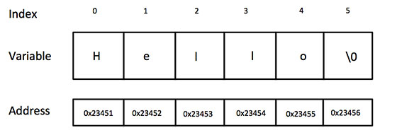

# C 数据类型

| 序号 | 类型与描述                                                   |
| :--- | :----------------------------------------------------------- |
| 1    | **==基本类型==：** 它们是算术类型，包括两种类型：==整数类型==和==浮点类型==。 |
| 2    | **==枚举类型==：** 它们也是算术类型，被用来定义在程序中只能赋予其一定的离散整数值的变量。 |
| 3    | **==void 类型==：** 类型说明符 *void* 表明没有可用的值。     |
| 4    | **派生类型：** 它们包括：==指针类型、数组类型、结构类型、共用体类型和函数类型==。 |

数组类型和结构类型统称为聚合类型。函数的类型指的是函数返回值的类型。

## 整数类型

下表列出了关于标准整数类型的存储大小和值范围的细节：

| 类型           | 存储大小    | 值范围                                               |
| :------------- | :---------- | :--------------------------------------------------- |
| char           | 1 字节      | -128 到 127 或 0 到 255                              |
| unsigned char  | 1 字节      | 0 到 255                                             |
| signed char    | 1 字节      | -128 到 127                                          |
| int            | 2 或 4 字节 | -32,768 到 32,767 或 -2,147,483,648 到 2,147,483,647 |
| unsigned int   | 2 或 4 字节 | 0 到 65,535 或 0 到 4,294,967,295                    |
| short          | 2 字节      | -32,768 到 32,767                                    |
| unsigned short | 2 字节      | 0 到 65,535                                          |
| long           | 4 字节      | -2,147,483,648 到 2,147,483,647                      |
| unsigned long  | 4 字节      | 0 到 4,294,967,295                                   |

> 注意，各种类型的存储大小与系统位数有关，但目前通用的以64位系统为主。
>
> 以下列出了32位系统与64位系统的存储大小的差别（windows 相同）：
>
> 

为了得到某个类型或某个变量在特定平台上的准确大小，您可以使用 `sizeof` 运算符。表达式 *sizeof(type)* 得到对象或类型的存储字节大小。下面的实例演示了获取 int 类型的大小：

```c
printf("int 存储大小 : %lu \n", sizeof(int));
```

## 浮点类型

| 类型        | 存储大小 | 值范围                 | 精度      |
| :---------- | :------- | :--------------------- | :-------- |
| float       | 4 字节   | 1.2E-38 到 3.4E+38     | 6 位小数  |
| double      | 8 字节   | 2.3E-308 到 1.7E+308   | 15 位小数 |
| long double | 16 字节  | 3.4E-4932 到 1.1E+4932 | 19 位小数 |

头文件 ==float.h== 定义了宏，在程序中可以使用这些值和其他有关实数二进制表示的细节。下面的实例将输出浮点类型占用的存储空间以及它的范围值：

```c
#include <stdio.h>
#include <float.h>
 
int main()
{
   printf("float 存储最大字节数 : %d \n", sizeof(float));
   printf("float 最小值: %E\n", FLT_MIN );
   printf("float 最大值: %E\n", FLT_MAX );
   printf("精度值: %d\n", FLT_DIG );
   
   return 0;
}
```

## void 类型

void 类型指定没有可用的值。它通常用于以下三种情况下：

| 序号 | 类型与描述                                                   |
| :--- | :----------------------------------------------------------- |
| 1    | **函数返回为空** C 中有各种函数都不返回值，或者您可以说它们返回空。不返回值的函数的返回类型为空。例如 **void exit (int status);** |
| 2    | **函数参数为空** C 中有各种函数不接受任何参数。不带参数的函数可以接受一个 void。例如 **int rand(void);** |
| 3    | **指针指向 void** 类型为 void * 的指针代表对象的地址，而不是类型。例如，内存分配函数 **void \*malloc( size_t size );** 返回指向 void 的指针，可以转换为任何数据类型。 |

---

常用基本数据类型占用空间（64位机器为例）

-  char ： 1个字节
-  int ：4个字节
-  float：4个字节
-  double：8个字节

基本类型书写

**整数**

-  默认为10进制 ，10 ，20。
-  以0开头为8进制，045，021。
-  以0b开头为2进制，0b11101101。
-  以0x开头为16进制，0x21458adf。

**小数**

单精度常量：2.3f 。

双精度常量：2.3，默认为双精度。

**字符型常量**

用英文单引号括起来，只保存一个字符'a'、'b' 、'*' ，还有转义字符 '\n' 、'\t'。

**字符串常量**

用英文的双引号引起来 可以保存多个字符："abc"。

---

2、数据类型自动转换规则：

-  a）浮点数赋给整型，该浮点数小数被舍去；
-  b）整数赋给浮点型，数值不变，但是被存储到相应的浮点型变量中；

3、强制类型转换形式: **(类型说明符)(表达式)**

## printf输出控制符

* `%d %ld // 十进制输出`
* `%x或%X // 十六进制输出`
* `%#x %#X // 十六进制输出，前面自动加0x`
* `%0 // 八进制输出， 是零不是O`
* `%c //字符输出`
* `%f %lf // 浮点型输出`
* `%s // 字符串输出`

## scanf输入

scanf要严格遵循控制符输入：

```c
int i, j, k;
scanf("%d %d %d", &i, &j, &k); // 要输入: 1 2 3
scanf("%d, %d, %d", &i, &j, &k); // 要输入: 1,2,3
scanf("mmm%d, %d, %d", &i, &j, &k); // 要输入: mmm1,2,3, scanf中尽量不要使用非输入控制符，尤其不要用\n
```

## 计算机内数据的存储

* 整数是以补码的形式转化为二进制代码存储在计算机中的
* 实数是以IEEE754标准转化为二进制代码存储在计算机中的
* 字符的本质也是以整数形式存储
* 字节是存储数据的单位，并且是硬件所能访问的最小单位。

## 原码、补码、反码、移码

### 原码

* 也叫符号-绝对值码
* 最高位0表示正，1表示负，其余二进制位是该数字的绝对值的二进制表示
* 加减运算复杂，存在加减乘除运算，增加了CPU运算的复杂度
* 0的表示不唯一

### 反码

运算不便，没有在计算机中应用

### 移码

* 表示数值平移n位，n成为移码量
* 移码主要用于浮点数的阶码的存储

### 补码

#### 正整数转二进制

除二取余，余数倒序排序，不够位数时左边补0

#### 负整数转二进制

先求与该负数相对应的正数的补码，然后左边补齐0, 然后将所有位取反，然后加一。

#### 二进制转十进制

如果首位是0,直接转为正整数

如果首位是1, 则将所有位取反，末尾加1,所得数字就是该负数的绝对值

#### 范围

一个n位的有符号整数的范围是$-2^{n-1}-1$到$2^{n-1}$

---

# 运算符

## 运算符优先级

运算符优先级：`算术>关系>逻辑>赋值`

* 除法/的运算结果和运算对象的数据类型有关，两个int相除商是int，若商有小数部分，则截取小数部分。被除数和除数中有浮点数结果也是浮点数。`16/5 = 3; 16/5.0 = 3.20000; -13 / 4 = -4; -13/-3 = 4; 3 / 5 = 0; 5 / 3 = 1;`
* 取余%的运算对象必须是整数，余数符号与被除数相同。`13%3 = 1; 13 % -3 = 1; -13 % 3 = -1; -13 % 23 = -13; 3 % 5 = 3`

`int a = 1; int b = (a = 0) && (5 > 3); //b是0, 因为a=0当作0处理`

`int a = 5; int b = (2 > 3) && (a = 9);  // 运行完a仍然是5, 因为&&是短路运算, a=9没有执行`

## 位运算符

要先理解补码

* &： 按位与
* |：按位或
* ~：按位非
* ^：按位异或
* <<：左移，左移n位相当与乘2的n次方，如i = i << 3; 比i *= 8; 速度更快
* `>>`：右移，右移n位相当于除2的n次方

# 流程控制

## 判断语句

| 语句                                                         | 描述                                                         |
| :----------------------------------------------------------- | :----------------------------------------------------------- |
| [if 语句](https://www.runoob.com/cprogramming/c-if.html)     | 一个 **if 语句** 由一个布尔表达式后跟一个或多个语句组成。    |
| [if...else 语句](https://www.runoob.com/cprogramming/c-if-else.html) | 一个 **if 语句** 后可跟一个可选的 **else 语句**，else 语句在布尔表达式为假时执行。 |
| [switch 语句](https://www.runoob.com/cprogramming/c-switch.html) | 一个 **switch** 语句允许测试一个变量等于多个值时的情况。     |
| [嵌套 switch 语句](https://www.runoob.com/cprogramming/c-nested-switch.html) | 您可以在一个 **switch** 语句内使用另一个 **switch** 语句。   |

### ? : 运算符(三元运算符)

我们已经在前面的章节中讲解了 **条件运算符 ? :**，可以用来替代 **if...else** 语句。它的一般形式如下：

```
Exp1 ? Exp2 : Exp3;
```

其中，Exp1、Exp2 和 Exp3 是表达式。请注意，冒号的使用和位置。

? 表达式的值是由 Exp1 决定的。如果 Exp1 为真，则计算 Exp2 的值，结果即为整个 ? 表达式的值。如果 Exp1 为假，则计算 Exp3 的值，结果即为整个 ? 表达式的值。


switch 语句不会在执行判断为真后的语句之后跳出循环，而是继续执行后面所有 case 语句。在每一 case 语句之后增加 break 语句，使每一次执行之后均可跳出 switch 语句，从而避免输出不应有的结果。

------

## 循环

| 循环类型                                                     | 描述                                                         |
| :----------------------------------------------------------- | :----------------------------------------------------------- |
| [while 循环](https://www.runoob.com/cprogramming/c-while-loop.html) | 当给定条件为真时，重复语句或语句组。它会在执行循环主体之前测试条件。 |
| [for 循环](https://www.runoob.com/cprogramming/c-for-loop.html) | 多次执行一个语句序列，简化管理循环变量的代码。               |
| [do...while 循环](https://www.runoob.com/cprogramming/c-do-while-loop.html) | 除了它是在循环主体结尾测试条件外，其他与 while 语句类似。    |

### 循环控制语句

循环控制语句改变你代码的执行顺序。通过它你可以实现代码的跳转。

| 控制语句                                                     | 描述                                                         |
| :----------------------------------------------------------- | :----------------------------------------------------------- |
| [break 语句](https://www.runoob.com/cprogramming/c-break-statement.html) | 终止**循环**或 **switch** 语句，程序流将继续执行紧接着循环或 switch 的下一条语句。 |
| [continue 语句](https://www.runoob.com/cprogramming/c-continue-statement.html) | 告诉一个循环体立刻停止本次循环迭代，重新开始下次循环迭代。   |
| [goto 语句](https://www.runoob.com/cprogramming/c-goto-statement.html) | 将控制转移到被标记的语句。但是不建议在程序中使用 goto 语句。 |

```c
int fun(int n){
    for(i=2;i<=sqrt(p);i++){  
            if(x%i==0){
            return 0;  //不为素数
          }
            else{
            return 1; //为素数 
          }
        }
}
```

这个是求素数的关键代码。

------

# 函数

函数**声明**告诉编译器函数的名称、返回类型和参数。函数**定义**提供了函数的实际主体。

主函数可以调用普通函数，普通函数不能调用主函数。

## 定义函数

C 语言中的函数定义的一般形式如下：

```c
return_type function_name( parameter list )
{
   body of the function
}
```

## 函数声明

函数**声明**会告诉编译器函数名称及如何调用函数。函数的实际主体可以单独定义。

函数声明包括以下几个部分：

```c
return_type function_name( parameter list );
```

针对函数 max()，以下是函数声明：

```c
int max(int num1, int num2);
```

在函数声明中，参数的名称并不重要，只有参数的类型是必需的，因此下面也是有效的声明：

```c
int max(int, int);
```

==当您在一个源文件中定义函数且在另一个文件中调用函数时，函数声明是必需的。在这种情况下，您应该在调用函数的文件顶部声明函数。==

## 调用函数

### 函数参数

如果函数要使用参数，则必须声明接受参数值的变量。这些变量称为函数的**形式参数**。

==形式参数就像函数内的其他局部变量，在进入函数时被创建，退出函数时被销毁。==

当调用函数时，有两种向函数传递参数的方式：

| 调用类型                                                     | 描述                                                         |
| :----------------------------------------------------------- | :----------------------------------------------------------- |
| [传值调用](https://www.runoob.com/cprogramming/c-function-call-by-value.html) | 该方法把参数的实际值复制给函数的形式参数。在这种情况下，修改函数内的形式参数不会影响实际参数。 |
| [引用调用](https://www.runoob.com/cprogramming/c-function-call-by-pointer.html) | 通过指针传递方式，形参为指向实参地址的指针，当对形参的指向操作时，就相当于对实参本身进行的操作。 |

默认情况下，C 使用**传值调用**来传递参数。一般来说，这意味着函数内的代码不能改变用于调用函数的实际参数。

### C 传值方式调用函数

向函数传递参数的==**传值调用**方法，把参数的实际值复制给函数的形式参数。在这种情况下，修改函数内的形式参数不会影响实际参数。==

### C 引用方式调用函数

通过==引用传递方式，形参为指向实参地址的指针，当对形参的指向操作时，就相当于对实参本身进行的操作。==

传递指针可以让多个函数访问指针所引用的对象，而不用把对象声明为全局可访问。

```c
void swap(int *x, int *y)
{
   int temp;
   temp = *x;
   *x = *y; 
   *y = temp; 
}
```

现在，让我们通过引用传值来调用函数 **swap()**：

```c
void swap(int *x, int *y);
 
int main ()
{
   int a = 100;
   int b = 200;
 
   swap(&a, &b);
 
   printf("交换后，a 的值： %d\n", a );
   printf("交换后，b 的值： %d\n", b );

   return 0;
}
```

---

根据函数能否被其他源文件调用，将函数区分为内部函数和外部函数。

## 内部函数

==如果一个函数只能被本文件中其他函数所调用，它称为内部函数。在定义内部函数时，在函数名和函数类型的前面加 static==，即

```c
static 类型名 函数名 （形参表）
```

例如，函数的首行：

```c
static int max(int a,int b)
```

==内部函数又称静态函数==。==使用内部函数，可以使函数的作用域只局限于所在文件。即使在不同的文件中有同名的内部函数，也互不干扰。提高了程序的可靠性。==

## 外部函数

如果在定义函数时，==在函数的首部的最左端加关键字 extern，则此函数是外部函数，可供其它文件调用==。

如函数首部可以为

```c
extern int max (int a,int b)
```

==C 语言规定，如果在定义函数时省略 extern，则默认为外部函数。==

==在需要调用此函数的其他文件中，需要对此函数作声明（不要忘记，即使在本文件中调用一个函数，也要用函数原型来声明）。====在对此函数作声明时，要加关键字 extern，表示该函数是在其他文件中定义的外部函数。==

以下实例通过多个文件的函数实现输入一串字符串，然后删除指定的字符：

file1.c

```c
#include <stdio.h>

static void delete_string(char str[], char ch);

int main()
{
	extern void enter(char str[]); // 对函数的声明
	extern void print(char str[]); // 对函数的声明
	char c, str[100];
	enter(str);
	scanf("%c", &c);
	delete_string(str, c);
	print(str);
	return 0;
}

static void delete_string(char str[], char ch)//内部函数
{
	int i, j;
	for (i = j = 0; str[i] != '\0'; i++)
		if (str[i] != ch) str[j++] = str[i];
	str[j] = '\0';
}
```

file2.c

```c
#include <stdio.h>

void enter(char str[100]) // 定义外部函数 enter
{
    fgets(str, 100, stdin); // 向字符数组输入字符串
}
```

file3.c

```c
#include <stdio.h>

void print(char str[]) // 定义外部函数 print
{
    printf("%s\n",str);
}
```

输入字符串"abcdef"，给字符数组 str，在输入要删去的字符'd'。 运行结果:

```c
$ gcc file1.c file2.c file3.c 
$ ./a.out
abcdef                   # 输入的字符串
d                        # 要删除的字符
abcef                    # 删除后的字符串

```

**内联函数**

内联函数是指用==inline==关键字修饰的函数。==在类内定义的函数被默认成内联函数==。内联函数从源代码层看，有函数的结构，而在编译后，却不具备函数的性质。

==内联扩展是用来**消除函数调用时的时间开销**。它通常用于频繁执行的函数，对于小内存空间的函数非常受益。==

使用内联函数的时候要注意：

- ==递归函数不能定义为内联函数==
- ==内联函数一般适合于不存在while和switch等复杂的结构且只有1~5条语句的小函数上，否则编译系统将该函数视为普通函数。==
- ==内联函数只能先定义后使用，否则编译系统也会把它认为是普通函数。==
- ==对内联函数不能进行异常的接口声明。==

**示例：**一个简单的交换函数

```c
inline void swap(int *a, int *b)
{
    int t = *a;
    *a = *b;
    *b = t;
}
```

**关于 main 函数的参数**

在有些很专业的书会看到如下代码

```c
int main( int argc, char *argv[] )

```

但是有时又会看见main函数没有参数，如下：

```c
int main()
```

这两个形式参数的类型是系统规定的。如果 main 函数要带参数，就是这两个类型的参数；否则main函数就没有参数。

C程序在编译和链接后，都生成一个文件，执行该文件时，可以直接执行；也可以在命令行下带参数执行，命令行执行的形式为：可执行文件名称 参数1 参数2 ... ... 参数n。可执行文件名称和参数、参数之间均使用空格隔开。

如果按照这种方法执行，命令行字符串将作为实际参数传递给main函数。具体为：

- (1) ==可执行文件名称和所有参数的个数之和传递给 argc；==
- (2) ==可执行文件名称（包括路径名称）作为一个字符串，首地址被赋给 argv[0]，参数1也作为一个字符串，首地址被赋给 argv[1]，... ...依次类推。==

## 函数参数传递常用的三种方式

**1. 值传递**

```c
void swap(int x, int y)
{
    int temp;
    temp = x;
    x = y;
    y = temp;
}

int main( int argc, char *argv[] )
{
    int a = 5;
    int b = 10;
    swap(a, b); //调用交换函数
    printf("交换结果为 a = %d, b = %d\n",a,b);
    return 0;
}
```

由于值传递是单向传递，传递过程中只是改变了形参的数值，并未改变实参的数值，因此并不会改变a和b原有的值。

**2. 指针传递**

```c
void swap(int *x, int *y)
{
    int temp;
    temp = *x;
    *x = *y;
    *y = temp;
}

int main( int argc, char *argv[] )
{
    int a = 5;
    int b = 10;
    swap(&a, &b); //调用交换函数
    printf("交换结果为 a = %d, b = %d\n",a,b);
    return 0;
}
```

指针传递过程中，将a和b的地址分别传递给了x和y，在函数体内部改变了a、b所在地址的值，即交换了a、b的数值。

**3. 引用传递**

```c
void swap(int &x, int &y)
{
    int temp;
    temp = x;
    x = y;
    y = temp;
}

int main( int argc, char *argv[] )
{
    int a = 5;
    int b = 10;
    swap(a, b); //调用交换函数
    printf("交换结果为 a = %d, b = %d\n",a,b);
    return 0;
}
```

引用传递中，在调用swap(a, b);时函数会用a、b分别代替x、y，即x、y分别引用了a、b变量，这样函数体中实际参与运算的其实就是实参a、b本身，因此也能达到交换数值的目的。

**注：**严格来说，C语言中是没有引用传递，这是C++中语言特性，因此在.c文件中使用引用传递会导致程序编译出错。

## 笔记

### **占位符**

格式占位符(%)是在C/C++语言中格式输入函数，如 scanf、printf 等函数中使用。其意义就是起到格式占位的意思，表示在该位置有输入或者输出。

- ==**%d, %i** 代表整数==
- ==**%f** 浮点==
- ==**%s** 字符串==
- ==**%c** char==
- ==**%p** 指针==
- ==**%fL** 长log==
- ==**%e** 科学计数==
- ==**%g** 小数或科学计数。==
- ==**%a,%A** 读入一个浮点值(仅C99有效)。==
- ==**%c** 读入一个字符。==
- ==**%d** 读入十进制整数。==
- ==**%i** 读入十进制，八进制，十六进制整数。==
- ==**%o** 读入八进制整数。==
- ==**%x,%X** 读入十六进制整数。==
- ==**%s** 读入一个字符串，遇空格、制表符或换行符结束。==
- ==**%f,%F,%e,%E,%g,%G** 用来输入实数，可以用小数形式或指数形式输入。==
- ==**%p** 读入一个指针。==
- ==**%u** 读入一个无符号十进制整数。==
- ==**%n** 至此已读入值的等价字符数。==
- ==**%[]** 扫描字符集合。==
- ==**%%** 读 % 符号==

**实例：**

```c
scanf("%d,%d,%d",&a,&b,&c); // 从键盘输入三个整数，用逗号分隔 　
scanf("%c", &s);   // 从键盘输入一个字符 　
scanf("%f", &f);   // 从键盘输入一个浮点型数据 　
printf("%d\n",a);  // 输出一个整数 　
printf("%f\n",b);  // 输出一个浮点数 　
printf("%s\n",c);  // 输出一个字符, 其中\n表示换行
```

# 作用域规则

任何一种编程中，作用域是程序中定义的变量所存在的区域，超过该区域变量就不能被访问。C 语言中有三个地方可以声明变量：

1. 在函数或块内部的**局部**变量
2. 在所有函数外部的**全局**变量
3. 在**形式**参数的函数参数定义中

让我们来看看什么是**局部**变量、**全局**变量和**形式**参数。

## 局部变量

在某个函数或块的内部声明的变量称为局部变量。它们只能被该函数或该代码块内部的语句使用。局部变量在函数外部是不可知的。

## 全局变量

全局变量是定义在函数外部，通常是在程序的顶部。==全局变量在整个程序生命周期内都是有效的，在任意的函数内部能访问全局变量。==

全局变量可以被任何函数访问。也就是说，全局变量在声明后整个程序中都是可用的。在程序中，局部变量和全局变量的名称可以相同，但是==在函数内，如果两个名字相同，局部变量会屏蔽掉全局变量==。

```c
#include <stdio.h>
 
/* 全局变量声明 */
int g = 20;
 
int main ()
{
  /* 局部变量声明 */
  int g = 10;
 
  printf ("value of g = %d\n",  g);
 
  return 0;
}

```

当上面的代码被编译和执行时，它会产生下列结果：

```c
value of g = 10
```

**全局变量与局部变量在内存中的区别**：

- ==全局变量保存在内存的全局存储区中，占用静态的存储单元==；
- ==局部变量保存在栈中，只有在所在函数被调用时才动态地为变量分配存储单元==。

## 初始化局部变量和全局变量

当局部变量被定义时，系统不会对其初始化，您必须自行对其初始化。定义全局变量时，系统会自动对其初始化，如下所示：

| 数据类型 | 初始化默认值 |
| :------- | :----------- |
| int      | 0            |
| char     | '\0'         |
| float    | 0            |
| double   | 0            |
| pointer  | NULL         |

正确地初始化变量是一个良好的编程习惯，否则有时候程序可能会产生意想不到的结果，因为未初始化的变量会导致一些在内存位置中已经可用的垃圾值。

---

# 数组

C 语言支持**数组**数据结构，它可以存储一个固定大小的相同类型元素的顺序集合。

==所有的数组都是由连续的内存位置组成。最低的地址对应第一个元素，最高的地址对应最后一个元素。==

## 声明数组

在 C 中要声明一个数组，需要指定元素的类型和元素的数量，如下所示：

```c
type arrayName [ arraySize ];
```

这叫做一维数组。**arraySize** 必须是一个大于零的整数常量，**type** 可以是任意有效的 C 数据类型。

## 初始化数组

一维数组初始化方式

* 完全初始化: `int a[5] = {1, 2, 3, 4, 5};`
* 不完全初始化： `int a[5] = {1, 2}; `// 不完全初始化时，其他的元素被赋0
* 不初始化：`int a[5]; ` // 此时所有的元素都是垃圾值
* 清零： `int a[5] = {0};`


当赋值的元素少于数组总体元素的时候，不同类型剩余的元素自动初始化值说明如下：

- 对于 short、int、long，就是整数 **0**；
- 对于 char，就是字符 **'\0'**；
- 对于 float、double，就是小数 **0.0**。

我们可以通过下面的形式将数组的所有元素初始化为 0：

```c
int nums[10] = {0};
char str[10] = {0};
float scores[10] = {0.0};
```

由于剩余的元素会自动初始化为 0，所以只需要给第 0 个元素赋值为 0 即可。


下面的实例使用了上述的三个概念，即，声明数组、数组赋值、访问数组：

```c
int n[10]; /* n 是一个包含 10 个整数的数组 */
int i, j;

/* 初始化数组元素 */
for (i = 0; i < 10; i++)
{
    n[i] = i + 100; /* 设置元素 i 为 i + 100 */
}

/* 输出数组中每个元素的值 */
for (j = 0; j < 10; j++)
{
    printf("Element[%d] = %d\n", j, n[j]);
}
```

## 数组详解

| 概念                                                         | 描述                                                         |
| :----------------------------------------------------------- | :----------------------------------------------------------- |
| [多维数组](https://www.runoob.com/cprogramming/c-multi-dimensional-arrays.html) | C 支持多维数组。多维数组最简单的形式是二维数组。             |
| [传递数组给函数](https://www.runoob.com/cprogramming/c-passing-arrays-to-functions.html) | 您可以通过指定不带索引的数组名称来给函数传递一个指向数组的指针。 |
| [从函数返回数组](https://www.runoob.com/cprogramming/c-return-arrays-from-function.html) | C 允许从函数返回数组。                                       |
| [指向数组的指针](https://www.runoob.com/cprogramming/c-pointer-to-an-array.html) | 您可以通过指定不带索引的数组名称来生成一个指向数组中第一个元素的指针。 |

------

## 笔记

指针与数组的区别

```c
char *str="Hello";
char arrgs[]="Hello";
```

字符数组:

```c
char *p=(char*)&arrgs == char *p=arrgs ;
char *p=(char*)(&(arrgs[0])) == &arrgs == arrgs;
```

字符串指针:

```c
char *p=(char*)&str != str; str==str[0] =='H'
```

得出结论==字符数组的 首地址可以用 arrgs ，&arrgs,来表示并且它们相等==，

但是==指针&str和str是不同的,当遇到字符串指针时候要注意处理方式==;


**一个小知识点：**

在我们没有明确数组的元素个数时，在程序中想知道数组单元个数可以使用 **sizeof(a)/sizeof(a[0])**

------

```c
#include <stdio.h>

int main()
{
    int a[2] = {1,2};
    printf("a      = %d\n",a[0]);
    printf("*(a+0) = %d\n",*(a + 0));
    printf("a[1]   = %d\n",a[1]);
    printf("*a     = %d\n",*a);
    printf("*(a+1) = %d\n",*(a + 1));
    printf("\n");
    printf("a    的地址：%p\n",a);
    printf("(a+0)的地址：%p\n",(a + 0));
    printf("(a+1)的地址：%p\n",(a + 1));
    // %p 读入一个指针
    printf("\n");
    return 0;
}
```

输出结果：

```c
a      = 1
*(a+0) = 1
a[1]   = 2
*a     = 1
*(a+1) = 2

a    的地址：0x7ffe9e227634
(a+0)的地址：0x7ffe9e227634
(a+1)的地址：0x7ffe9e227638
```

事实上 **a[0] 、a[1]...a[i]** 代表的都是值，**a、(a+0)、(a+1)、(a+i)** 代表的是地址；另外这里的 **a** 代表整个数组的首地址，相当于 **a[0]** 的地址，而这里 **(a+1)**就代表的是 **a[0+1]** 的地址。

------

**指针与数组名的区别**

指针：也是一个变量，存储的数据是地址。

数组名：代表的是该数组最开始的一个元素的地址。

```c
int a[10];
int *p;
p = &a[0] // 可以写成 p = a;
```

- 对数组元素 a[i]的引用也可以写成*(a+i)这种形式。
- 赋值语句  p=&a[0] 也可以写成下列形式: p=a。
- p 是个指针，p[i]与*(p+i)是等价的。

区别：==指针是一个变量，可以进行数值运算。数组名不是变量，不可以进行数值运算。==

------

**数组和指针的关系**

1. 函数的参数中 数组类型参数 `int a[]`本质是指针 可以直接换成 `int *a`;
3. `size of(a) == sizeof(int *)` 所以函数内部没法用`sizeof`得到数组的长度 只能传一个`len`;

```c
// 一个整型数组的指针，长度为 len， 得到数组中的最小值和最大值 ———— 从外部传入两个指针，从而将所求的两个结果保存带出来，得到多个返回值。
void minMax(int a[], int len, int *min, int *max) {
    int i;
    
    *min = *max = a[0]; //假定最大值 最小值相等 为a[0]  
    
    for(i= 1; i < len, i++) {
        if( a[i] < *min) {
          *min = a[i];
        }
        
        if(a[i] > *max) {
          *max = a[i];
        }
    }

}

int a[] = {1, 2, 3, 4, 5, 7, 8, 9, 15, 18, 25, 33};
int min, max;
minMax(a, sizeof(a)/ sizeof(a[0]), &min , &max );
printf( "min = %d, max = %d \n",  min,  max);
```

- ==数组变量是特殊的指针，数组变量本身表达地址==，int a[10];   int *p =a;
- ==数组变量无需用取址符&== ;
- ==数组的元素表达的是变量，需要用&取地址,如 m = &a[0]==;
- ==`[]`运算符可以对数组做，也可以对指针做 `p[0] == a[0]`;==
- ==`*`运算符可以对指针做，也可以对数组做 `*a = 25`, *a可以得到或者修改数组首个元素的值;==
- ==实际上数组是 const 的指针，所以不能被赋值。== 如果 `int a[] = {1,2,5,7}`; `int b[]`，由于 `int b[]`实质上等价于 <===> int const *b;    b 是一个常数，不能被改变，初始化出来代表这个数组就不能再改变。 b = a; (错误) 数组变量之间是不可以这样互相赋值的。 而 int *q = a; 这样是可以的。

------

**数组赋值的区别:**

```c
char a[]="runoob"; // 这样赋值之后在结尾会自动加上'\0'。
char a1[]={'r','u','n','o','o','b'}; // 这样赋值是整整好好的6个空间不会自动加上
```

所以比较的话，a 的长度比 a1 的要大。

---

注意:

- 只有在定义数组时才能整体赋值
- 一维数组名是一个指针常量，存放的是第一个元素的地址，其值不能被改变
- ==数组的长度必须事先指定，而且不可以是变量==, `int len = 5; int a[len];`=>错误。长度一旦定义，就不同在运行过程中动态扩充或缩小
- 传统形式定义的数组，该数组的内存程序员无法释放，除非该数组所在函数结束。数组一旦定义，系统为该数组分配的空间就会一直存在，除非数组所在的函数运行结束。
- a函数定义的数组，在a函数运行期间可以被其他函数操作，但是一旦a函数运行完成，该数组便被释放
- 如果函数需要处理一维数组，那么该函数需要接受的数组信息，即确定一个一维数组需要的信息为：

  * 需要数组名（地址）和数组长度

- 传统数组也叫静态数组

------

## 多维数组

C 语言支持多维数组。多维数组声明的一般形式如下：

```c
type name[size1][size2]...[sizeN];
```

## 二维数组

多维数组最简单的形式是二维数组。一个二维数组，==在本质上，是一个一维数组的列表==。声明一个 x 行 y 列的二维整型数组，形式如下：

```c
type arrayName [ x ][ y ];
```

### 初始化二维数组

==多维数组可以通过在括号内为每行指定值来进行初始化==。下面是一个带有 3 行 4 列的数组。

```c
int a[3][4] = {  
 {0, 1, 2, 3} ,   /*  初始化索引号为 0 的行 */
 {4, 5, 6, 7} ,   /*  初始化索引号为 1 的行 */
 {8, 9, 10, 11}   /*  初始化索引号为 2 的行 */
};
```

==内部嵌套的括号是可选的==，下面的初始化与上面是等同的：

```c
int a[3][4] = {0,1,2,3,4,5,6,7,8,9,10,11};
```

### 访问二维数组元素

二维数组中的元素是通过使用下标（即数组的行索引和列索引）来访问的。例如：

```c
int val = a[2][3];
```

------

二维数组存放字符串，读取时当一维数组使用。比如：

```c
#include<stdio.h>
int main(){
  int i;
  char names[6][50]={"马超","关平","赵云","张飞","关羽","刘备"};
  for(i=0;i<6;i++)  {
      printf("悍将名称：%s\n",names[i]);
  }
  return 0;
}
```

------

二维数组在逻辑上是方阵，由行和列组成。

但是二维数组在物理上是线性的，按行来依次进行存放，内存是连续的。

二维数组名的步长是一行的长度，比如一下例子中：

```c
age + 1 address is 00EFFC04
age + 2 address is 00EFFC14

```

因为每一行有四个元素，每个int类型的元素占四个字节，一行有16个字节，所以数组名age加1后地址增加了16个字节说明数组名的步长位一行的长度。

具体到每一个元素加1的时候，地址增加的是一个元素所占字节的大小，因此元素的步长即为元素本身的大小，例如：

```c
age[2][0] + 0 address is 00EFFC14
age[2][0] + 1 address is 00EFFC18

```

示例及运行结果：

```c
#include <stdio.h>

int main()
{
    int age[6][4];
    for (int i = 0; i < sizeof(age)/sizeof(age[0]) ; i++)
    {
        printf("age + %d address is %p\n",i, age + i);
    }
    for (int i = 0; i < sizeof(age) / sizeof(age[0]); i++)
    {
        for (int j = 0; j < sizeof(age[0]) / sizeof(int); j++)
        {
            printf("age[%d][0] + %d address is %p\n",i,j,&age[i][0]+j);
        }

    }
}
```

输出结果：

```c
age + 0 address is 0x7fffd98b9400
age + 1 address is 0x7fffd98b9410
age + 2 address is 0x7fffd98b9420
age + 3 address is 0x7fffd98b9430
age + 4 address is 0x7fffd98b9440
age + 5 address is 0x7fffd98b9450
age[0][0] + 0 address is 0x7fffd98b9400
age[0][0] + 1 address is 0x7fffd98b9404
age[0][0] + 2 address is 0x7fffd98b9408
age[0][0] + 3 address is 0x7fffd98b940c
age[1][0] + 0 address is 0x7fffd98b9410
age[1][0] + 1 address is 0x7fffd98b9414
age[1][0] + 2 address is 0x7fffd98b9418
age[1][0] + 3 address is 0x7fffd98b941c
age[2][0] + 0 address is 0x7fffd98b9420
age[2][0] + 1 address is 0x7fffd98b9424
age[2][0] + 2 address is 0x7fffd98b9428
age[2][0] + 3 address is 0x7fffd98b942c
age[3][0] + 0 address is 0x7fffd98b9430
age[3][0] + 1 address is 0x7fffd98b9434
age[3][0] + 2 address is 0x7fffd98b9438
age[3][0] + 3 address is 0x7fffd98b943c
age[4][0] + 0 address is 0x7fffd98b9440
age[4][0] + 1 address is 0x7fffd98b9444
age[4][0] + 2 address is 0x7fffd98b9448
age[4][0] + 3 address is 0x7fffd98b944c
age[5][0] + 0 address is 0x7fffd98b9450
age[5][0] + 1 address is 0x7fffd98b9454
age[5][0] + 2 address is 0x7fffd98b9458
age[5][0] + 3 address is 0x7fffd98b945c
```

可以看到每一个元素占了四个字节的大小，并且这24的元素的地址是连续的。

------

将二维数组当作参数的时候，必须指明所有维数大小或者省略第一维的，但是不能省略第二维或者更高维的大小，这是由编译器原理限制的。事实上，编译器是这样处理数组的：

设有数组 `int a[m][n]`，如果要访问 `a[i][j]`的值，编译器的寻址方式为。

```
&a[i][j]=&a[0][0]+i*sizeof(int)*n+j*sizeof(int); // 注意 n 为第二维的维数
```

因此，可以省略第一维的维数，不能省略其他维的维数。

在定义二维数组的时候对其进行初始化，也可以省略第一维，编译器会根据你的初始化语句自动决定第一维度。

------

## 传递数组给函数

如果您想要在函数中传递一个一维数组作为参数，您必须以下面三种方式来声明函数形式参数，

### 方式 1

形式参数是一个指针（您可以在下一章中学习到有关指针的知识）：

```c
void myFunction(int *param){}
```

### 方式 2

形式参数是一个已定义大小的数组：

```c
void myFunction(int param[10]){}
```

### 方式 3

形式参数是一个未定义大小的数组：

```c
void myFunction(int param[]){}
```

现在，让我们来看下面这个函数，它把数组作为参数，同时还传递了另一个参数，根据所传的参数，会返回数组中各元素的平均值：

```c
#include <stdio.h>

double getAverage(int arr[], int size);

int main()
{
	/* 带有 5 个元素的整型数组 */
	int balance[5] = {1000, 2, 3, 17, 50};
	double avg;

	/* 传递一个指向数组的指针作为参数 */
	avg = getAverage(balance, 5);

	/* 输出返回值 */
	printf("平均值是： %f ", avg);

	return 0;
}

double getAverage(int arr[], int size)
{
	int i;
	double avg;
	double sum = 0;

	for (i = 0; i < size; ++i) { sum += arr[i]; }

	avg = sum / size;

	return avg;
}
```

您可以看到，==就函数而言，数组的长度是无关紧要的，因为 C 不会对形式参数执行边界检查。==

------

**二维数组传递给函数**

如果我们想将二维数组作为实参传递给某个函数，如下代码是有问题的:

```c++
double * MatrixMultiple(double a[][], double b[][]);
```

原因可以简单理解为：编译器并没有那么高级，在二维以上的数组一定要规定一个最高维数:

```c
double * MatrixMultiple(double a[][2], double b[][3]);  /* 这才是正确的 */
```

------

**二维数组传递给函数**

列举 C 语言传递二维数组的方法。

方法1: 第一维的长度可以不指定，但必须指定第二维的长度：

```c
void print_a(int a[][5], int n, int m)
```

方法2: 指向一个有5个元素一维数组的指针：

```c
void print_b(int (*a)[5], int n, int m)
```

方法3: 利用数组是顺序存储的特性,通过降维来访问原数组!

```c
void print_c(int *a, int n, int m)
```

如果知道二维数组的长度，当然选择第一或者第二种方式，但是长度不确定时，只能传入数组大小来遍历元素啦。

```c
#include <stdio.h>
/*********************************
* 方法1: 第一维的长度可以不指定
*        但必须指定第二维的长度
*********************************/ 
void print_a(int a[][5], int n, int m){ 
    int i, j;
    for(i = 0; i < n; i++) {
        for(j = 0; j < m; j++) 
            printf("%d ", a[i][j]); 
        printf("\n"); 
    } 
} 

/***************************************** 
* 方法2: 指向一个有5个元素一维数组的指针
*****************************************/ 
void print_b(int (*a)[5], int n, int m) { 
    int i, j;
    for(i = 0; i < n; i++) { 
        for(j = 0; j < m; j++) 
            printf("%d ", a[i][j]);
        printf("\n"); 
    } 
}

/*********************************** 
* 方法3: 利用数组是顺序存储的特性, 
*       通过降维来访问原数组!
***********************************/ 
void print_c(int *a, int n, int m) { 
    int i, j; 
    for(i = 0; i < n; i++) { 
        for(j = 0; j < m; j++) 
            printf("%d ", *(a + i*m + j));
        printf("\n"); 
    } 
}
int main(void) 
{ 
    int a[5][5] = {{1, 2}, {3, 4, 5}, {6}, {7}, {0, 8}}; 
 
    print_a(a, 5, 5);  
    print_b(a, 5, 5);   
    print_c(&a[0][0], 5, 5); 

    return 0; 
} 

```

------

## 从函数返回数组

==C 语言不允许返回一个完整的数组作为函数的参数。但是，您可以通过指定不带索引的数组名来返回一个指向数组的指针==。

如果您想要从函数返回一个一维数组，您必须声明一个返回指针的函数，如下：

```c
int * myFunction()
{
}
```

另外，==C 不支持在函数外返回局部变量的地址，除非定义局部变量为 **static** 变量。==

现在，让我们来看下面的函数，它会生成 10 个随机数，并使用数组来返回它们，具体如下：

```c
#include <stdio.h>
#include <stdlib.h>
#include <time.h>

/* 要生成和返回随机数的函数 */
int *getRandom()
{
	static int r[10];
	int i;

	srand((unsigned) time(NULL));
	for (i = 0; i < 10; ++i)
	{
		r[i] = rand();
		printf("r[%d] = %d\n", i, r[i]);

	}

	return r;
}

/* 要调用上面定义函数的主函数 */
int main()
{
	int *p;
	int i;

	p = getRandom();
	for (i = 0; i < 10; i++) { printf("*(p + %d) : %d\n", i, *(p + i)); }

	return 0;
}
```

`srand((unsigned)time(NULL))`是初始化随机函数种子：

- 1、是拿当前系统时间作为种子，由于时间是变化的，种子变化，可以产生不相同的随机数。计算机中的随机数实际上都不是真正的随机数，如果两次给的种子一样，是会生成同样的随机序列的。 
- 2、使用时，参数可以是unsigned型的任意数据，比如srand（10）；
- 3、如果不使用srand，用rand（）产生的随机数，在多次运行，结果是一样的。

------

## 指向数组的指针

数组名是一个指向数组中第一个元素的常量指针。因此，在下面的声明中：

```c
double balance[50];
```

**balance** 是一个指向 &balance[0] 的指针，即数组 balance 的第一个元素的地址。因此，下面的程序片段把 **p** 赋值为 **balance** 的第一个元素的地址：

```c
double *p;
double balance[10];

p = balance;
```

==使用数组名作为常量指针是合法的，反之亦然==。因此，*(balance + 4) 是一种访问 balance[4] 数据的合法方式。

一旦您把第一个元素的地址存储在 p 中，您就可以使用 \*p、\*(p+1)、*(p+2) 等来访问数组元素。下面的实例演示了上面讨论到的这些概念：

```c
#include <stdio.h>

int main()
{
	double balance[5] = {1000.0, 2.0, 3.4, 17.0, 50.0};
	double *p;
	int i;

	p = balance;

	printf("使用指针的数组值\n");
	for (i = 0; i < 5; i++) { printf("*(p + %d) : %f\n", i, *(p + i)); }

	printf("使用 balance 作为地址的数组值\n");
	for (i = 0; i < 5; i++) { printf("*(balance + %d) : %f\n", i, *(balance + i)); }

	return 0;
}
```

------

# 枚举

枚举语法定义格式为：

```c
enum　枚举名　{枚举元素1,枚举元素2,……};
```

接下来我们举个例子，比如：一星期有 7 天，如果不用枚举，我们需要使用 #define 来为每个整数定义一个别名：

#define MON  1
#define TUE  2
#define WED  3
#define THU  4
#define FRI  5
#define SAT  6
#define SUN  7

这个看起来代码量就比较多，接下来我们看看使用枚举的方式：

```c
enum DAY
{
      MON=1, TUE, WED, THU, FRI, SAT, SUN
};
```

**注意：**==第一个枚举成员的默认值为整型的 0，后续枚举成员的值在前一个成员上加 1。我们在这个实例中把第一个枚举成员的值定义为 1，第二个就为 2，以此类推==。

> 可以在定义枚举类型时改变枚举元素的值：
>
> ```c
> enum season {spring, summer=3, autumn, winter};
> ```
> 
>==没有指定值的枚举元素，其值为前一元素加 1==。也就说 spring 的值为 0，summer 的值为 3，autumn 的值为 4，winter 的值为 5

### 枚举变量的定义

==**1、先定义枚举类型，再定义枚举变量**==

```c
enum DAY
{
      MON=1, TUE, WED, THU, FRI, SAT, SUN
};
enum DAY day;

```

==**2、定义枚举类型的同时定义枚举变量**==

```c
enum DAY
{
      MON=1, TUE, WED, THU, FRI, SAT, SUN
} day;

```

==**3、省略枚举名称，直接定义枚举变量**==

```c
enum
{
      MON=1, TUE, WED, THU, FRI, SAT, SUN
} day;

```

```c
#include<stdio.h>
 
enum DAY
{
      MON=1, TUE, WED, THU, FRI, SAT, SUN
};
 
int main()
{
    enum DAY day;
    day = WED;
    printf("%d",day); // 3
    return 0;
}
```


==在C 语言中，枚举类型是被当做 int 或者 unsigned int 类型来处理的==，所以按照 C 语言规范是没有办法遍历枚举类型的。

不过在一些特殊的情况下，枚举类型必须连续是可以实现有条件的遍历。

以下实例使用 for 来遍历枚举的元素：

```c
#include<stdio.h>
 
enum DAY
{
      MON=1, TUE, WED, THU, FRI, SAT, SUN
} day;
int main()
{
    // 遍历枚举元素
    for (day = MON; day <= SUN; day++) {
        printf("枚举元素：%d \n", day);
    }
}
```

以上实例输出结果为：

```c
枚举元素：1 
枚举元素：2 
枚举元素：3 
枚举元素：4 
枚举元素：5 
枚举元素：6 
枚举元素：7
```

以下枚举类型不连续，这种枚举无法遍历。

```
enum
{
    ENUM_0,
    ENUM_10 = 10,
    ENUM_11
};
```

枚举在 switch 中的使用：

```c
#include <stdio.h>
#include <stdlib.h>

int main()
{
	enum color { red = 1, green, blue };
	enum color favorite_color;

	/* ask user to choose color */
	printf("请输入你喜欢的颜色: (1. red, 2. green, 3. blue): ");
	scanf("%d", &favorite_color);

	/* 输出结果 */
	switch (favorite_color)
	{
		case red:
			printf("你喜欢的颜色是红色");
			break;
		case green:
			printf("你喜欢的颜色是绿色");
			break;
		case blue:
			printf("你喜欢的颜色是蓝色");
			break;
		default:
			printf("你没有选择你喜欢的颜色");
	}

	return 0;
}
```

### 将整数转换为枚举

```c
	enum day { saturday, sunday, monday, tuesday, wednesday, thursday, friday };

	int a = 1;
	enum day weekend;
	weekend = (enum day) a;  //类型转换
	//weekend = a; //错误
	printf("weekend:%d", weekend); // 1
```

------

用 for 用来遍历枚举元素根本是不可行的：

```c
#include<stdio.h>
enum DAY{MON=1, TUE, WED, THU=7, FRI, SAT, SUN};

int main()
{
        enum DAY day;
        for(day=MON;day<=SUN;day++)
        {
                printf("day=%d\n",day);
        }
        return 0;
}

```

得到的结果：

```c
day=1
day=2
day=3
day=4
day=5
day=6
day=7
day=8
day=9
day=10

```

所以用来遍历是不可行的，它只是给 day 赋值了一个整数类型的值。

------

# 指针

正如您所知道的，每一个变量都有一个内存位置，每一个内存位置都定义了==可使用连字号（&）运算符访问的地址==，它表示了在内存中的一个地址。

指针和指针变量是两个不同的概念，但是叙述时通常把指针变量简称为指针，指针的本质就是一个操作受限的非负整数。==**指针变量**是一个变量，其值为另一个变量的地址==，指针变量声明的一般形式为：

```c
type *var-name;
```

## NULL 指针

==在变量声明的时候，如果没有确切的地址可以赋值，为指针变量赋一个 NULL 值是一个良好的编程习惯。赋为 NULL 值的指针被称为**空**指针。==NULL 指针是一个定义在标准库中的值为零的常量。

```c
#include <stdio.h>

int main()
{
	int *ptr = NULL;
	printf("ptr 的地址是 %p\n", ptr); // 0x0

	return 0;
}
```

==在大多数的操作系统上，程序不允许访问地址为 0 的内存，因为该内存是操作系统保留的。然而，内存地址 0 有特别重要的意义，它表明该指针不指向一个可访问的内存位置。==但按照惯例，如果指针包含空值（零值），则假定它不指向任何东西。

==如需检查一个空指针，您可以使用 if 语句，==如下所示：

```c
if(ptr)     /* 如果 p 非空，则完成 */
if(!ptr)    /* 如果 p 为空，则完成 */
```

## C 指针详解

在 C 中，有很多指针相关的概念，这些概念都很简单，但是都很重要。下面列出了 C 程序员必须清楚的一些与指针相关的重要概念：

| 概念                                                         | 描述                                                     |
| :----------------------------------------------------------- | :------------------------------------------------------- |
| [指针的算术运算](https://www.runoob.com/cprogramming/c-pointer-arithmetic.html) | 可以对指针进行四种算术运算：++、--、+、-                 |
| [指针数组](https://www.runoob.com/cprogramming/c-array-of-pointers.html) | 可以定义用来存储指针的数组。                             |
| [指向指针的指针](https://www.runoob.com/cprogramming/c-pointer-to-pointer.html) | C 允许指向指针的指针。                                   |
| [传递指针给函数](https://www.runoob.com/cprogramming/c-passing-pointers-to-functions.html) | 通过引用或地址传递参数，使传递的参数在调用函数中被改变。 |
| [从函数返回指针](https://www.runoob.com/cprogramming/c-return-pointer-from-functions.html) | C 允许函数返回指针到局部变量、静态变量和动态内存分配。   |

==64位指针变量占用的内存大小为8, 32位指针变量占用内存大小为4。 无论什么类型的指针==

指针指向了其指向变量的第一个字节，但是指针指向的地址长度由指针变量的类型指定，如`int a = 0; int *p = &a;`, a长度为4,p只指向了第一个字节，长度4由`int *`指定。

------

## 指针的算术运算

指针变量不能相加，相乘，相除，如果两个指针变量指向的是同一快连续空间中的不同存储单元，则这两个指针变量可以相减。可以对指针进行四种算术运算：++、--、+、-。

假设 **ptr** 是一个指向地址 ==1000 的整型指针，是一个 32 位==的整数，让我们对该指针执行下列的算术运算：

```
ptr++
```

在执行完上述的运算之后，**ptr** 将==指向位置 1004==，因为 ptr 每增加一次，它都将指向下一个整数位置，即当前位置==往后移 4 个字节==。这个运算会在不影响内存位置中实际值的情况下，移动指针到下一个内存位置。==如果 **ptr** 指向一个地址为 1000 的字符，上面的运算会导致指针指向位置 1001，因为下一个字符位置是在 1001==。

### 指针的比较

指针可以用关系运算符进行比较，如 ==、< 和 >。==如果 p1 和 p2 指向两个相关的变量，比如同一个数组中的不同元素，则可对 p1 和 p2 进行大小比较。

```c
#include <stdio.h>

const int MAX = 3;

int main()
{
	int var[] = {10, 100, 200};
	int i, *ptr;

	ptr = var;
	i = 0;
	while (ptr <= &var[MAX - 1])
	{
		printf("Address of var[%d] = %x\n", i, ptr);
		printf("Value of var[%d] = %d\n", i, *ptr);

		ptr++;
		i++;
	}
	return 0;
}
```

当上面的代码被编译和执行时，它会产生下列结果：

```c
Address of var[0] = bfdbcb20
Value of var[0] = 10
Address of var[1] = bfdbcb24
Value of var[1] = 100
Address of var[2] = bfdbcb28
Value of var[2] = 200
```

------

## 指针数组

下面是一个==指向整数的指针数组的声明==：

```c
int *ptr[MAX];
```

下面的实例用到了三个整数，它们将存储在一个指针数组中，如下所示：

```c
#include <stdio.h>

const int MAX = 3;

int main()
{
	int var[] = {10, 100, 200};
	int i, *ptr[MAX];

	for (i = 0; i < MAX; i++)
	{
		ptr[i] = &var[i]; /* 赋值为整数的地址 */
	}
	for (i = 0; i < MAX; i++)
	{
		printf("Value of var[%d] = %d\n", i, *ptr[i]);
	}
	return 0;
}
```

您也可以用一个指向字符的指针数组来存储一个字符串列表，如下：

```c
#include <stdio.h>

const int MAX = 4;

int main()
{
	const char *names[] = {"Zara Ali", "Hina Ali", "Nuha Ali", "Sara Ali"};

	for (int i = 0; i < MAX; i++) { printf("Value of names[%d] = %s\n", i, names[i]); }
	return 0;
}
```

------

## 指向指针的指针

==指向指针的指针是一种多级间接寻址的形式，或者说是一个指针链。==通常，一个指针包含一个变量的地址。当我们定义一个指向指针的指针时，第一个指针包含了第二个指针的地址，第二个指针指向包含实际值的位置。


```c
int **var;
```

当一个目标值被一个指针间接指向到另一个指针时，==访问这个值需要使用两个星号运算符==

------

## 传递指针给函数

==C 语言允许您传递指针给函数，只需要简单地声明函数参数为指针类型即可==。

下面的实例中，我们传递一个无符号的 long 型指针给函数，并在函数内改变这个值：

```c
#include <stdio.h>
#include <time.h>

void getSeconds(unsigned long *par);

int main()
{
	unsigned long sec;

	getSeconds(&sec);
	printf("Number of seconds: %ld\n", sec);

	return 0;
}

void getSeconds(unsigned long *par)
{
	/* 获取当前的秒数 */
	*par = time(NULL);
}
```

------

## 从函数返回指针

==声明一个返回指针的函数==，如下所示：

```c
int * myFunction();
```

另外，==C 语言不支持在调用函数时返回局部变量的地址，除非定义局部变量为 **static** 变量==。因为==局部变量是存储在内存的栈区内，当函数调用结束后，局部变量所占的内存地址便被释放了，因此当其函数执行完毕后，函数内的变量便不再拥有那个内存地址，所以不能返回其指针==。除非将其变量定义为 static 变量，static 变量的值存放在内存中的静态数据区，不会随着函数执行的结束而被清除，故能返回其地址。

下面的函数，它会生成 10 个随机数，并使用表示指针的数组名（即第一个数组元素的地址）来返回它们，具体如下：

```c
#include <stdio.h>
#include <time.h>
#include <stdlib.h>

/* 要生成和返回随机数的函数 */
int *getRandom()
{
	static int r[10];
	int i;

	srand((unsigned) time(NULL));
	for (i = 0; i < 10; ++i)
	{
		r[i] = rand();
		printf("%d\n", r[i]);
	}

	return r;
}

int main()
{
	int *p;
	int i;

	p = getRandom();
	for (i = 0; i < 10; i++) { printf("*(p + [%d]) : %d\n", i, *(p + i)); }

	return 0;
}
```

------

# 函数指针与回调函数

### 函数指针

函数指针是指向函数的指针变量。==函数指针可以像一般函数一样，用于调用函数、传递参数==。

函数指针变量的声明：

```c
returnType (*fun_ptr)(paramType1, paramType2, ...); // 声明一个指向同样参数、返回值的函数指针类型
```

以下实例声明了函数指针变量 p，指向函数 max：

```c
#include <stdio.h>

int max(int x, int y) { return x > y ? x : y; }

int main(void)
{
	/* p 是函数指针 */
	// int (*p)(int, int) = &max;
	int (*p)(int, int) = max;
	int a, b, c, d;

	printf("请输入三个数字:");
	scanf("%d %d %d", &a, &b, &c);

	/* 与直接调用函数等价，d = max(max(a, b), c) */
	d = p(p(a, b), c);

	printf("最大的数字是: %d\n", d);

	return 0;
}
```

------

### 回调函数, 函数指针作为某个函数的参数

==函数指针变量可以作为某个函数的参数来使用的，回调函数就是一个通过函数指针调用的函数。==

==简单讲：回调函数是由别人的函数执行时调用你实现的函数。==

实例中 populate_array 函数定义了三个参数，其中第三个参数是函数的指针，通过该函数来设置数组的值。

实例中我们定义了回调函数 getNextRandomValue，它返回一个随机值，它作为一个函数指针传递给 populate_array 函数。

populate_array 将调用 10 次回调函数，并将回调函数的返回值赋值给数组。

```c
#include <stdlib.h>
#include <stdio.h>

// 回调函数
void genArr(int *array, size_t arraySize, int (*getNextValue)(void))
{
	for (size_t i = 0; i < arraySize; i++)
		array[i] = getNextValue();
}

// 获取随机值
int getNextRandomValue(void) { return rand(); }

int main(void)
{
	int arr[10];
	genArr(arr, 10, getNextRandomValue);
	for (int i = 0; i < 10; i++)
	{
		printf("%d ", arr[i]);
	}
	printf("\n");
	return 0;
}
```

有关于 **size_t**:

size_t 是一种数据类型，近似于无符号整型，但容量范围一般大于 int 和 unsigned。这里使用 size_t 是为了保证 arraysize 变量能够有足够大的容量来储存可能大的数组。

size_t 类型在C语言标准库函数原型使用的很多，数值范围一般是要大于int和unsigned.

但凡不涉及负值范围的表示size取值的，都可以用size_t；比如array[size_t]。

==size_t 在stddef.h头文件中定义。==

在其他常见的宏定义以及函数中常用到有：

1，==sizeof运算符返回的结果是size_t类型；==

2，==void *malloc(size_t size)...==

---

# 字符串

在 C 语言中，==字符串实际上是使用 **null** 字符 '\0' 终止的一维字符数组==。因此，一个以 null 结尾的字符串，包含了组成字符串的字符。

下面的声明和初始化创建了一个 "Hello" 字符串。由于在数组的末尾存储了空字符，所以字符数组的大小比单词 "Hello" 的字符数多一个。

```c
char greeting[6] = {'H', 'e', 'l', 'l', 'o', '\0'};
```

==依据数组初始化规则，您可以把上面的语句写成以下语句==：

```c
char greeting[] = "Hello";
```

以下是 C/C++ 中定义的字符串的内存表示：



C 中有大量操作字符串的函数：

| 序号 | 函数 & 目的                                                  |
| :--- | :----------------------------------------------------------- |
| 1    | ==**strcpy(s1, s2);**== 复制字符串 s2 到字符串 s1。          |
| 2    | ==**strcat(s1, s2);**== 连接字符串 s2 到字符串 s1 的末尾。   |
| 3    | ==**strlen(s1);**== 返回字符串 s1 的长度。                   |
| 4    | ==**strcmp(s1, s2);**== ==如果 s1 和 s2 是相同的，则返回 0；如果 s1<s2 则返回小于 0；如果 s1>s2 则返回大于 0。== |
| 5    | ==**strchr(s1, ch);**== 返回一个指针，指向字符串 s1 中字符 ch 的第一次出现的位置。 |
| 6    | ==**strstr(s1, s2);**== 返回一个指针，指向字符串 s1 中字符串 s2 的第一次出现的位置。 |

下面的实例使用了上述的一些函数：

```c
#include <stdio.h>
#include <string.h>

int main()
{
	char str1[12] = "Hello";
	char str2[12] = "World";
	char str3[12];
	int len;

	/* 复制 str1 到 str3 */
	strcpy(str3, str1);
	printf("strcpy( str3, str1) :  %s\n", str3);

	/* 连接 str1 和 str2 */
	strcat(str1, str2);
	printf("strcat( str1, str2):   %s\n", str1);

	/* 连接后，str1 的总长度 */
	len = strlen(str1);
	printf("strlen(str1) :  %d\n", len);

	return 0;
}
```

当上面的代码被编译和执行时，它会产生下列结果：

```c
strcpy( str3, str1) :  Hello
strcat( str1, str2):   HelloWorld
strlen(str1) :  10
```

您可以在 C 标准库中找到更多字符串相关的函数。

```c
strcmp: string compare 
strcat: string catenate 
strcpy: string copy 
strlen: string length 
strlwr: string lowercase 
strupr: string upercase
```

------

字符串在以如下输入进行初始化的时候需要对 **\0** 特别注意：

```c
char greeting[6] = {'H', 'e', 'l', 'l', 'o', '\0'};
```

如果没有在字符数组最后增加 **\0** 的话输出结果有误：

```c
// 初始化字符串
char greeting[5] = { 'H', 'e', 'l', 'l', 'o' };
printf("Greeting message: %s\n", greeting);
```

输出结果:

```c
Greeting message: Hello烫烫烫?侵7(?╔?╚╔╔
```

在使用不定长数组初始化字符串时默认结尾为 **\0**

```c
char greeting[] = "Hello";
printf("Greeting message: %s, greeting[] Length: %d\n", greeting, sizeof(greeting));
```

输出结果:

```c
Greeting message: Hello, greeting[] Length: 6
```

------

**strlen 与 sizeof的区别：**

strlen 是函数，sizeof 是运算操作符，二者得到的结果类型为 size_t，即 unsigned int 类型。

sizeof 计算的是变量的大小，不受字符 **\0**

而 strlen 计算的是字符串的长度，以 **\0** 作为长度判定依据。

------

**'a'** 表示是一个字符，**"a"** 表示一个字符串相当于 **'a'+'\0'**;

**''** 里面只能放一个字符;

**""** 里面表示是字符串系统自动会在串末尾补一个 0。

------

1、字符串的本质是以 **\0** 结束的字符数组。

2、字符串的字面量是常量，比如"hello world"。

3、字符串的定义与初始化。

**字符数组：**

1）数组形式

```c
char hi[] = {'h','e','l','l','o','\0'};
```

2）直接赋首地址：

```c
char hi[50] ="hello" ;
```

3）省略长度

```c
char hi[] = "hello";
char hi[] = { "hello" };
```

字符指针：(注意指针不能直接赋给数组)

```c
char *hi = "hello";
```

4、字符串遍历：

```c
char hi[] = "hello";
```

for 遍历：

```c
for(i==0, i<6,i++)
{
    printf("%c",hi[i]);
}
```

直接输出：

```c
printf(hi);
```

字符串格式（%s）输出：

```c
printf("%s",hi);
```

------

## 利用 strlen 和 sizeof 求取字符串长度注意事项

首先，==**strlen** 是函数，**sizeof** 是运算操作符==，二者得到的==结果类型为 size_t==**，即 **unsigned int类型。大部分编译程序在编译的时候就把 **sizeof** 计算过了，而 **strlen** 的结果要在运行的时候才能计算出来。

对于以下语句：

```c
char *str1 = "asdfgh";
char str2[] = "asdfgh";
char str3[8] = {'a', 's', 'd'};
char str4[] = "as\0df";
```

执行结果是：

```c
sizeof(str1) = 4;  strlen(str1) = 6;
sizeof(str2) = 7;  strlen(str2) = 6;
sizeof(str3) = 8;  strlen(str3) = 3;
sizeof(str4) = 6;  strlen(str4) = 2;

```

str1是字符指针变量，sizeof 获得的是该指针所占的地址空间，32 位操作系统对应 4 字节，所以结果是 4；==strlen 返回的是该字符串的长度，遇到 **\0** 结束， **\0** 本身不计算在内==，故结果是 6。

str2 是字符数组，大小由字符串常量 "asdfgh" 确定，sizeof 获得该数组所占内存空间大小，包括字符串结尾的  

str3 也是字符数组，但大小确定为 8，故 sizeof 得到的结果是 8；strlen 统计 **\0** 之前所有字符的个数，即为 3；

str4 是常量字符数组，sizeof 得到字符总数即 6；strlen 计算至 **\0** 结束，因此返回 2；

==总结一句就是 sizeof 计算的是变量的大小，而 strlen 计算的是字符串的长度，前者不受字符 **\0** 影响，后者以 **\0** 作为长度判定依据。==

------

## C++ sizeof 与 strlen的区别

1、sizeof 操作符的结果类型是 size_t，它在头文件中 typedef 为 unsigned int 类型。该类型保证能容纳实现所建立的最大对象的字节大小。

2、sizeof 是运算符，strlen 是函数。

3、==sizeof 可以用类型做参数，**strlen** 只能用 **char\*** 做参数，且必须是以 **\0** 结尾的==。

==sizeof 还可以用函数做参数==，比如：

```c
short f();
printf("%d\n", sizeof(f()));
```

输出的结果是 sizeof(short)，即 2。

4、数组做 **sizeof** 的参数不退化，传递给 **strlen** 就退化为指针了。

5、大部分编译程序在编译的时候就把 **sizeof** 计算过了，是类型或是变量的长度，==这就是 **sizeof(x)** 可以用来定义数组维数的原因==。

```c
char str[20]="0123456789";
int a=strlen(str); // a=10;
int b=sizeof(str); // 而 b=20;
```

6、==strlen 的结果要在运行的时候才能计算出来，是用来计算字符串的长度，不是类型占内存的大小==。

7、sizeof 后如果是类型必须加括弧，如果是变量名可以不加括弧。这是因为 **sizeof** 是个操作符不是个函数。

8、当适用一个结构类型或变量时， sizeof 返回实际的大小；当适用一静态地空间数组， sizeof 归还全部数组的尺寸；sizeof 操作符不能返回动态地被分派了的数组或外部的数组的尺寸。

==数组作为参数传给函数时传的是指针而不是数组，传递的是数组的首地址， 如：==

```c
fun(char [8])
fun(char [])
```

==都等价于==

```c
fun(char *) 
```

在 C++ 里参数传递数组永远都是传递指向数组首元素的指针，编译器不知道数组的大小。

==如果想在函数内知道数组的大小， 需要这样做：==

==进入函数后用memcpy拷贝出来，长度由另一个形参传进去==

```
fun(unsiged char *p1, int len)
{
    unsigned char* buf = new unsigned char[len+1]
    memcpy(buf, p1, len);
}
```

看了上面的详细解释，发现两者的使用还是有区别的，从这个例子可以看得很清楚：

```c
char str[20]="0123456789";
int a=strlen(str);         // a=10; >>>> strlen 计算字符串的长度，以结束符 0x00 为字符串结束。
int b=sizeof(str);         // 而 b=20; >>>> sizeof 计算的则是分配的数组 str[20] 所占的内存空间的大小，不受里面存储的内容改变。  
```

上面是对静态数组处理的结果，如果是对指针，结果就不一样了。

```c
char* ss = "0123456789";
sizeof(ss) 结果 4 ＝＝＝》ss 是指向字符串常量的字符指针，sizeof 获得的是一个指针的之所占的空间,应该是长整型的，所以是 4。
sizeof(*ss) 结果 1 ＝＝＝》*ss 是第一个字符 其实就是获得了字符串的第一位 '0' 所占的内存空间，是 char 类型的，占了 1 位
strlen(ss)= 10      ＝＝＝》 如果要获得这个字符串的长度，则一定要使用 strlen。strlen 用来求字符串的长度；而 sizeof 是用来求指定变量或者变量类型等所占内存大小。
```

------

# 结构体

**结构**是 C 编程中另一种用户自定义的可用的数据类型，它允许您存储不同类型的数据项。

## 定义结构

为了定义结构，您必须使用 ==**struct**== 语句。struct 语句定义了一个包含多个成员的新的数据类型，struct 语句的格式如下：

```c
struct tag { 
    member-list
    member-list 
    member-list  
    ...
} variable-list ;

```

**tag** 是结构体标签。

**member-list** 是标准的变量定义，比如 int i; 或者 float f，或者其他有效的变量定义。

**variable-list** 结构变量，定义在结构的末尾，最后一个分号之前，您可以指定一个或多个结构变量。下面是声明 Book 结构的方式：

```c
struct Books
{
   char  title[50];
   char  author[50];
   char  subject[100];
   int   book_id;
} book;

```

==在一般情况下，**tag、member-list、variable-list** 这 3 部分至少要出现 2 个==。以下为实例：

```c
//此声明声明了拥有3个成员的结构体，分别为整型的a，字符型的b和双精度的c
//同时又声明了结构体变量s1
//这个结构体并没有标明其标签
struct 
{
    int a;
    char b;
    double c;
} s1;
 
//此声明声明了拥有3个成员的结构体，分别为整型的a，字符型的b和双精度的c
//结构体的标签被命名为SIMPLE,没有声明变量
struct SIMPLE
{
    int a;
    char b;
    double c;
};
//用SIMPLE标签的结构体，另外声明了变量t1、t2、t3
struct SIMPLE t1, t2[20], *t3;
 
//也可以用typedef创建新类型
typedef struct
{
    int a;
    char b;
    double c; 
} Simple2;
//现在可以用Simple2作为类型声明新的结构体变量
Simple2 u1, u2[20], *u3;

```

==在上面的声明中，第一个和第二声明被编译器当作两个完全不同的类型，即使他们的成员列表是一样的，如果令 t3=&s1，则是非法的==。

==结构体的成员可以包含其他结构体，也可以包含指向自己结构体类型的指针，而通常这种指针的应用是为了实现一些更高级的数据结构如链表和树等。==

```c
//此结构体的声明包含了其他的结构体
struct COMPLEX
{
    char string[100];
    struct SIMPLE a;
};
 
//此结构体的声明包含了指向自己类型的指针
struct NODE
{
    char string[100];
    struct NODE *next_node;
};

```

==如果两个结构体互相包含，则需要对其中一个结构体进行不完整声明==，如下所示：

```c
struct B;    //对结构体B进行不完整声明
 
//结构体A中包含指向结构体B的指针
struct A
{
    struct B *partner;
    //other members;
};
 
//结构体B中包含指向结构体A的指针，在A声明完后，B也随之进行声明
struct B
{
    struct A *partner;
    //other members;
};

```

------

## 结构体变量的初始化

和其它类型变量一样，对结构体变量可以在定义时指定初始值。

```c
#include <stdio.h>
 
struct Books
{
   char  title[50];
   char  author[50];
   char  subject[100];
   int   book_id;
} book = {"C 语言", "RUNOOB", "编程语言", 123456};
 
int main()
{
    printf("title : %s\nauthor: %s\nsubject: %s\nbook_id: %d\n", book.title, book.author, book.subject, book.book_id);
}

```

## 访问结构成员

为了访问结构的成员，我们使用**成员访问运算符（.）**。

## 结构作为函数参数

您可以把结构作为函数参数，传参方式与其他类型的变量或指针类似。您可以使用上面实例中的方式来访问结构变量：

```c
#include <stdio.h>
#include <string.h>
 
struct Books
{
   char  title[50];
   char  author[50];
   char  subject[100];
   int   book_id;
};
 
/* 函数声明 */
void printBook( struct Books book );
int main( )
{
   struct Books Book1;        /* 声明 Book1，类型为 Books */
   struct Books Book2;        /* 声明 Book2，类型为 Books */
 
   /* Book1 详述 */
   strcpy( Book1.title, "C Programming");
   strcpy( Book1.author, "Nuha Ali"); 
   strcpy( Book1.subject, "C Programming Tutorial");
   Book1.book_id = 6495407;
 
   /* Book2 详述 */
   strcpy( Book2.title, "Telecom Billing");
   strcpy( Book2.author, "Zara Ali");
   strcpy( Book2.subject, "Telecom Billing Tutorial");
   Book2.book_id = 6495700;
 
   /* 输出 Book1 信息 */
   printBook( Book1 );
 
   /* 输出 Book2 信息 */
   printBook( Book2 );
 
   return 0;
}
void printBook( struct Books book )
{
   printf( "Book title : %s\n", book.title);
   printf( "Book author : %s\n", book.author);
   printf( "Book subject : %s\n", book.subject);
   printf( "Book book_id : %d\n", book.book_id);
}
```

## 指向结构的指针

您可以定义指向结构的指针，方式与定义指向其他类型变量的指针相似，如下所示：

```c
struct Books *struct_pointer;
```

现在，您可以在上述定义的指针变量中存储结构变量的地址。为了查找结构变量的地址，请把 & 运算符放在结构名称的前面，如下所示：

```c
struct_pointer = &Book1;
```

为了==使用指向该结构的指针访问结构的成员，====您必须使用 -> 运算符==，在计算机内部会被转换为(*指针变量名).成员名。如下所示：

```c
struct_pointer->title;
```

## 指向结构体数组的指针

以前介绍过可以使用指向数组或数组元素的指针和指针变量，同样，对结构体数组及其元素也可以用指针变量来指向。

指向结构体数组的指针的应用。

```c
#include <stdio.h>
#inlcude <stdlib.h>
 
struct student
{
    int num;
    char name[20];
    char sex;
    int age;
};
 
struct student stu[3] = {{10101, "Li Lin", 'M', 18},
                        　{10102, "Zhang Fun", 'M', 19},
                        　{10103, "Wang Min", 'F', 20}};
 
int main()
{
    struct student *p;
    printf("No.    name        sex        age\n");
    for(p=stu; p<stu+3;p++)
        printf("%5d %-20s %2c %4d\n", p->num, p->name, p->sex, p->age);	// 对输出长度进行控制，-表示左对齐（默认右对齐）
    system("pause");
}
```

**注意以下两点：**

（1）如果 p 的初值为 stu，即指向第一个元素，则 p + 1 后指向下一个元素的起始地址。例如：

(++p) -> num 先使 p 自加 1 ，然后得到它指向的元素中的 num 成员的值（即10102）。

(p++) ->num 先得到 p->num 的值（即10101），然后使 p 自加 1 ，指向 stu[1]。

（2）程序已定义了指针 p 为指向 struct student 类型数据的变量，它只能指向一个 struct student 型的数据（p 的值是 stu 数组的一个元素的起始地址），而不能指向 stu 数组元素中的某一成员，（即 p 的地址不能是成员地址）。

## 位域

有些信息在存储时，并不需要占用一个完整的字节，而只需占几个或一个二进制位。例如在存放一个开关量时，只有 0 和 1 两种状态，用 1 位二进位即可。为了节省存储空间，并使处理简便，C 语言又提供了一种数据结构，称为=="位域"或"位段"==。

==所谓"位域"是把一个字节中的二进位划分为几个不同的区域，并说明每个区域的位数。每个域有一个域名，允许在程序中按域名进行操作。这样就可以把几个不同的对象用一个字节的二进制位域来表示。==

典型的实例：

- ==用 1 位二进位存放一个开关量时，只有 0 和 1 两种状态。==
- ==读取外部文件格式——可以读取非标准的文件格式。例如：9 位的整数。==

### 位域的定义和位域变量的说明

位域定义与结构定义相仿，其形式为：

```c
struct 位域结构名 
{
 位域列表
};
```

其中位域列表的形式为：

```c
类型说明符 位域名: 位域长度 
```

例如：

```c
struct bs{
    int a:8;
    int b:2;
    int c:6;
}data;

```

说明 data 为 bs 变量，共占两个字节。其中位域 a 占 8 位，位域 b 占 2 位，位域 c 占 6 位。

让我们再来看一个实例：

```c
struct packed_struct {
  unsigned int f1:1;
  unsigned int f2:1;
  unsigned int f3:1;
  unsigned int f4:1;
  unsigned int type:4;
  unsigned int my_int:9;
} pack;

```

在这里，packed_struct 包含了 6 个成员：四个 1 位的标识符 f1..f4、一个 4 位的 type 和一个 9 位的 my_int。

**对于位域的定义尚有以下几点说明：**

- ==一个位域存储在同一个字节中，如一个字节所剩空间不够存放另一位域时，则会从下一单元起存放该位域。也可以有意使某位域从下一单元开始==。例如：

    ```c
    struct bs{
        unsigned a:4;
        unsigned  :4;    /* 空域 */
        unsigned b:4;    /* 从下一单元开始存放 */
        unsigned c:4
    }
    
    ```

    在这个位域定义中，a 占第一字节的 4 位，后 4 位填 0 表示不使用，b 从第二字节开始，占用 4 位，c 占用 4 位。

- ==由于位域不允许跨两个字节，因此位域的长度不能大于一个字节的长度，也就是说不能超过8位二进位。==如果最大长度大于计算机的整数字长，一些编译器可能会允许域的内存重叠，另外一些编译器可能会把大于一个域的部分存储在下一个字中。

- ==位域可以是无名位域，这时它只用来作填充或调整位置。无名的位域是不能使用的==。例如：

    ```c
    struct k{
        int a:1;
        int  :2;    /* 该 2 位不能使用 */
        int b:3;
        int c:2;
    };
    
    ```


从以上分析可以看出，位域在本质上就是一种结构类型，不过其成员是按二进位分配的。

### 位域的使用

位域的使用和结构成员的使用相同，其一般形式为：

```c
位域变量名.位域名
位域变量名->位域名
```

位域允许用各种格式输出。

请看下面的实例：

```c
main(){
    struct bs{
        unsigned a:1;
        unsigned b:3;
        unsigned c:4;
    } bit,*pbit;
    bit.a=1;    /* 给位域赋值（应注意赋值不能超过该位域的允许范围） */
    bit.b=7;    /* 给位域赋值（应注意赋值不能超过该位域的允许范围） */
    bit.c=15;    /* 给位域赋值（应注意赋值不能超过该位域的允许范围） */
    printf("%d,%d,%d\n",bit.a,bit.b,bit.c);    /* 以整型量格式输出三个域的内容 */
    pbit=&bit;    /* 把位域变量 bit 的地址送给指针变量 pbit */
    pbit->a=0;    /* 用指针方式给位域 a 重新赋值，赋为 0 */
    pbit->b&=3;    /* 使用了复合的位运算符 "&="，相当于：pbit->b=pbit->b&3，位域 b 中原有值为 7，与 3 作按位与运算的结果为 3（111&011=011，十进制值为 3） */
    pbit->c|=1;    /* 使用了复合位运算符"|="，相当于：pbit->c=pbit->c|1，其结果为 15 */
    printf("%d,%d,%d\n",pbit->a,pbit->b,pbit->c);    /* 用指针方式输出了这三个域的值 */
}

```

上例程序中定义了位域结构 bs，三个位域为 a、b、c。说明了 bs 类型的变量 bit 和指向 bs 类型的指针变量 pbit。这表示位域也是可以使用指针的。

------

==结构体中成员变量分配的空间是按照成员变量中占用空间最大的来作为分配单位,同样成员变量的存储空间也是不能跨分配单位的,如果当前的空间不足,则会存储到下一个分配单位中==。

```c
#include <stdio.h>

typedef struct
{
    unsigned char a;
    unsigned int  b;
    unsigned char c;
} debug_size1_t;
typedef struct
{
    unsigned char a;
    unsigned char b;
    unsigned int  c;
} debug_size2_t;

int main(void)
{
    printf("debug_size1_t size=%lu,debug_size2_t size=%lu\r\n", sizeof(debug_size1_t), sizeof(debug_size2_t));
    return 0;
}
```

编译执行输出结果：

```
debug_size1_t size=12,debug_size2_t size=8
```

结构体占用存储空间,以32位机为例

- 1.debug_size1_t 存储空间分布为a(1byte)+空闲(3byte)+b(4byte)+c(1byte)+空闲(3byte)=12(byte)。
- 1.debug_size2_t 存储空间分布为a(1byte)+b(1byte)+空闲(2byte)+c(4byte)=8(byte)。

==**结构体内存大小对齐原则**==

1. 结构体变量的首地址能够被其最宽基本类型成员的大小所整除。
2. 结构体每个成员相对于结构体首地址的偏移量(offset)都是成员大小的整数倍，如有需要编译器会在成员之间加上填充字节(internal adding)。即结构体成员的末地址减去结构体首地址(第一个结构体成员的首地址)得到的偏移量都要是对应成员大小的整数倍。
3. 结构体的总大小为结构体最宽基本类型成员大小的整数倍，如有需要编译器会在成员末尾加上填充字节。

------

**结构体数组:**

```c
#include <stdio.h>
#include <string.h>
#include <stdlib.h>

#define MAXTITL 41
#define MAXAUTL 31
#define MAVXBKS 100

char *s_gets(char *st, int n);
struct book
{
	char title[MAXTITL];
	char author[MAXAUTL];
	float value;
};

int main()
{
	struct book library[MAVXBKS];    //book类型的结构体数组
	int i;
	int index;
	printf("请问你要录入多少本书的信息\n");
	do { scanf("%d", &index); } while (index > MAVXBKS); 
	getchar();
	
	for (i = 0; i < index; i++)
	{
		printf("请输入第%d本书的名称:\n", i + 1);
		s_gets(library[i].title, MAXTITL);
		printf("输入其作者的名字:\n");
		s_gets(library[i].author, MAXAUTL);
		printf("请输入书本的价格:\n");
		scanf("%f", &library[i].value);
		getchar();
	}
	for (i = 0; i < index; i++)
	{
		printf("%d\t%s  是  %s 写的 定价为%f元\n", i, library[i].title, library[i].author, library[i].value);
	}
	system("pause");
	return 0;
}

char *s_gets(char *st, int n)
{
	char *ret_val;
	char *find;
	ret_val = fgets(st, n, stdin);
	if (ret_val)
	{
		find = strchr(st, '\n');    //查找换行符
		if (find)    //  查找地址不为空
			*find = '\0';    //在此处放入一个空字符
		else
			while (getchar() != '\n') continue;    //处理剩余字符
	}
	return ret_val;
}
```

------

可以在声明结构体时初始化结构体变量:

```c
struct Student
{
	char name[50];
	int gender;
	int age;
} student = {"张三", 0, 30};
```

------

## 结构体数组

一个结构体变量中可以存放一组数据（如一个学生的学号，姓名，成绩等数据）。如果有10个学生的数据需要参加运算，显然应该用数组，这就是结构体数组。结构体数组与以前介绍过的数据值型数组不同之处在于每个数组元素都一个结构体类型的数据，它们分别包括各个成员（分量）项。

### 定义结构体数组

和定义结构体变量的方法相仿，只需说明其为数组即可。

```c
struct student
{
    int num;
    char name[20];
    char sex;
    int age;
    float score;
    char addr[30];
};
struct student stu[3];
```

以上定义了一个数组 stu，其元素为 struct student 类型数据，数组有 3 个元素。也可以直接定义一个结构体数组。如：

```c
struct student
{
    int num;
    ....
}stu[3];
或
struct
{
    int num;
    　...
}stu[3];
```

### 结构体数组的初始化

与其它类型数组一样，对结构体数组可以初始化如：

```c
struct student
{
    int mum;
    char name[20];
    char sex;
    int age;
    float score;
    char addr[30];
}stu[3] = {{10101,"Li Lin", 'M', 18, 87.5, "103 Beijing Road"},
            {10101,"Li Lin", 'M', 18, 87.5, "103 Beijing Road"},
            {10101,"Li Lin", 'M', 18, 87.5, "103 Beijing Road"}};
```

定义数组 stu 时，==元素个数可以不指定==，即写成以下形式：

```c
stu[] = {{...},{...},{...}};
```

编译时，系统会根据给出初值的结构体常量的个数来确定数组元素的个数。

当然，数组的初始化也可以用以下形式：

```c
struct student
{
    int num;
    ...
};
struct student stu[] = {{...},{...},{...}};
```

------

==使用结构数组存储书名/作者，结构体指针访问成员时，也可以对指针解引用再访问==，如：***struct_pointer.title;**(上面范例)。

```c
#include<stdio.h>
#include<string.h>

char * s_gets(char*st, int n);

#define MAXTITL 40
#define MAXAUTL 40
#define MAXBKS 100  // 书籍的最大数量

struct book {   //简历 book 模板
    char title[MAXTITL];
    char author[MAXAUTL];
    float value;
};

int main(void)
{
    struct book library[MAXBKS];  //book 结构类型数组
    int count = 0;
    int index;
    printf("请输入书名：\n");
    printf("按下 [enter] 键结束输入。\n");
    while (count < MAXBKS && s_gets(library[count].title, MAXTITL) != NULL && library[count].title[0] != '\0')
    {
        printf("请输入作者：\n");
        s_gets(library[count].author, MAXAUTL);
        printf("请输入价格：\n");
        scanf("%f", &library[count++].value);
        while (getchar() != '\n')
            continue;  //清理输入行
        if (count < MAXBKS)
            printf("输入下一本书。\n");
    }
    if (count > 0)  // 如果数组内有存书籍
    {
        printf("书的列表:\n");
        for (index = 0; index < count; index++)  // 遍历已存入的书籍,
            printf("%s - %s:$%.2f\n", library[index].title, library[index].author, library[index].value); // 将内容打印出来
    }
    else
        printf("没有书。\n");  // 否则就打印没书
    return 0;
}

char * s_gets(char * st, int n)  //输入文本(作家)函数
{
    char * ret_val;
    char * find;
    ret_val = fgets(st, n, stdin);
    if (ret_val)
    {
        find = strchr(st, '\n');  //查找换行符
        if (find)  //如果地址不是NULL
            *find = '\0';  //在此处放置一个空字符
        else
            while (getchar() != '\n')
                continue;
    }
    return ret_val;
}
```

---

# 共用体

**共用体**是一种特殊的数据类型，允许您在相同的内存位置存储不同的数据类型。您可以定义一个带有多成员的共用体，但是任何时候只能有一个成员带有值。共用体提供了一种使用相同的内存位置的有效方式。

## 定义共用体

为了==定义共用体，您必须使用 **union** 语句==，方式与定义结构类似。union 语句定义了一个新的数据类型，带有多个成员。union 语句的格式如下：

```c
union [union tag]
{
   member definition;
   member definition;
   ...
   member definition;
} [one or more union variables];
```

**union tag** 是可选的，每个 member definition 是标准的变量定义，比如 int i; 或者 float f; 或者其他有效的变量定义。在共用体定义的末尾，最后一个分号之前，您可以指定一个或多个共用体变量，这是可选的。下面定义一个名为 Data 的共用体类型，有三个成员 i、f 和 str：

```c
union Data
{
   int i;
   float f;
   char  str[20];
} data;
```

现在，**Data** 类型的变量可以存储一个整数、一个浮点数，或者一个字符串。这意味着一个变量（相同的内存位置）可以存储多个多种类型的数据。您可以根据需要在一个共用体内使用任何内置的或者用户自定义的数据类型。

==共用体占用的内存应足够存储共用体中最大的成员==。例如，在上面的实例中，Data 将占用 20 个字节的内存空间，因为在各个成员中，字符串所占用的空间是最大的。下面的实例将显示上面的共用体占用的总内存大小：

```c
#include <stdio.h>
#include <string.h>
 
union Data
{
   int i;
   float f;
   char  str[20];
};
 
int main( )
{
   union Data data;        
 
   printf( "Memory size occupied by data : %d\n", sizeof(data));
 
   return 0;
}
```

当上面的代码被编译和执行时，它会产生下列结果：

```c
Memory size occupied by data : 20
```

## 访问共用体成员

为了访问共用体的成员，我们使用**==成员访问运算符（.）==**。成员访问运算符是共用体变量名称和我们要访问的共用体成员之间的一个句号。您可以使用 **union** 关键字来定义共用体类型的变量。下面的实例演示了共用体的用法：

```c
#include <stdio.h>
#include <string.h>
 
union Data
{
   int i;
   float f;
   char  str[20];
};
 
int main( )
{
   union Data data;        
 
   data.i = 10;
   data.f = 220.5;
   strcpy( data.str, "C Programming");
 
   printf( "data.i : %d\n", data.i);
   printf( "data.f : %f\n", data.f);
   printf( "data.str : %s\n", data.str);
 
   return 0;
}
```

当上面的代码被编译和执行时，它会产生下列结果：

```c
data.i : 1917853763
data.f : 4122360580327794860452759994368.000000
data.str : C Programming
```

==在这里，我们可以看到共用体的 **i** 和 **f** 成员的值有损坏，因为最后赋给变量的值占用了内存位置==，这也是 **str** 成员能够完好输出的原因。现在让我们再来看一个相同的实例，这次我们在同一时间只使用一个变量，这也演示了使用共用体的主要目的：

```c
#include <stdio.h>
#include <string.h>
 
union Data
{
   int i;
   float f;
   char  str[20];
};
 
int main( )
{
   union Data data;        

   data.i = 10;
   printf( "data.i : %d\n", data.i);
  
   data.f = 220.5;
   printf( "data.f : %f\n", data.f);
  
   strcpy( data.str, "C Programming");
   printf( "data.str : %s\n", data.str);

   return 0;
}
```

当上面的代码被编译和执行时，它会产生下列结果：

```
data.i : 10
data.f : 220.500000
data.str : C Programming
```

在这里，所有的成员都能完好输出，因为同一时间只用到一个成员。

------

**结构体与共用体**

结构体变量所占内存长度是其中最大字段大小的整数倍（参考：[结构体大小的计算](https://www.runoob.com/w3cnote/struct-size.html)）。

共用体变量所占的内存长度等于最长的成员变量的长度。例如，教程中定义的共用体Data各占20个字节（因为char str[20]变量占20个字节）,而不是各占4+4+20=28个字节。

```c
union Data
{
   int i;
   float f;
   char  str[20];
} data;  
```

------

## 共用体作用

节省内存，有两个很长的数据结构，不会同时使用，比如一个表示老师，一个表示学生，如果要统计教师和学生的情况用结构体的话就有点浪费了！用共用体的话，只占用最长的那个数据结构所占用的空间，就足够了！

## 共用体应用场景

通信中的数据包会用到共用体:因为不知道对方会发一个什么包过来，用共用体的话就很简单了，定义几种格式的包，收到包之后就可以直接根据包的格式取出数据。

------

```c
union Data{
    int i;
    float f;
    char str[9];
    double d;
}data;
```

共用体所占内存**并非是**9个char，即9个字节，**而是double的两倍，即16个字节，**而且每次输出都是它前面离它最近的值

------

编程时经常会需要判断机器是大端机还是小端机，此时使用union就非常方便：

```c
union
{
    char str;
    int data;
};
data=0x01020304;
if(str==0x01)
{
    cout<< "此机器是大端！"<<endl;
}
else if(str==0x04){
    cout<<"此机器是小端！"<<endl;
}
else{
    cout <<" 暂无法判断此机器类型！"<<endl;
}
```

注：大端机高位存在低位，小端机反之

------

看了前面大家的内存占用大小计算，都没有分析到点，下面给出部分概念：

- **位：**"位(bit)"是电子计算机中最小的数据单位。每一位的状态只能是0或1。
- **字节：**8个二进制位构成1个"字节(Byte)"，它是存储空间的基本计量单位。1个字节可以储存1个英文字母或者半个汉字，换句话说，1个汉字占据2个字节的存储空间。
- **字：**"字"由若干个字节构成，字的位数叫做字长，不同档次的机器有不同的字长。例如一台8位机，它的1个字就等于1个字节，字长为8位。如果是一台16位机，那么，它的1个字就由2个字节构成，字长为16位。字是计算机进行数据处理和运算的单位。
- 一般的计算机都已经到了64位机  也就是说 一个基本单位就是64位，也就是8字节了。这样再综合上面的分析就不难看出，结构体，共用体，位域的定义中，按顺序分配内存，下一个字段所占大小如果超出了上一个字段占的内存单元剩余部分，那么它会重新申请下一个内存单元，而上一个多出部分将空着。

------

关于3楼：

原文内容：

“”共用体所占内存**并非是**9个char，即9个字节，**而是double的两倍，即16个字节，**而且每次输出都是它前面离它最近的值“”

补充说明：

这是因为字节对齐


关于5楼：

原文内容：

**“字节：**8个二进制位构成1个"字节(Byte)"，它是存储空间的基本计量单位。1个字节可以储存1个英文字母或者半个汉字，换句话说，1个汉字占据2个字节的存储空间。”

补充说明：

一个汉字占几个字节的存储空间，要看汉字的编码格式；

前不久测出的一个汉字占3个字节的存储空间；还没确定编码格式是UTF-8还是GB213

------

# 位域

如果程序的结构中包含多个开关量，只有 TRUE/FALSE 变量，如下：

```c
struct
{
  unsigned int widthValidated;
  unsigned int heightValidated;
} status;
```

这种结构需要 8 字节的内存空间，但在实际上，在每个变量中，我们只存储 0 或 1。在这种情况下，C 语言提供了一种更好的利用内存空间的方式。如果您在结构内使用这样的变量，您可以定义变量的宽度来告诉编译器，您将只使用这些字节。例如，上面的结构可以重写成：

```c
struct
{
  unsigned int widthValidated : 1;
  unsigned int heightValidated : 1;
} status;
```

现在，上面的结构中，status 变量将占用 4 个字节的内存空间，但是只有 2 位被用来存储值。如果您用了 32 个变量，每一个变量宽度为 1 位，那么 status 结构将使用 4 个字节，但只要您再多用一个变量，如果使用了 33 个变量，那么它将分配内存的下一段来存储第 33 个变量，这个时候就开始使用 8 个字节。让我们看看下面的实例来理解这个概念：

```c
#include <stdio.h>
#include <string.h>
 
/* 定义简单的结构 */
struct
{
  unsigned int widthValidated;
  unsigned int heightValidated;
} status1;
 
/* 定义位域结构 */
struct
{
  unsigned int widthValidated : 1;
  unsigned int heightValidated : 1;
} status2;
 
int main( )
{
   printf( "Memory size occupied by status1 : %d\n", sizeof(status1));
   printf( "Memory size occupied by status2 : %d\n", sizeof(status2));
 
   return 0;
}
```

当上面的代码被编译和执行时，它会产生下列结果：

```c
Memory size occupied by status1 : 8
Memory size occupied by status2 : 4
```

## 位域声明

在结构内声明位域的形式如下：

```c
struct
{
  type [member_name] : width ;
};
```

下面是有关位域中变量元素的描述：

| 元素        | 描述                                                         |
| :---------- | :----------------------------------------------------------- |
| type        | ==整数类型，决定了如何解释位域的值。类型可以是整型、有符号整型、无符号整型。== |
| member_name | 位域的名称。                                                 |
| width       | ==位域中位的数量。宽度必须小于或等于指定类型的位宽度。==     |

==带有预定义宽度的变量被称为**位域**==。位域可以存储多于 1 位的数，例如，需要一个变量来存储从 0 到 7 的值，您可以定义一个宽度为 3 位的位域，如下：

```c
struct
{
  unsigned int age : 3;
} Age;

```

上面的结构定义指示 C 编译器，age 变量将只使用 3 位来存储这个值，如果您试图使用超过 3 位，则无法完成。让我们来看下面的实例：

```c
#include <stdio.h>
#include <string.h>
 
struct
{
  unsigned int age : 3;
} Age;
 
int main( )
{
   Age.age = 4;
   printf( "Sizeof( Age ) : %d\n", sizeof(Age) );
   printf( "Age.age : %d\n", Age.age );
 
   Age.age = 7;
   printf( "Age.age : %d\n", Age.age );
 
   Age.age = 8; // 二进制表示为 1000 有四位，超出
   printf( "Age.age : %d\n", Age.age );
 
   return 0;
}
```

当上面的代码被编译时，它会带有警告，当上面的代码被执行时，它会产生下列结果：

```c
Sizeof( Age ) : 4
Age.age : 4
Age.age : 7
Age.age : 0
```

------

文中例子解析：

```c
struct 
{
    unsigned int age : 3;
} Age;

/*age 变量将只使用 3 位来存储这个值，如果您试图使用超过 3 位，则无法完成*/
Age.age = 4;
printf("Sizeof( Age ) : %d\n", sizeof(Age));
printf("Age.age : %d\n", Age.age);

// 二进制表示为 111 有三位，达到最大值
Age.age = 7;
printf("Age.age : %d\n", Age.age);

// 二进制表示为 1000 有四位，超出
Age.age = 8;
printf("Age.age : %d\n", Age.age);

```

**如果超出范围，则直接丢掉了，存不进去。**

------

**结构体内存分配原则**

**原则一**：==结构体中元素按照定义顺序存放到内存中，但并不是紧密排列。从结构体存储的首地址开始 ，每一个元素存入内存中时，它都会认为内存是以自己的宽度来划分空间的，因此元素存放的位置一定会在自己大小的整数倍上开始==。

**原则二**： ==在原则一的基础上，检查计算出的存储单元是否为所有元素中最宽的元素长度的整数倍。若是，则结束；否则，将其补齐为它的整数倍。==

测试实例：

```c
#include <stdio.h>

typedef struct t1{
    char x;
    int y;
    double z;
}T1;

typedef struct t2{
    char x;
    double z;
    int y;
}T2;

int main(int argc, char* argv[])
{
    printf("sizeof(T1) = %lu\n", sizeof(T1));
    printf("sizeof(T2) = %lu\n", sizeof(T2));

    return 0;
}

```

输出：

```
sizeof(T1) = 16
sizeof(T2) = 24
```

**解析**

```c
sizeof(T1.x) = sizeof(T2.x) = 1; 
sizeof(T1.y) = sizeof(T2.y) = 4; 
sizeof(T1.z) = sizeof(T2.z) = 8;
```

==**T1**: 若从第 0 个字节开始分配内存，则 T1.x 存入第 0 字节，T1.y 占 4 个字节，由于第一的 4 字节已有数据，所以 T1.y 存入第 4-7 个字节，T1.z 占 8 个字节，由于第一个 8 字节已有数据，所以 T1.z 存入 8-15 个字节。共占有 16 个字节。==

==**T2**: 若从第 0 个字节开始分配内存，则 T1.x 存入第 0 字节，T1.z 占 8 个字节，由于第一的 8 字节已有数据，所以 T1.z 存入第 8-15 个字节，T1.y 占 4 个字节，由于前四个 4 字节已有数据，所以 T1.z 存入 16-19 个字节。共占有 20 个字节。此时所占字节不是最宽元素（double 长度为 8）的整数倍，因此将其补齐到 8 的整数倍，最终结果为 24。==

------

```c
// 位域内存测试
#include <stdio.h>
struct ONE_BYTE
{
    unsigned char _bool : 1;
    unsigned char del_flag : 1;
    unsigned char status : 4;
} one_byte;

struct TWO_BYTE
{
    unsigned char ccc1 : 4;
    unsigned char ccc2 : 4;
    unsigned char ccc3 : 4;
    unsigned char ccc4 : 4;
} two_byte;

struct THREE_BYTE
{
    unsigned char ccc1 : 4;
    unsigned char ccc2 : 4;
    unsigned char ccc3 : 4;
    unsigned char ccc4 : 4;
    unsigned char ccc5 : 4;
} three_byte;

struct FOUR_BYTE
{
    unsigned int ccc1 : 16;
    unsigned int ccc2 : 16;
} four_byte;


struct EIGHT_BYTE
{
    unsigned char ccc1 : 1;
    unsigned int ccc2 : 1;
} eight_byte;

int main(int argc, char const *argv[])
{
    printf("sizeof one_byte is : %lu\n", sizeof(one_byte));
    printf("sizeof two_byte is : %lu\n", sizeof(two_byte));
    printf("sizeof three_byte is : %lu\n", sizeof(three_byte));
    printf("sizeof four_byte is : %lu\n", sizeof(four_byte));
    printf("sizeof eight_byte is : %lu\n", sizeof(eight_byte));
    return 0;
}
```

输出结果为：

```c
sizeof one_byte is : 1B
sizeof two_byte is : 2B
sizeof three_byte is : 3B
sizeof four_byte is : 4B
sizeof eight_byte is : 4B
```

由输出，可以验证以下结论：

（1）结构体内存分配原则：

- ==原则一：结构体中元素按照定义顺序存放到内存中，但并不是紧密排列。从结构体存储的首地址开始 ，每一个元素存入内存中时，它都会认为内存是以自己的宽度来划分空间的，因此元素存放的位置一定会在自己大小的整数倍上开始。==
- ==原则二： 在原则一的基础上，检查计算出的存储单元是否为所有元素中最宽的元素长度的整数倍。若是，则结束；否则，将其补齐为它的整数倍。==

（2）==定义位域时，各个成员的类型最好保持一致，比如都用char，或都用int，不要混合使用，这样才能达到节省内存空间的目的==。

------

# 链表

## 链表概述

==链表是一种常见的重要的数据结构。它是动态地进行存储分配的一种结构==。

==链表有一个 头指针 变量，它存放一个地址，该地址指向一个元素，链表中每一个元素称为 结点，每个结点都应包括两个部分，一为用户需要用的实际数据，二为下一个结点的地址。可以看出，头指针 head 指向第一个元素，第一个元素又指向第二个元素，。。。。直到最后一个元素，该元素不再指向其他元素，它称为 表尾，它的地址部分放一个 NULL（表示 空地址）链表到此结束==。

可以看到==链表中各元素在内存中可以不是连续存放的，要找某一元素，必须先找到上一个元素，根据它提供的下一元素地址才能找到下一个元素。如果不提供 头指针 head 则整个链表无法访问==。

可以看到。这种链表的数据结构，必须利用指针变量才能实现，即==一个结点中应包含一个指针变量，用它存放下一结点的地址==。


节点：

* 首节点
  * 存放第一个有效数据的节点
* 尾节点
  * 存放最后一个有效数据的节点
* 头节点
  * 头节点是首节点前面的那个节点
  * 头节点并不存放有效数据，而是方便对于链表操作，只存放指向首节点的指针
* 头指针
  * 存放头节点地址的指针变量，确定一个链表只需要知道头指针

## 数组与链表对比

数组的优缺点：

* 优点：存取速度快
* 缺点：需要一个很大的连续内存，插入和删除元素效率低

链表优缺点：

* 优点：插入删除元素效率高，而且不需要很大的连续的内存空间存储
* 缺点：访问某个元素效率低

## 处理动态链表所需的函数

==**（1）malloc 函数**==

```c
void *malloc(unsigned int size);
```

作用是在内存的动态存储区中分配一个长度为 size 的连接空间。些函数的值（即返回值）是一个指向分配空间起始地址的指针（基类型为 void）。如果些函数未能成功地执行（例如内存空间不足）则返回空指针 NULL。

==**（2）calloc 函数**==

```c
void *calloc(unsigned n, unsigned size);
```

其作用是在内存的动态区存储中分配 n 个长度为 size 的连续空间。函数返回一个指向分配空间起始地址的指针，如果分配不成功，返回 NULL。 用 calloc 函数可以为一维数组开辟动态存储空间， n 为数组元素个数，每个元素长度为 size。

==**（3）free 函数**==

```c
void free(void *p);
```

其作用是释放由 p 指向的内存区，使这部分内存区能被其它变量使用， p 是最后一次调用 calloc 或 malloc 函数时返回的值。free 函数无返回值。 ANSI C 提供的 malloc 和 calloc 函数规定为 void * 类型。

## 建立动态链表

所谓建立动态链表是指在程序执行过程中从无到有地建立起一个键表，即一个一个地开辟结点和输入各结点数据，并建立起前后相链的关系。

```c
#include <stdio.h>
#include <stdlib.h>
 
#define NULL 0
#define LEN sizeof(struct student)
 
struct student
{
    int num;
    float score;
    struct student *next;
};
 
struct student *create()
{
    struct student *p1, *p2, *head;
    int num;
    float score;
    int n = 0;
 
    head = NULL;
 
    p1 = p2 = (struct student *)malloc(LEN);
 
    printf("please input num and score.\n");
    scanf("%d,%f", &p1->num, &p1->score);
 
    while(p1->num != 0)
    {
        n ++;
        if(n == 1)
            head = p1;
        else
            p2->next = p1;
        p2 = p1;
        p1 = (struct student *)malloc(sizeof(struct student));
 
        printf("please input num and score.\n");
 
        scanf("%d,%f", &p1->num, &p1->score);
    }
    p2->next = NULL;
    return head;
}
 
void printlist(struct student *head)
{
    struct student *p;
    p = head;
    if(head != NULL)
    {
        do
        {
            printf("num=%d score=%f\n", p->num, p->score);
            p = p->next;
        }while(p != NULL);
    }
}
 
void main()
{
    struct student *head;
    head = create();
    printlist(head);
    system("pause");
}
```

**以下是对链表的各种操作**

打印链表:

```c
void printlist(struct student *head)
{
    struct student *p;
    p = head;

    if(head != NULL)
    {
        do 
        {
            printf("num=%d score=%5.2f\n", p->num, p->score);
            p = p->next;
        } while (p != NULL);
    }
    /* while(p -> next != NULL)
    {
        printf("num=%d score=%f\n", p->num, p->score);
        p = p->next;
    }*/
}
```

删除节点:

```c
struct student *delNode(struct student *head, int num)
{
    printf("delNode.\n");
    struct student *p1, *p2;
    if(head == NULL)
    {
        printf("The List is NULL.\n");
    }
    else
    {
        p1 = head;
        while(p1->next != NULL && p1->num != num)
        {
            p2 = p1;
            p1 = p1->next;
        }
        if(p1->num == num)
        {
            if(p1 == head)
                head = p1->next;
            else
                p2->next = p1->next;
        }
        else
            printf("Can not find list num.\n");
    }
    return head;
}
```

更新节点:

```c
struct student *update(struct student *head, int index, int num, float score)
{
    printf("update.\n");
    struct student *p;
    if(head == NULL)
    {
        printf("The List is NULL.\n");
    }
    else
    {
        p = head;
        while(p->next != NULL && p->num != index)
        {
            p = p->next;
        }
        if(p->num == index)
        {
            p->num = num;
            p->score = score;
        }
        else
            printf("Can not find list index.\n");
    }
    return head;
}
```

增加节点:

```c
struct student *add(struct student *head, int index, int num, float score)
{
    printf("add.\n");
    struct student *p1, *p2, *p3;
    if(head == NULL)
    {
        printf("The List is NULL.\n");
    }
    else
    {
        p1 = p2 = head;
        while(p1->next != NULL && p1->num != index)
        {
            p1 = p1->next;
            p2 = p1;
        }
        if(p1->num == index)
        {
            p3 = (struct student *)malloc(LEN);
            p3->num = num;
            p3->score = score;

            if(p2->next == NULL)
            {
                p2->next = p3;
                p3->next = NULL;
            }
            else
            {
                p3->next = p2->next;
                p2->next = p3;   
            }
        }
        else
            printf("Can not find list index.\n");
    }
    return head;
}
```

