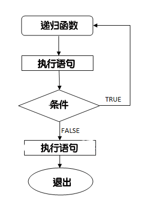

# typedef

C 语言提供了 **typedef** 关键字，您可以使用它来为类型取一个新的名字。下面的实例为单字节数字定义了一个术语 **BYTE**：

```c++
typedef unsigned char BYTE;
```

在这个类型定义之后，标识符 BYTE 可作为类型 **unsigned char** 的缩写，例如：

```c
BYTE  b1, b2;
```

按照惯例，定义时会大写字母，以便提醒用户类型名称是一个象征性的缩写

也可以使用 **typedef** 来为用户自定义的数据类型取一个新的名字。例如，==可以对结构体使用 typedef 来定义一个新的数据类型名字==，然后使用这个新的数据类型来直接定义结构变量，如下：

```c
typedef struct Books
{
   char  title[50];
   char  author[50];
   char  subject[100];
   int   book_id;
} Book;
 
int main( )
{
   Book book;

   return 0;
}
```

## typedef vs define

**#define** 是 C 指令，用于为各种数据类型定义别名，与 **typedef** 类似，但是它们有以下几点不同：

- ==**typedef** 仅限于为类型定义符号名称，**#define** 不仅可以为类型定义别名，也能为数值定义别名，比如您可以定义 1 为 ONE==。
- ==**typedef** 是由编译器执行解释的，**#define** 语句是由预编译器进行处理的==。

（1）#define可以使用其他类型说明符对宏类型名进行扩展，但对 typedef 所定义的类型名却不能这样做。例如：

```c
#define INTERGE int
unsigned INTERGE n;  //没问题
typedef int INTERGE;
unsigned INTERGE n;  //错误，不能在 INTERGE 前面添加 unsigned
```

（2） ==在连续定义几个变量的时候，typedef 能够保证定义的所有变量均为同一类型，而 #define 则无法保证==。例如：

```c
#define PTR_INT int *
PTR_INT p1, p2;        //p1、p2 类型不相同，宏展开后变为int *p1, p2;
typedef int * PTR_INT
PTR_INT p1, p2;        //p1、p2 类型相同，它们都是指向 int 类型的指针。
```

typdef 的一些特性与 define 的功能重合。例如：

```c
#define BYTE unsigned char
```

这是预处理器用 BYTE 替换 unsigned char。

但也有 #define 没有的功能，例如：

```c
typedef char * STRING;
```

编译器把 STRING 解释为一个类型的表示符，该类型指向 char。因此：

```c
STRING name, sign;
```

相当于：

```c
char * name , * sign;  
```

但是，如果这样假设：

```c
#define STRING char *
```

然后，下面的声明：

```c
STRING name, sign;
```

将被翻译成：

```c
char * name, sign;
```

这导致 name 才是指针。

简而言之，**#define** 只是字面上的替换，由预处理器执行，**#define A B** 相当于打开编辑器的替换功能，把所有的 B 替换成 A。

与 #define 不同，typedef 具有以下三个特点：

- 1.typedef 给出的符号名称仅限于对类型，而不是对值。
- 2.typedef 的解释由编译器，而不是预处理器执行。并不是简单的文本替换。
- 3.虽然范围有限，但是在其受限范围内 typedef 比 #define 灵活。

------

用 **typedef** 为数组去别名：

```c
typedef int A[6];
```

表示用 **A** 代替 **int [6]**。

即：**A a;** 等于 **int a[6];**

------

==typedef 还有一个作用，就是为复杂的声明定义一个新的简单的别名。用在回调函数中特别好用==：

1. 原声明：**int \*(\*a[5])(int, char\*);**

在这里，变量名为 **a**，直接用一个新别名 **pFun** 替换 **a** 就可以了：

```c
typedef int *(*pFun)(int, char*);

```

于是，原声明的最简化版：

```c
pFun a[5];
```

2. 原声明：**void (\*b[10]) (void (\*)());**

这里，变量名为 b，先替换右边部分括号里的，pFunParam 为别名一：

```c
typedef void (*pFunParam)();

```

再替换左边的变量 **b**，**pFunx** 为别名二：

```c
typedef void (*pFunx)(pFunParam);

```

于是，原声明的最简化版：

```c
pFunx b[10];
```

其实，可以这样理解:

```c
typedef int *(*pFun)(int, char*); 
```

由 **typedef** 定义的函数 **pFun**，为一个新的类型，所以这个新的类型可以像 **int** 一样定义变量，于是，**pFun a[5];** 就定义了 **int \*(\*a[5])(int, char\*);**

所以我们可以用来定义回调函数，特别好用。

另外，也要注意，typedef 在语法上是一个存储类的关键字（如 auto、extern、mutable、static、register 等一样），虽然它并不真正影响对象的存储特性，如：

```c
typedef static int INT2; // 不可行
```

编译将失败，会提示“指定了一个以上的存储类”。

------

# 输入 & 输出

当我们提到**输入**时，这意味着要向程序填充一些数据。输入可以是以文件的形式或从命令行中进行。C 语言提供了一系列内置的函数来读取给定的输入，并根据需要填充到程序中。

当我们提到**输出**时，这意味着要在屏幕上、打印机上或任意文件中显示一些数据。C 语言提供了一系列内置的函数来输出数据到计算机屏幕上和保存数据到文本文件或二进制文件中。

## 标准文件

==C 语言把所有的设备都当作文件==。以下三个文件会在程序执行时自动打开，以便访问键盘和屏幕。

| ==标准文件== | ==文件指针== | ==设备== |
| :----------- | :----------- | :------- |
| ==标准输入== | ==stdin==    | ==键盘== |
| ==标准输出== | ==stdout==   | ==屏幕== |
| ==标准错误== | ==stderr==   | ==屏幕== |

==文件指针==是访问文件的方式

C 语言中的 I/O (输入/输出) 通常使用 printf() 和 scanf() 两个函数。

scanf() 函数用于从标准输入（键盘）读取并格式化， printf() 函数发送格式化输出到标准输出（屏幕）。

## getchar() 与 putchar()函数

**int getchar(void)** 函数从屏幕读取下一个可用的字符，并把它返回为一个整数。这个函数在同一个时间内只会读取一个单一的字符。您可以在循环内使用这个方法，以便从屏幕上读取多个字符。

**int putchar(int c)** 函数把字符输出到屏幕上，并返回相同的字符。这个函数在同一个时间内只会输出一个单一的字符。您可以在循环内使用这个方法，以便在屏幕上输出多个字符。

请看下面的实例：

```c
#include <stdio.h>

int main()
{
	int c;

	printf("Enter a value :");
	c = getchar();

	printf("\nYou entered: ");
	putchar(c);
	printf("\n");
	return 0;
}
```

当上面的代码被编译和执行时，它会等待您输入一些文本，当您输入一个文本并按下回车键时，程序会继续并只会读取一个单一的字符，

## scanf() 和 printf() 函数

**int scanf(const char \*format, ...)** 函数从标准输入流 **stdin** 读取输入，并根据提供的 **format** 来浏览输入。

**int printf(const char \*format, ...)** 函数把输出写入到标准输出流 **stdout** ，并根据提供的格式产生输出。

在==读取字符串时，只要遇到一个空格，scanf() 就会停止读取，所以 "this is test" 对 scanf() 来说是三个字符串。==

## fgets()与fputs()

fgets函数原型：==char *fgets(char *s, int n, FILE *stream)==;//我们平时可以这么使用：==fgets(str, sizeof(str), stdin)==;

其中str为数组首地址，sizeof(str)为数组大小，stdin表示我们从键盘输入数据。

fgets函数功能：从文件指针stream中读取字符，存到以s为起始地址的空间里，==直到读完N-1个字符，或者读完一行==。

**注意：**==调用fgets函数时，最多只能读入n-1个字符。读入结束后，系统将自动在最后加'\0'，并以str作为函数值返回==。

```c
#include <stdio.h>

int main()
{
	char c[100];
	printf("Enter a value:");
	fgets(c, 100, stdin);

	printf("\nyou entered:");
	fputs(c, stdout);

	return 0;
}
```

## Windows、Unix、Mac不同操作系统的换行问题 回车符\r和换行符\n

**一、概念：**

**换行符‘\n’**和**回车符‘\r’**

（1）换行符就是另起一行  --- '**\n**' 10 换行（newline）

（2）回车符就是回到一行的开头 --- '**\r**' 13 回车（return）

所以我们平时编写文件的回车符应该确切来说叫做**回车换行符**  

**CR: 回车(Carriage Return) \rLF: 换行(Line Feed) \n**

**二、应用：**

（1）在微软的MS-DOS和Windows中，使用“回车CR('\r')”和“换行LF('\n')”两个字符作为换行符;

（2）Windows系统里面，每行结尾是 回车+换行(CR+LF)，即“\r\n”；

（3）Unix系统里，每行结尾只有 换行LF，即“\n”；

（4）Mac系统里，每行结尾是 回车CR 即'\r'。

Mac OS 9 以及之前的系统的换行符是 CR，从 Mac OS X （后来改名为“OS X”）开始的换行符是 LF即‘\n'，和Unix/Linux统一了。

**三、影响：**

（1）一个直接后果是，Unix/Mac系统下的文件在Windows里打开的话，所有文字会变成一行；

（2）而Windows里的文件在Unix/Mac下打开的话，在每行的结尾可能会多出一个^M符号。

（3）Linux保存的文件在windows上用记事本看的话会出现黑点。

**四、可以相互转换**：

在linux下，命令unix2dos 是把linux文件格式转换成windows文件格式，命令dos2unix 是把windows格式转换成linux文件格式。

在不同平台间使用FTP软件传送文件时, 在ascii文本模式传输模式下, 一些FTP客户端程序会自动对换行格式进行转换. 经过这种传输的文件字节数可能会发生变化.

 如果你不想ftp修改原文件, 可以使用bin模式(二进制模式)传输文本。

一个程序在windows上运行就生成CR/LF换行格式的文本文件，而在Linux上运行就生成LF格式换行的文本文件。

------

学 C 语言的时候，字符输入曾经困扰过我，例如这段代码：

```c
int i;
char c;
scanf("%d%c", &i,&c);
```

这时候变量 c 中存储的往往不是你想输入的字符，而是一个空格，然后我们又会这样来写：

```c
int i;
char c;
scanf("%d", &i);
scanf("%c", &c);

```

这时候，我们发现，根本没有输入字符C的机会，这是为什么？因为输入流是有缓冲区的，我们输入的字符存储在那，然后再赋值给我们的变量。我们可以这样改：

```c
int i;
char c;
scanf("%d", &i);
while((c=getchar())==' ' || c=='\n');
c = getchar();
```

这个办法是一直读取，读到没有空格和换行就跳出循环，但是有一个更好的解决办法；

```c
int i;
char c;
scanf("%d%[^' '^'\n']", &i, &c);
```

这是用==正则表达==来控制输入格式为非空格非换行。

------

在进行输出时，若要用到用来输出实数的 **f** 格式符（以小数形式输出），有以下几种用法：

**1、基本型，用 %f**

不指定输出类型的长度，用系统根据情况决定，==一般是实数中的整数部分全部输出，小数部分输出六位==。例：

```c
double a=1.0;
printf("%f\n",a/3);
```

**2、指定数据宽度和小数位数，用 %m.nf**

例：将上个程序的双精度变量 a 输出 15 位小数，用 ==**%20.15f** 的格式声明，指定输出的数据占 20 列，其中包括 15 位小数==。改动上面程序如下：

```c
double a=1.0;
printf("%20.15f\n",a/3);
```

运行结果：   **0.333333333333333**

注意在 0 的前面有 3 个空格，且双精度数只保证 15 位有效数字的准确性。

**3、==输出的数据相左对齐，用 %-m.nf==**

在 **m.n** 前加一个负号，其作用与 **%m.nf** 形式作用基本相同，但当数据长度不长过 **m** 时，数据向左靠，右端补空格。

------

scanf 是有返回值的

- 1、==scanf() 函数有返回值且类型 int 型，当发生错误时立刻返回 EOF==。
- 2、==scanf() 函数返回的值为：正确按指定格式输入变量的个数；也即能正确接收到值的变量个数==。

------

==在输入时注意格式对应：==

```c
int a;
float x;
char c1;
scanf("a=%d",&a);
scanf("x=%f",&x);
scanf("c1=%c",&c1);
```

若在输入时用错空格键或者换行符，则会出现错误:

```c
a=1 x=1.2 c1=3
```

上述输入只能输出 a=1 因为空格键取代了 x 的位置 输入完 x=1.2 后空格键有取代了应该输入 c1 的位置。

正确的输入应为:

```c
a=1x=1.2c1=3
```

------

# 文件读写

## 打开文件

==使用 **fopen( )** 函数来创建一个新的文件或者打开一个已有的文件==，这个调用会初始化类型 **FILE** 的一个对象，类型 **FILE** 包含了所有用来控制流的必要的信息。下面是这个函数调用的原型：

```c
FILE *fopen( const char * filename, const char * mode );

```

在这里，**filename** 是字符串，用来命名文件，访问模式 **mode** 的值可以是下列值中的一个：

| 模式   | 描述                                                         |
| :----- | :----------------------------------------------------------- |
| ==r==  | ==打开一个已有的文本文件，允许读取文件。==                   |
| ==w==  | 打开一个文本文件，允许==写入文件。如果文件不存在，则会创建一个新文件==。在这里，==您的程序会从文件的开头写入内容。如果文件存在，则该会被截断为零长度，重新写入。== |
| ==a==  | 打开一个文本文件，==以追加模式写入文件。如果文件不存在，则会创建一个新文件。在这里，您的程序会在已有的文件内容中追加内容。== |
| ==r+== | ==打开一个文本文件，允许读写文件。==                         |
| ==w+== | ==打开一个文本文件，允许读写文件。如果文件已存在，则文件会被截断为零长度，如果文件不存在，则会创建一个新文件。== |
| ==a+== | ==打开一个文本文件，允许读写文件。如果文件不存在，则会创建一个新文件。读取会从文件的开头开始，写入则只能是追加模式。== |

如果处理的是==二进制文件==，则需使用下面的访问模式来取代上面的访问模式：

```c
"rb", "wb", "ab", "rb+", "r+b", "wb+", "w+b", "ab+", "a+b"
```

## 关闭文件

为了关闭文件，请使用 fclose( ) 函数。函数的原型如下：

```c
 int fclose( FILE *fp );
```

==如果成功关闭文件，**fclose( )** 函数返回零，如果关闭文件时发生错误，函数返回 **EOF**==。这个函数实际上，会清空缓冲区中的数据，关闭文件，并释放用于该文件的所有内存。==EOF 是一个定义在头文件 **stdio.h** 中的常量==。

C 标准库提供了各种函数来按字符或者以固定长度字符串的形式读写文件。

## 写入文件

下面是把字符写入到流中的最简单的函数：

```c
int fputc( int c, FILE *fp );
```

函数 ==**fputc()**== 把参数 c 的==字符==值写入到 fp 所指向的输出流中。==如果写入成功，它会返回写入的字符，如果发生错误，则会返回 **EOF**==。您可以使用下面的函数来把一个以 null 结尾的字符串写入到流中：

```c
int fputs( const char *s, FILE *fp );
```

函数 **==fputs()==** 把==字符串== **s** 写入到 fp 所指向的输出流中。==如果写入成功，它会返回一个非负值，如果发生错误，则会返回 **EOF**==。您也可以使用 ==**int fprintf(FILE \*fp,const char \*format, ...)**== 函数来写把一个字符串写入到文件中。尝试下面的实例：

> **注意：**请确保您有可用的 **tmp** 目录，如果不存在该目录，则需要在您的计算机上先创建该目录。
>
> **/tmp** 一般是 Linux 系统上的临时目录，如果你在 Windows 系统上运行，则需要修改为本地环境中已存在的目录，例如: **C:\tmp**、**D:\tmp**等。

```c
#include <stdio.h>
 
int main()
{
   FILE *fp = NULL;
 
   fp = fopen("/tmp/test.txt", "w+");
   fprintf(fp, "This is testing for fprintf...\n");
   fputs("This is testing for fputs...\n", fp);
   fclose(fp);
}
```

当上面的代码被编译和执行时，它会在 /tmp 目录中创建一个新的文件 **test.txt**，并使用两个不同的函数写入两行。接下来让我们来读取这个文件。

## 读取文件

下面是从文件读取单个字符的最简单的函数：

```c
int fgetc( FILE * fp );
```

==**fgetc()** 函数从 fp 所指向的输入文件中读取一个字符。返回值是读取的字符，如果发生错误则返回 **EOF==**。下面的函数允许您从流中读取一个字符串：

```c
char *fgets( char *buf, int n, FILE *fp );
```

函数 ==**fgets()** 从 fp 所指向的输入流中读取 n - 1 个字符。它会把读取的字符串复制到缓冲区 **buf**，并在最后追加一个 **null** 字符来终止字符串。==

==如果这个函数在读取最后一个字符之前就遇到一个换行符 '\n' 或文件的末尾 EOF，则只会返回读取到的字符，包括换行符。==您也可以使用 ==**int fscanf(FILE \*fp, const char \*format, ...)** 函数来从文件中读取字符串，但是在遇到第一个空格字符时，它会停止读取。==

```c
#include <stdio.h>
 
int main()
{
   FILE *fp = NULL;
   char buff[255];
 
   fp = fopen("/tmp/test.txt", "r");
   fscanf(fp, "%s", buff);
   printf("1: %s\n", buff );
 
   fgets(buff, 255, (FILE*)fp);
   printf("2: %s\n", buff );
   
   fgets(buff, 255, (FILE*)fp);
   printf("3: %s\n", buff );
   fclose(fp);
 
}
```

当上面的代码被编译和执行时，它会读取上一部分创建的文件，产生下列结果：

```c
1: This
2: is testing for fprintf...

3: This is testing for fputs...
```

首先，**fscanf()** 方法只读取了 **This**，因为它在后边遇到了一个空格。其次，调用 **fgets()** 读取剩余的部分，直到行尾。最后，调用 **fgets()** 完整地读取第二行。

## 二进制 I/O 函数

下面两个函数用于二进制输入和输出：

```c
size_t fread(void *ptr, size_t size_of_elements, 
             size_t number_of_elements, FILE *a_file);
              
size_t fwrite(const void *ptr, size_t size_of_elements, 
             size_t number_of_elements, FILE *a_file);
```

这两个函数都是用于存储块的读写 - 通常是数组或结构体。

### fseek函数

==fseek 可以移动文件指针到指定位置读,或插入写==:

```c
int fseek(FILE *stream, long offset, int whence);
```

==fseek 设置当前读写点到 offset 处, whence 可以是 SEEK_SET,SEEK_CUR,SEEK_END 这些值决定是从文件头、当前点和文件尾计算偏移量 offset==。

你可以定义一个文件指针 **FILE \*fp**,当你打开一个文件时，文件指针指向开头，你要指到多少个字节，只要控制偏移量就好，例如, 相对当前位置往后移动一个字节：**fseek(fp,1,SEEK_CUR);** 中间的值就是偏移量。 如果你要往前移动一个字节，直接改为负值就可以：**fseek(fp,-1,SEEK_CUR)**。

执行以下实例前，确保当前目录下 **test.txt** 文件已创建：

```c
#include <stdio.h>

int main(){   
    FILE *fp = NULL;
    fp = fopen("test.txt", "r+");  // 确保 test.txt 文件已创建
    fprintf(fp, "This is testing for fprintf...\n");   
    fseek(fp, 10, SEEK_SET);
    if (fputc(65,fp) == EOF) {
        printf("fputc fail");   
    }   
    fclose(fp);
}
```

执行结束后，打开 test.txt 文件：

```c
This is teAting for fprintf...
```

**注意：** ==只有用 **r+** 模式打开文件才能插入内容，**w** 或 **w+** 模式都会清空掉原来文件的内容再来写，**a** 或 **a+** 模式即总会在文件最尾添加内容，哪怕用 fseek() 移动了文件指针位置。==

------

# 预处理器

**C 预处理器**不是编译器的组成部分，但是它是编译过程中一个单独的步骤。简言之，==C 预处理器只不过是一个文本替换工具而已==，它们会指示编译器在实际编译之前完成所需的预处理。我们将把 C 预处理器（C Preprocessor）简写为 CPP。

所有的预处理器命令都是以井号（#）开头。它必须是第一个非空字符，为了增强可读性，预处理器指令应从第一列开始。下面列出了所有重要的预处理器指令：

| 指令     | 描述                                                        |
| :------- | :---------------------------------------------------------- |
| #define  | 定义宏                                                      |
| #include | 包含一个源代码文件                                          |
| #undef   | 取消已定义的宏                                              |
| #ifdef   | 如果宏已经定义，则返回真                                    |
| #ifndef  | 如果宏没有定义，则返回真                                    |
| #if      | 如果给定条件为真，则编译下面代码                            |
| #else    | #if 的替代方案                                              |
| #elif    | 如果前面的 #if 给定条件不为真，当前条件为真，则编译下面代码 |
| #endif   | 结束一个 #if……#else 条件编译块                              |
| #error   | 当遇到标准错误时，输出错误消息                              |
| #pragma  | 使用标准化方法，向编译器发布特殊的命令到编译器中            |

## 预处理器实例

分析下面的实例来理解不同的指令。

```c
#define MAX_ARRAY_LENGTH 20
```

这个指令告诉 CPP 把所有的 MAX_ARRAY_LENGTH 替换为 20。使用 *#define* 定义常量来增强可读性。

```c
#include <stdio.h>
#include "myheader.h"
```

这些指令告诉 CPP ==从**系统库**中==获取 stdio.h，并添加文本到当前的源文件中。下一行告诉 CPP ==从本地目录中==获取 **myheader.h**，并添加内容到当前的源文件中。

```c
#undef  FILE_SIZE
#define FILE_SIZE 42
```

这个指令告诉 CPP 取消已定义的 FILE_SIZE，并定义它为 42。

```c
#ifndef MESSAGE
   #define MESSAGE "You wish!"
#endif
```

==这个指令告诉 CPP 只有当 MESSAGE 未定义时，才定义 MESSAGE==。

```c
#ifdef DEBUG
   /* Your debugging statements here */
#endif
```

==这个指令告诉 CPP 如果定义了 DEBUG，则执行处理语句。在编译时，如果您向 gcc 编译器传递了 *-DDEBUG* 开关量，这个指令就非常有用。它定义了 DEBUG，您<font color = red>可以在编译期间随时开启或关闭调试</font>。==

## 预定义宏

ANSI C 定义了许多宏。在编程中您可以使用这些宏，但是不能直接修改这些预定义的宏。

| 宏             | 描述                                                    |
| :------------- | :------------------------------------------------------ |
| ==\__DATE\__== | ==当前日期，一个以 "MMM DD YYYY" 格式表示的字符常量。== |
| ==\__TIME\__== | ==当前时间，一个以 "HH:MM:SS" 格式表示的字符常量。==    |
| ==\__FILE\__== | ==这会包含当前文件名，一个字符串常量。==                |
| ==\__LINE\__== | ==这会包含当前行号，一个十进制常量。==                  |
| ==\__STDC\__== | ==当编译器以 ANSI 标准编译时，则定义为 1。==            |

让我们来尝试下面的实例：

```c
#include <stdio.h>

main()
{
   printf("File :%s\n", __FILE__ );
   printf("Date :%s\n", __DATE__ );
   printf("Time :%s\n", __TIME__ );
   printf("Line :%d\n", __LINE__ );
   printf("ANSI :%d\n", __STDC__ );

}
```

## 预处理器运算符

C 预处理器提供了下列的运算符来帮助您创建宏：

##### ==宏延续运算符（\）==

一个宏通常写在一个单行上。但是如果宏太长，一个单行容纳不下，则使用宏延续运算符（\）。例如：

```c
#define  message_for(a, b)  \
    printf(#a " and " #b ": We love you!\n")
```

##### ==字符串常量化运算符（#）==

在宏定义中，当需要把一个宏的参数转换为字符串常量时，则使用字符串常量化运算符（#）。在宏中使用的该运算符有一个特定的参数或参数列表。例如：

```c
#include <stdio.h>

#define  message_for(a, b)  \
    printf(#a " and " #b ": We love you!\n")

int main(void)
{
   message_for(Carole, Debra);
   return 0;
}
```

当上面的代码被编译和执行时，它会产生下列结果：

```c
Carole and Debra: We love you!
```

##### ==标记粘贴运算符（##）==

宏定义内的标记粘贴运算符（##）会合并两个参数。它允许在宏定义中两个独立的标记被合并为一个标记。例如：

```c
#include <stdio.h>

#define tokenpaster(n) printf ("token" #n " = %d", token##n)

int main(void)
{
   int token34 = 40;
   
   tokenpaster(34);
   return 0;
}

```

当上面的代码被编译和执行时，它会产生下列结果：

```c
token34 = 40

```

这是怎么发生的，因为这个实例会从编译器产生下列的实际输出：

```c
printf ("token34 = %d", token34);
```

这个实例演示了 token##n 会连接到 token34 中，在这里，我们使用了**字符串常量化运算符（#）**和**标记粘贴运算符（##）**。

##### ==defined() 运算符==

预处理器 **defined** 运算符是用在常量表达式中的，用来确定一个标识符是否已经使用 #define 定义过。如果指定的标识符已定义，则值为真（非零）。如果指定的标识符未定义，则值为假（零）。下面的实例演示了 defined() 运算符的用法：

```c
#include <stdio.h>

#if !defined (MESSAGE)
   #define MESSAGE "You wish!"
#endif

int main(void)
{
   printf("Here is the message: %s\n", MESSAGE);  
   return 0;
}
```

当上面的代码被编译和执行时，它会产生下列结果：

```c
Here is the message: You wish!
```

## ==参数化的宏==

CPP 一个强大的功能是可以使用参数化的宏来模拟函数。例如，下面的代码是计算一个数的平方：

```c
int square(int x) {
   return x * x;
}
```

我们可以使用宏重写上面的代码，如下：

```c
#define square(x) ((x) * (x))

```

==在使用带有参数的宏之前，必须使用 **#define** 指令定义。参数列表是括在圆括号内，且必须紧跟在宏名称的后边。宏名称和左圆括号之间不允许有空格==。例如：

```c
#include <stdio.h>

#define MAX(x,y) ((x) > (y) ? (x) : (y))

int main(void)
{
   printf("Max between 20 and 10 is %d\n", MAX(10, 20));  
   return 0;
}

```

当上面的代码被编译和执行时，它会产生下列结果：

```c
Max between 20 and 10 is 20

```

------

使用#define含参时，参数括号很重要，如上例中省略括号会导致运算错误：

```c
#include <stdio.h>

#define square(x) ((x) * (x))

#define square_1(x) (x * x)

int main(void)
{
   printf("square 5+4 is %d\n", square(5+4));  
   printf("square_1 5+4 is %d\n", square_1(5+4)); 
   return 0;
}

```

输出结果为：

```c
square 5+4 is 81
square_1 5+4 is 29

```

原因:

```c
square   等价于   （5+4）*（5+4）=81
square_1 等价于   5+4*5+4=29

```

------

# 头文件

==头文件是扩展名为 **.h** 的文件，包含了 C 函数声明和宏定义，被多个源文件中引用共享==。有两种类型的头文件：程序员编写的头文件和编译器自带的头文件。

==引用头文件相当于复制头文件的内容==，但是我们不会直接在源文件中复制头文件的内容，因为这么做很容易出错，特别在程序是由多个源文件组成的时候。

A simple practice in C 或 C++ 程序中，==建议把所有的常量、宏、系统全局变量和函数原型写在头文件中，在需要的时候随时引用这些头文件。==

## 引用头文件的语法

使用预处理指令 **#include** 可以引用用户和系统头文件。它的形式有以下两种：

```c
#include <file>
```

这种形式用于引用系统头文件。它在==系统目录==的标准列表中搜索名为 file 的文件。在编译源代码时，您可以通过 ==-I 选项==把目录前置在该列表前。

```c
#include "file"
```

这种形式用于引用用户头文件。它在包含==当前文件的目录==中搜索名为 file 的文件。在编译源代码时，您可以通过 ==-I 选项==把目录前置在该列表前。

## 引用头文件的操作

**#include** 指令会指示 C 预处理器浏览指定的文件作为输入。==预处理器的输出包含了已经生成的输出，被引用文件生成的输出以及 **#include** 指令之后的文本输出==。例如，如果您有一个头文件 header.h，如下：

```c
char *test (void);
```

和一个使用了头文件的主程序 *program.c*，如下：

```c
int x;
#include "header.h"

int main (void)
{
   puts (test ());
}
```

编译器会看到如下的代码信息：

```c
int x;
char *test (void);

int main (void)
{
   puts (test ());
}
```

## 只引用一次头文件

==如果一个头文件被引用两次，编译器会处理两次头文件的内容，这将产生错误。为了防止这种情况，标准的做法是把文件的整个内容放在条件编译语句中，==如下：

```c
#ifndef HEADER_FILE
#define HEADER_FILE

the entire header file file

#endif

```

这种结构就是通常所说的包装器 **#ifndef**。当再次引用头文件时，条件为假，因为 HEADER_FILE 已定义。此时，预处理器会跳过文件的整个内容，编译器会忽略它。

## 有条件引用

有时需要从多个不同的头文件中选择一个引用到程序中。例如，需要指定在不同的操作系统上使用的配置参数。您可以通过一系列条件来实现这点，如下：

```c
#if SYSTEM_1
   # include "system_1.h"
#elif SYSTEM_2
   # include "system_2.h"
#elif SYSTEM_3
   ...
#endif
```

但是如果头文件比较多的时候，这么做是很不妥当的，预处理器使用宏来定义头文件的名称。这就是所谓的**有条件引用**。它不是用头文件的名称作为 **#include** 的直接参数，您只需要使用宏名称代替即可：

```c
 #define SYSTEM_H "system_1.h"
 ...
 #include SYSTEM_H
```

SYSTEM_H 会扩展，预处理器会查找 system_1.h，就像 **#include** 最初编写的那样。SYSTEM_H 可通过 -D 选项被您的 Makefile 定义。

------

在有多个 **.h** 文件和多个 **.c** 文件的时候，往往我们会用一个 **global.h** 的头文件来包括所有的 **.h** 文件，然后在除 **global.h** 文件外的头文件中 包含 **global.h** 就可以实现所有头文件的包含，同时不会乱。方便在各个文件里面调用其他文件的函数或者变量。

```c
#ifndef _GLOBAL_H
#define _GLOBAL_H
#include <fstream>
#include <iostream>
#include <math.h>
#include <Config.h>
```

------

# 强制类型转换

强制类型转换是把变量从一种类型转换为另一种数据类型。例如，如果您想存储一个 long 类型的值到一个简单的整型中，您需要把 long 类型强制转换为 int 类型。您可以使用**强制类型转换运算符**来把值显式地从一种类型转换为另一种类型，如下所示：

```c
(type_name) expression
```

请看下面的实例，使用强制类型转换运算符把一个整数变量除以另一个整数变量，得到一个浮点数：

## 实例

```c
#include <stdio.h>
 
int main()
{
   int sum = 17, count = 5;
   double mean;
 
   mean = (double) sum / count;
   printf("Value of mean : %f\n", mean );
 
}
```

当上面的代码被编译和执行时，它会产生下列结果：

```
Value of mean : 3.400000
```

这里要注意的是强制类型转换运算符的优先级大于除法，因此 **sum** 的值首先被转换为 **double** 型，然后除以 count，得到一个类型为 double 的值。

类型转换可以是隐式的，由编译器自动执行，也可以是显式的，通过使用**强制类型转换运算符**来指定。在编程时，有需要类型转换的时候都用上强制类型转换运算符，是一种良好的编程习惯。

## 整数提升

==整数提升是指把小于 **int** 或 **unsigned int** 的整数类型转换为 **int** 或 **unsigned int** 的过程==。请看下面的实例，在 int 中添加一个字符：

## 实例

```c
#include <stdio.h>
 
int main()
{
   int  i = 17;
   char c = 'c'; /* ascii 值是 99 */
   int sum;
 
   sum = i + c;
   printf("Value of sum : %d\n", sum );
 
}
```

当上面的代码被编译和执行时，它会产生下列结果：

```
Value of sum : 116
```

在这里，sum 的值为 116，因为编译器进行了整数提升，在执行实际加法运算时，把 'c' 的值转换为对应的 ascii 值。

## 常用的算术转换

**常用的算术转换**是隐式地把值强制转换为相同的类型。编译器首先执行**整数提升**，如果操作数类型不同，则它们会被转换为下列层次中出现的最高层次的类型：


## 实例

```c
#include <stdio.h>
 
int main()
{
   int  i = 17;
   char c = 'c'; /* ascii 值是 99 */
   float sum;
 
   sum = i + c;
   printf("Value of sum : %f\n", sum );
 
}
```

当上面的代码被编译和执行时，它会产生下列结果：

```
Value of sum : 116.000000
```

在这里，c 首先被转换为整数，但是由于最后的值是 float 型的，所以会应用常用的算术转换，编译器会把 i 和 c 转换为浮点型，并把它们相加得到一个浮点数。

如果一个运算符两边的运算数类型不同，先要将其转换为相同的类型，即较低类型转换为较高类型，然后再参加运算，转换规则如下图所示。


------

# 错误处理

C 语言不提供对错误处理的直接支持，但是作为一种系统编程语言，它以返回值的形式允许您访问底层数据。在发生错误时，大多数的 C 或 UNIX 函数调用==返回 1== 或 NULL，同时会设置一个错误代码 **==errno==**，该错误代码是==全局变量==，表示在函数调用期间发生了错误。您可以在 ==errno.h== 头文件中找到各种各样的错误代码。

所以，C 程序员可以通过检查返回值，然后根据返回值决定采取哪种适当的动作。开发人员==应该在程序初始化时，把 errno 设置为 0，这是一种良好的编程习惯。0 值表示程序中没有错误。==

## ==errno、perror() 和 strerror()==

C 语言提供了 **perror()** 和 **strerror()** 函数来显示与 **errno** 相关的文本消息。

- ==**perror()** 函数显示您传给它的字符串，后跟一个冒号、一个空格和当前 errno 值的文本表示形式==。
- ==**strerror()** 函数，返回一个指针，指针指向当前 errno 值的文本表示形式。==

让我们来模拟一种错误情况，尝试打开一个不存在的文件。您可以使用多种方式来输出错误消息，在这里我们使用函数来演示用法。另外有一点需要注意，您应该使用 **stderr** 文件流来输出所有的错误。

## 实例

```c
#include <stdio.h>
#include <errno.h>
#include <string.h>
 
extern int errno ;
 
int main ()
{
   FILE * pf;
   int errnum;
   pf = fopen ("unexist.txt", "rb");
   if (pf == NULL)
   {
      errnum = errno;
      fprintf(stderr, "错误号: %d\n", errno);
      perror("通过 perror 输出错误");
      fprintf(stderr, "打开文件错误: %s\n", strerror( errnum ));
   }
   else
   {
      fclose (pf);
   }
   return 0;
}

```

当上面的代码被编译和执行时，它会产生下列结果：

```
错误号: 2
通过 perror 输出错误: No such file or directory
打开文件错误: No such file or directory
```

## 被零除的错误

在进行除法运算时，如果不检查除数是否为零，则会导致一个运行时错误。

为了避免这种情况发生，下面的代码在进行除法运算前会先检查除数是否为零：

```c
#include <stdio.h>
#include <stdlib.h>
 
main()
{
   int dividend = 20;
   int divisor = 0;
   int quotient;
 
   if( divisor == 0){
      fprintf(stderr, "除数为 0 退出运行...\n");
      exit(-1);
   }
   quotient = dividend / divisor;
   fprintf(stderr, "quotient 变量的值为 : %d\n", quotient );
 
   exit(0);
}
```

当上面的代码被编译和执行时，它会产生下列结果：

```c
除数为 0 退出运行...
```

## 程序退出状态

通常情况下，程序成功执行完一个操作正常退出的时候会带有值 EXIT_SUCCESS。在这里，==EXIT_SUCCESS 是宏，它被定义为 0==。

如果程序中存在一种错误情况，==当您退出程序时，会带有状态值 EXIT_FAILURE，被定义为 -1==。所以，上面的程序可以写成：

```c
#include <stdio.h>
#include <stdlib.h>
 
main()
{
   int dividend = 20;
   int divisor = 5;
   int quotient;
 
   if( divisor == 0){
      fprintf(stderr, "除数为 0 退出运行...\n");
      exit(EXIT_FAILURE);
   }
   quotient = dividend / divisor;
   fprintf(stderr, "quotient 变量的值为: %d\n", quotient );
 
   exit(EXIT_SUCCESS);
}
```

当上面的代码被编译和执行时，它会产生下列结果：

```c
quotient 变量的值为 : 4
```

------

# 递归

递归指的是在函数的定义中使用函数自身的方法。

语法格式如下：

```c
void recursion()
{
   statements;
   ... ... ...
   recursion(); /* 函数调用自身 */
   ... ... ...
}
 
int main()
{
   recursion();
}
```

流程图：



C 语言支持递归，即一个函数可以调用其自身。但在使用递归时，程序员需要注意定义一个从函数退出的条件，否则会进入死循环。

递归函数在解决许多数学问题上起了至关重要的作用，比如计算一个数的阶乘、生成斐波那契数列，等等。

## 数的阶乘

下面的实例使用递归函数计算一个给定的数的阶乘：

## 实例

```c
#include <stdio.h>
 
double factorial(unsigned int i)
{
   if(i <= 1)
   {
      return 1;
   }
   return i * factorial(i - 1);
}
int  main()
{
    int i = 15;
    printf("%d 的阶乘为 %f\n", i, factorial(i));
    return 0;
}
```

当上面的代码被编译和执行时，它会产生下列结果：

```
15 的阶乘为 1307674368000.000000
```

## 斐波那契数列

下面的实例使用递归函数生成一个给定的数的斐波那契数列：

```c#
#include <stdio.h>
 
int fibonaci(int i)
{
   if(i == 0)
   {
      return 0;
   }
   if(i == 1)
   {
      return 1;
   }
   return fibonaci(i-1) + fibonaci(i-2);
}
 
int  main()
{
    int i;
    for (i = 0; i < 10; i++)
    {
       printf("%d\t\n", fibonaci(i));
    }
    return 0;
}
```

递归是一个简洁的概念，同时也是一种很有用的手段。但是，使用递归是要付出代价的。与直接的语句(如while循环)相比，递归函数会耗费更多的运行时间，并且要占用大量的栈空间。递归函数每次调用自身时，都需要把它的状态存到栈中，以便在它调用完自身后，程序可以返回到它原来的状态。未经精心设计的递归函数总是会带来麻烦。

采用递归方法来解决问题，必须符合以下三个条件：

1、可以把要解决的问题转化为一个新问题，而这个新的问题的解决方法仍与原来的解决方法相同，只是所处理的对象有规律地递增或递减。

说明：解决问题的方法相同，调用函数的参数每次不同（有规律的递增或递减），如果没有规律也就不能适用递归调用。

2、可以应用这个转化过程使问题得到解决。

说明：使用其他的办法比较麻烦或很难解决，而使用递归的方法可以很好地解决问题。

3、必定要有一个明确的结束递归的条件。

说明：一定要能够在适当的地方结束递归调用。不然可能导致系统崩溃。

------

# 可变参数

有时，您可能会碰到这样的情况，您希望函数带有可变数量的参数，而不是预定义数量的参数。C 语言为这种情况提供了一个解决方案，它允许您定义一个函数，能根据具体的需求接受可变数量的参数。下面的实例演示了这种函数的定义。

```c
int func(int, ... ) 
{
   .
   .
   .
}
 
int main()
{
   func(2, 2, 3);
   func(3, 2, 3, 4);
}
```

请注意，函数 **func()** ==最后一个参数写成省略号==，即三个点号（**...**），==省略号之前的那个参数是 **int**，代表了要传递的可变参数的总数==。为了使用这个功能，您需要使用 ==**stdarg.h**== 头文件，该文件提供了实现可变参数功能的函数和宏。具体步骤如下：

- ==定义一个函数，最后一个参数为省略号，省略号前面可以设置自定义参数。==
- ==在函数定义中创建一个 **va_list** 类型变量，该类型是在 stdarg.h 头文件中定义的。==
- ==使用 **int** 参数和 **va_start** 宏来初始化 **va_list** 变量为一个参数列表。宏 va_start 是在 stdarg.h 头文件中定义的。==
- ==使用 **va_arg** 宏和 **va_list** 变量来访问参数列表中的每个项。==
- ==使用宏 **va_end** 来清理赋予 **va_list** 变量的内存。==

现在让我们按照上面的步骤，来编写一个带有可变数量参数的函数，并返回它们的平均值：

## 实例

```c
#include <stdio.h>
#include <stdarg.h>
 
double average(int num,...)
{
 
    va_list valist;
    double sum = 0.0;
    int i;
 
    /* 为 num 个参数初始化 valist */
    va_start(valist, num);
 
    /* 访问所有赋给 valist 的参数 */
    for (i = 0; i < num; i++)
    {
       sum += va_arg(valist, int);
    }
    /* 清理为 valist 保留的内存 */
    va_end(valist);
 
    return sum/num;
}
 
int main()
{
   printf("Average of 2, 3, 4, 5 = %f\n", average(4, 2,3,4,5));
   printf("Average of 5, 10, 15 = %f\n", average(3, 5,10,15));
}
```

当上面的代码被编译和执行时，它会产生下列结果。应该指出的是，函数 **average()** 被调用两次，每次第一个参数都是表示被传的可变参数的总数。省略号被用来传递可变数量的参数。

```
Average of 2, 3, 4, 5 = 3.500000
Average of 5, 10, 15 = 10.000000
```

------

C 函数要在程序中用到以下这些宏:

```c
void va_start( va_list arg_ptr, prev_param ); 
type va_arg( va_list arg_ptr, type ); 
void va_end( va_list arg_ptr );
```

**va_list**: 用来保存宏va_start、va_arg和va_end所需信息的一种类型。为了访问变长参数列表中的参数，必须声明 va_list 类型的一个对象，定义： **typedef char \* va_list;**

**va_start**: 访问变长参数列表中的参数之前使用的宏，它初始化用 va_list 声明的对象，初始化结果供宏 va_arg 和 va_end 使用；

**va_arg**: 展开成一个表达式的宏，该表达式具有变长参数列表中下一个参数的值和类型。每次调用 va_arg 都会修改用 va_list 声明的对象，从而使该对象指向参数列表中的下一个参数；

**va_end**: 该宏使程序能够从变长参数列表用宏 va_start 引用的函数中正常返回。

**va** 在这里是 variable-argument(可变参数) 的意思。

这些宏定义在 stdarg.h 中，所以用到可变参数的程序应该包含这个头文件。

下面我们写一个简单的可变参数的函数，改函数至少有一个整数参数，第二个参数也是整数，是可选的。函数只是打印这两个参数的值。

```c
#include <stdio.h>
#include <string.h>
#include <stdarg.h>

/* ANSI标准形式的声明方式，括号内的省略号表示可选参数 */
int demo(char *msg, ...)
{
    va_list argp;        /* 定义保存函数参数的结构 */
    int argno = 0;       /* 纪录参数个数 */
    char *para;          /* 存放取出的字符串参数 */
    va_start(argp, msg); /* argp指向传入的第一个可选参数，      msg是最后一个确定的参数 */

    while (1)
    {
        para = va_arg(argp, char *); /*      取出当前的参数，类型为char *. */
        if (strcmp(para, "\0") == 0)
            /* 采用空串指示参数输入结束 */
            break;
        printf("Parameter #%d is: %s\n", argno, para);
        argno++;
    }
    va_end(argp); /* 将argp置为NULL */
    return 0;
}

int main(void)
{
    demo("DEMO", "This", "is", "a", "demo!", "333333", "/0");
}
```

------

# 动态内存管理

本章将讲解 C 中的动态内存管理。C 语言为内存的分配和管理提供了几个函数。这些函数可以在 ==<stdlib.h>==头文件中找到。

| 序号 | 函数和描述                                                   |
| :--- | :----------------------------------------------------------- |
| 1    | ==**void \*calloc(int num, int size);**== 在内存中==动态地分配 num 个长度为 size 的连续空间，并将每一个字节都初始化为 0。所以它的结果是分配了 num*size 个字节长度的内存空间，并且每个字节的值都是0==。 |
| 2    | ==**void free(void \*address);**==  该函数释放 address 所指向的内存块,释放的是动态分配的内存空间。 |
| 3    | ==**void \*malloc(int num);**==  在堆区==分配一块指定大小的内存空间，用来存放数据。这块内存空间在函数执行完成后不会被初始化，它们的值是未知的==。==malloc只能返回第一个字节的地址，所以malloc函数前面一般都加上强制类型转换== |
| 4    | ==**void \*realloc(void \*address, int newsize);**==  该函数==重新分配内存，把内存扩展到 **newsize**。== |

**注意：**==void * 类型表示未确定类型的指针。C、C++ 规定 void * 类型可以通过类型转换强制转换为任何其它类型的指针。==

## ==动态分配内存==

编程时，如果您预先知道数组的大小，那么定义数组时就比较容易。例如，一个存储人名的数组，它最多容纳 100 个字符，所以您可以定义数组.

但是，如果您预先不知道需要存储的文本长度，例如您向存储有关一个主题的详细描述。在这里，我们需要定义一个指针，该指针指向未定义所需内存大小的字符，后续再根据需求来分配内存，如下所示：

## 实例

```c
// p本身所占的内存是静态分配的，p指向的内存是动态分配的
int *p = (int *)malloc(4);

// p本身的内存是静态分配的，不能由程序员释放，只能p所在函数终止时由系统释放
free(p);   // 表示把p所指向的内存释放掉，p所指向的内存内容无法再读写
```


```c
#include <stdio.h>
#include <stdlib.h>
#include <string.h>
 
int main()
{
   char name[100];
   char *description;
 
   strcpy(name, "Zara Ali");
 
   /* 动态分配内存 */
   description = (char *)malloc( 200 * sizeof(char) );
   if( description == NULL )
   {
      fprintf(stderr, "Error - unable to allocate required memory\n");
   }
   else
   {
      strcpy( description, "Zara ali a DPS student in class 10th");
   }
   printf("Name = %s\n", name );
   printf("Description: %s\n", description );
}
```

当上面的代码被编译和执行时，它会产生下列结果：

```
Name = Zara Ali
Description: Zara ali a DPS student in class 10th
```

上面的程序也可以使用 **calloc()** 来编写，只需要把 malloc 替换为 calloc 即可，如下所示：

```c
calloc(200, sizeof(char));
```

当动态分配内存时，您有完全控制权，可以传递任何大小的值。而那些预先定义了大小的数组，一旦定义则无法改变大小。

## 重新调整内存的大小和释放内存

当程序退出时，操作系统会自动释放所有分配给程序的内存，但是，建议您在不需要内存时，都应该调用函数 **free()** 来释放内存。

或者，您可以通过调用函数 **realloc()** 来增加或减少已分配的内存块的大小。让我们使用 realloc() 和 free() 函数，再次查看上面的实例：

```c
#include <stdio.h>
#include <stdlib.h>
#include <string.h>
 
int main()
{
   char name[100];
   char *description;
 
   strcpy(name, "Zara Ali");
 
   /* 动态分配内存 */
   description = (char *)malloc( 30 * sizeof(char) );
   if( description == NULL )
   {
      fprintf(stderr, "Error - unable to allocate required memory\n");
   }
   else
   {
      strcpy( description, "Zara ali a DPS student.");
   }
   /* 假设您想要存储更大的描述信息 */
   description = (char *) realloc( description, 100 * sizeof(char) );
   if( description == NULL )
   {
      fprintf(stderr, "Error - unable to allocate required memory\n");
   }
   else
   {
      strcat( description, "She is in class 10th");
   }
   
   printf("Name = %s\n", name );
   printf("Description: %s\n", description );
 
   /* 使用 free() 函数释放内存 */
   free(description);
}
```

当上面的代码被编译和执行时，它会产生下列结果：

```
Name = Zara Ali
Description: Zara ali a DPS student.She is in class 10th
```

您可以尝试一下不重新分配额外的内存，strcat() 函数会生成一个错误，因为存储 description 时可用的内存不足。

---

对于 void 指针，GNU 认为 **void \*** 和 **char \*** 一样，所以以下写法是正确的:

```c
description = malloc( 200 * sizeof(char) );
```

但按照 ANSI(American National Standards Institute) 标准，需要对 void 指针进行强制转换，如下:

```c
description = (char *)malloc( 200 * sizeof(char) );
```

同时，按照 ANSI(American National Standards Institute) 标准，不能对 void 指针进行算法操作:

```c
void * pvoid;
pvoid++; //ANSI：错误
pvoid += 1; //ANSI：错误
// ANSI标准之所以这样认定，是因为它坚持：进行算法操作的指针必须是确定知道其指向数据类型大小的。

int *pint;
pint++; //ANSI：正确
```

对于我们手动分配的内存，在 C 语言中是不用强制转换类型的。

```c
description = malloc( 200 * sizeof(char) ); // C 语言正确。
description = malloc( 200 * sizeof(char) ); // C++ 错误
```

但是 C++ 是强制要求的，不然会报错。

## 动态内存分配和静态内存分配的区别

* 静态内存是由系统分配，由系统释放。
* 静态内存在栈内分配
* 动态内存是由程序员手动分配，手动释放
* 动态内存是在堆分配的

---

# 命令行参数

执行程序时，可以从命令行传值给 C 程序。这些值被称为**命令行参数**，它们对程序很重要，特别是当您想从外部控制程序，而不是在代码内对这些值进行硬编码时，就显得尤为重要了。

命令行参数是使用 main() 函数参数来处理的，其中，==**argc** 是指传入参数的个数，**argv[]** 是一个指针数组，指向传递给程序的每个参数==。下面是一个简单的实例，检查命令行是否有提供参数，并根据参数执行相应的动作：

```c
#include <stdio.h>

int main( int argc, char *argv[] )  
{
   if( argc == 2 )
   {
      printf("The argument supplied is %s\n", argv[1]);
   }
   else if( argc > 2 )
   {
      printf("Too many arguments supplied.\n");
   }
   else
   {
      printf("One argument expected.\n");
   }
}
```

使用一个参数，编译并执行上面的代码，它会产生下列结果：

```c
$./a.out testing
The argument supplied is testing
```

使用两个参数，编译并执行上面的代码，它会产生下列结果：

```c
$./a.out testing1 testing2
Too many arguments supplied.
```

不传任何参数，编译并执行上面的代码，它会产生下列结果：

```c
$./a.out
One argument expected
```

应当指出的是，==**argv[0]** 存储程序的名称，**argv[1]** 是一个指向第一个命令行参数的指针，*argv[n] 是最后一个参数==。如果没有提供任何参数，argc 将为 1，否则，如果传递了一个参数，**argc** 将被设置为 2。

多个命令行参数之间用空格分隔，但是==如果参数本身带有空格，那么传递参数的时候应把参数放置在双引号 "" 或单引号 '' 内部==。让我们重新编写上面的实例，有一个空间，那么你可以通过这样的观点，把它们放在双引号或单引号""""。让我们重新编写上面的实例，向程序传递一个放置在双引号内部的命令行参数：

```c
#include <stdio.h>

int main( int argc, char *argv[] )  
{
   printf("Program name %s\n", argv[0]);
 
   if( argc == 2 )
   {
      printf("The argument supplied is %s\n", argv[1]);
   }
   else if( argc > 2 )
   {
      printf("Too many arguments supplied.\n");
   }
   else
   {
      printf("One argument expected.\n");
   }
}
```

使用一个用空格分隔的简单参数，参数括在双引号中，编译并执行上面的代码，它会产生下列结果：

```c
$./a.out "testing1 testing2"

Progranm name ./a.out
The argument supplied is testing1 testing2
```

---

# 算法

## 算法的定义：

* 狭义定义：对存储数据的操作
  * 对不同的存储结构，要完成某一个功能所执行的操作是不一样的
  * 比如：要输出数组中的所有元素的操作和要输出链表中的所有元素的操作是不一样的
  * 这说明：
    * 算法是依附与数据结构的
    * 不同的存储结构，所执行的算法是不一样的
* 广义定义：广义的算法也叫泛型
  * 无论数据是如何存储的，对该数据的操作都是一样的

## 排序算法

### 冒泡排序

冒泡排序（英语：Bubble Sort）是一种简单的排序算法。它重复地走访过要排序的数列，一次比较两个元素，如果他们的顺序（如从大到小、首字母从A到Z）错误就把他们交换过来。

过程演示：


## 实例

\#include <stdio.h> void bubble_sort(int arr[], int len) {     int i, j, temp;     for (i = 0; i < len - 1; i++)         for (j = 0; j < len - 1 - i; j++)             if (arr[j] > arr[j + 1]) {                 temp = arr[j];                 arr[j] = arr[j + 1];                 arr[j + 1] = temp;             } } int main() {     int arr[] = { 22, 34, 3, 32, 82, 55, 89, 50, 37, 5, 64, 35, 9, 70 };     int len = (int) sizeof(arr) / sizeof(*arr);     bubble_sort(arr, len);     int i;     for (i = 0; i < len; i++)         printf("%d ", arr[i]);     return 0; }

### 选择排序

选择排序（Selection sort）是一种简单直观的排序算法。它的工作原理如下。首先在未排序序列中找到最小（大）元素，存放到排序序列的起始位置，然后，再从剩余未排序元素中继续寻找最小（大）元素，然后放到已排序序列的末尾。以此类推，直到所有元素均排序完毕。

过程演示：


## 实例

void swap(int *a,int *b) //交換兩個變數 {     int temp = *a;     *a = *b;     *b = temp; } void selection_sort(int arr[], int len)  {     int i,j;       for (i = 0 ; i < len - 1 ; i++)      {         int min = i;         for (j = i + 1; j < len; j++)     //走訪未排序的元素             if (arr[j] < arr[min])    //找到目前最小值                 min = j;    //紀錄最小值            swap(&arr[min], &arr[i]);    //做交換     } }

### 插入排序

插入排序（英语：Insertion Sort）是一种简单直观的排序算法。它的工作原理是通过构建有序序列，对于未排序数据，在已排序序列中从后向前扫描，找到相应位置并插入。插入排序在实现上，通常采用in-place排序（即只需用到 {\displaystyle O(1)} {\displaystyle O(1)}的额外空间的排序），因而在从后向前扫描过程中，需要反复把已排序元素逐步向后

挪位，为最新元素提供插入空间。


过程演示：


## 实例

void insertion_sort(int arr[], int len){     int i,j,temp;     for (i=1;i<len;i++){             temp = arr[i];             for (j=i;j>0 && arr[j-1]>temp;j--)                     arr[j] = arr[j-1];             arr[j] = temp;     } }

### 希尔排序

希尔排序，也称递减增量排序算法，是插入排序的一种更高效的改进版本。希尔排序是非稳定排序算法。

希尔排序是基于插入排序的以下两点性质而提出改进方法的：

- 插入排序在对几乎已经排好序的数据操作时，效率高，即可以达到线性排序的效率
- 但插入排序一般来说是低效的，因为插入排序每次只能将数据移动一位

过程演示：


## 实例

void shell_sort(int arr[], int len) {     int gap, i, j;     int temp;     for (gap = len >> 1; gap > 0; gap = gap >> 1)         for (i = gap; i < len; i++) {             temp = arr[i];             for (j = i - gap; j >= 0 && arr[j] > temp; j -= gap)                 arr[j + gap] = arr[j];             arr[j + gap] = temp;         } }

### 归并排序

把数据分为两段，从两段中逐个选最小的元素移入新数据段的末尾。

可从上到下或从下到上进行。

过程演示：


## 迭代法

int min(int x, int y) {     return x < y ? x : y; } void merge_sort(int arr[], int len) {     int* a = arr;     int* b = (int*) malloc(len * sizeof(int));     int seg, start;     for (seg = 1; seg < len; seg += seg) {         for (start = 0; start < len; start += seg + seg) {             int low = start, mid = min(start + seg, len), high = min(start + seg + seg, len);             int k = low;             int start1 = low, end1 = mid;             int start2 = mid, end2 = high;             while (start1 < end1 && start2 < end2)                 b[k++] = a[start1] < a[start2] ? a[start1++] : a[start2++];             while (start1 < end1)                 b[k++] = a[start1++];             while (start2 < end2)                 b[k++] = a[start2++];         }         int* temp = a;         a = b;         b = temp;     }     if (a != arr) {         int i;         for (i = 0; i < len; i++)             b[i] = a[i];         b = a;     }     free(b); }

## 递归法

void merge_sort_recursive(int arr[], int reg[], int start, int end) {     if (start >= end)         return;     int len = end - start, mid = (len >> 1) + start;     int start1 = start, end1 = mid;     int start2 = mid + 1, end2 = end;     merge_sort_recursive(arr, reg, start1, end1);     merge_sort_recursive(arr, reg, start2, end2);     int k = start;     while (start1 <= end1 && start2 <= end2)         reg[k++] = arr[start1] < arr[start2] ? arr[start1++] : arr[start2++];     while (start1 <= end1)         reg[k++] = arr[start1++];     while (start2 <= end2)         reg[k++] = arr[start2++];     for (k = start; k <= end; k++)         arr[k] = reg[k]; } void merge_sort(int arr[], const int len) {     int reg[len];     merge_sort_recursive(arr, reg, 0, len - 1); }

### 快速排序

在区间中随机挑选一个元素作基准，将小于基准的元素放在基准之前，大于基准的元素放在基准之后，再分别对小数区与大数区进行排序。

过程演示：


## 迭代法

typedef struct _Range {     int start, end; } Range; Range new_Range(int s, int e) {     Range r;     r.start = s;     r.end = e;     return r; } void swap(int *x, int *y) {     int t = *x;     *x = *y;     *y = t; } void quick_sort(int arr[], const int len) {     if (len <= 0)         return; // 避免len等於負值時引發段錯誤（Segment Fault）     // r[]模擬列表,p為數量,r[p++]為push,r[--p]為pop且取得元素     Range r[len];     int p = 0;     r[p++] = new_Range(0, len - 1);     while (p) {         Range range = r[--p];         if (range.start >= range.end)             continue;         int mid = arr[(range.start + range.end) / 2]; // 選取中間點為基準點         int left = range.start, right = range.end;         do         {             while (arr[left] < mid) ++left;   // 檢測基準點左側是否符合要求             while (arr[right] > mid) --right; //檢測基準點右側是否符合要求               if (left <= right)             {                 swap(&arr[left],&arr[right]);                 left++;right--;               // 移動指針以繼續             }         } while (left <= right);           if (range.start < right) r[p++] = new_Range(range.start, right);         if (range.end > left) r[p++] = new_Range(left, range.end);     } }

## 递归法

void swap(int *x, int *y) {     int t = *x;     *x = *y;     *y = t; } void quick_sort_recursive(int arr[], int start, int end) {     if (start >= end)         return;     int mid = arr[end];     int left = start, right = end - 1;     while (left < right) {         while (arr[left] < mid && left < right)             left++;         while (arr[right] >= mid && left < right)             right--;         swap(&arr[left], &arr[right]);     }     if (arr[left] >= arr[end])         swap(&arr[left], &arr[end]);     else         left++;     if (left)         quick_sort_recursive(arr, start, left - 1);     quick_sort_recursive(arr, left + 1, end); } void quick_sort(int arr[], int len) {     quick_sort_recursive(arr, 0, len - 1); }