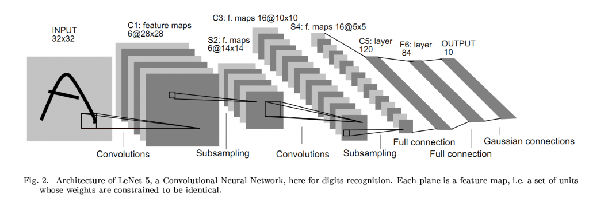
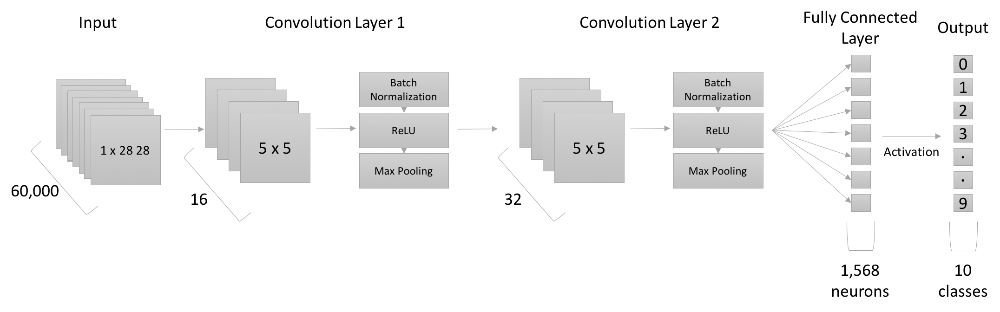
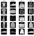
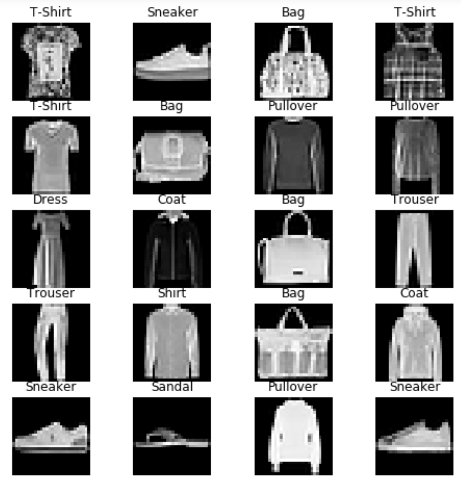
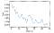
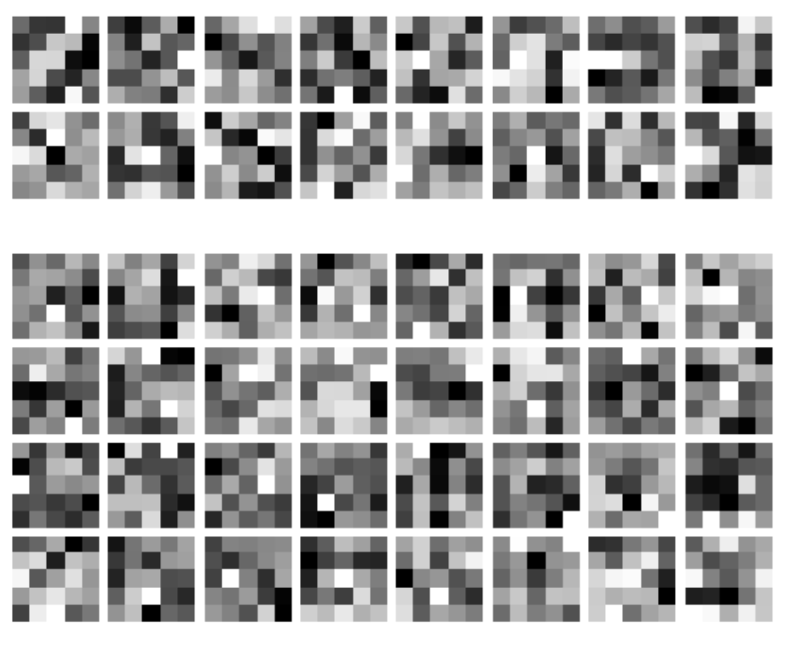

In this post, I want to introduce one of the popular Deep Learning frameworks, PyTorch, by implementing a simple example of a Convolutional Neural Network with the very simple Fashion MNIST dataset. The MNIST datasets are very easy to train on, and are often used as the “Hello World” examples of Machine Learning models. But I want to use the example to introduce the basics of Pytorch, and creating a Convolutional Neural Network.

Compared to TensorFlow, PyTorch offers several advantages as a Deep Learning library. For one, it is much easier to use in Python because of it executes code at runtime. This is different from TensorFlow, in which we define the execution graph first, with the input and output shapes, activation functions, and order of each layer. The code is then run in a separate session. In PyTorch, you define the graph as a class of type `nn.module`, and feed the input data through it. The code runs as the class is called. This has several advantages as well, because the code is easier to read and intuitive, and because of its runtime-execution model, it is easy to debug the code as the data passes through the model.

# The Data

For this project, I am going to be using the Fashion MNIST dataset. The Fashion MNIST dataset consists of Zalando’s article images, with grayscale images of size 28x28, developed as a drop-in replacement for the MNIST handwritten digits dataset. For most machine learning models, the handwritten digits dataset is very easy to train on, yielding almost 100% accuracy with simple convolutional neural networks. Although it provides a good metric to validate models, it is not very challenging. The Fashion MNIST dataset provides this challenge, with more complicated features to train on.

# The Model

To train images, we use a convolutional neural network (CNN). CNNs are a type of deep layer neural networks, used to learn Filters that when convolved with the image, can be used to extract features. An example:




LeNet-5 Convolutional Neural Network

In this network, there are 5 convolution layers. In the first layer, there are 6 filters being learnt. We step the filters across the input to update the values. These kernel values are propagated forward to calculate the loss, and re-updated through backpropagation. We have different numbers of convolution filters for each layer, or different sizes, and with different activation functions. For this project, the model we will use will have the following architecture




Neural Network architecture

We will have 2 convolution layers, with 5x5 kernels, followed by a fully connected layer, and a final activation for the last output layer. Now, let’s look into the code and follow through an example of implementing a Convolutional Neural Network in Pytorch.

------

# Imports

```python
import torch import torch.nn as nnimport torchvision.datasets as dsetsfrom skimage import transformimport torchvision.transforms as transformsfrom torch.autograd import Variableimport pandas as pd;import numpy as np;from torch.utils.data import Dataset, DataLoaderfrom vis_utils import *import random;import math;
```

Apart from the general Python imports for math, random, Pandas, and and Numpy, we will import the Torch utilities. These include the `torch`, `torch.nn`, and `torch.utils` for the Dataset loaders.

Let’s declare the essential hyperparameters:

```python
num_epochs = 5;batch_size = 100;learning_rate = 0.001;
```

# Data Loading

In Pytorch, for data loading, we implement a class that inherits the `Dataset` type, and defines the data reading functions and data access functions. Let’s look at how we implement it for the Fashion MNIST dataset:

```python
class FashionMNISTDataset(Dataset):    '''Fashion MNIST Dataset'''    def __init__(self, csv_file, transform=None):        """        Args:            csv_file (string): Path to the csv file            transform (callable): Optional transform to apply to sample        """                data = pd.read_csv(csv_file);        self.X = np.array(data.iloc[:, 1:]).reshape(-1, 1, 28, 28)#.astype(float);        self.Y = np.array(data.iloc[:, 0]);                del data;        self.transform = transform;            def __len__(self):        return len(self.X);        def __getitem__(self, idx):        item = self.X[idx];        label = self.Y[idx];                if self.transform:            item = self.transform(item);                return (item, label);
```

In the `__init__`, we load in the data from the csv file. For this dataset, I use Pandas to read it in as a dataframe, and convert it to a numpy array for indexing. Follow this by a `transform` function, which can be passed in as a method parameter, to transform the inputs before being returned.

The `__getitem__` will return a single image from the loader. It takes in an index, returns that item and label with it. If the transform function is defined, apply the transformation to the item and return it.

We get the data readers as

```python
train_dataset = FashionMNISTDataset(csv_file='fashionmnist/fashion-mnist_train.csv');test_dataset = FashionMNISTDataset(csv_file='fashionmnist/fashion-mnist_test.csv')
```

And using these, define the data loaders using the `DataLoader` module:

```python
train_loader = torch.utils.data.DataLoader(dataset=train_dataset,                                           batch_size=batch_size,                                           shuffle=True);test_loader = torch.utils.data.DataLoader(dataset=test_dataset,                                          batch_size=batch_size,                                          shuffle=True);
```

Now, by iterating over the loader, we can get the items in batch to process on.

We can also use the data reader to visualize some images and see the dataset:

```python
labels_map = {0 : 'T-Shirt', 1 : 'Trouser', 2 : 'Pullover', 3 : 'Dress', 4 : 'Coat', 5 : 'Sandal', 6 : 'Shirt',              7 : 'Sneaker', 8 : 'Bag', 9 : 'Ankle Boot'};fig = plt.figure(figsize=(8,8));columns = 4;rows = 5;for i in range(1, columns*rows +1):    img_xy = np.random.randint(len(train_dataset));    img = train_dataset[img_xy][0][0,:,:]    fig.add_subplot(rows, columns, i)    plt.title(labels_map[train_dataset[img_xy][1]])    plt.axis('off')    plt.imshow(img, cmap='gray')plt.show()
```





Sample of images from the training dataset

# The Network

The next main part of the project is to implement the Neural Network graph. This is one of the things I really like about PyTorch over TensorFlow and Keras, as PyTorch makes defining graphs much more easier and intuitive to understand.

Neural Networks are inherited from the `nn.Module` class, and define the graph in the constructor. We will implement two functions, the `__init__` and `forward`. Let’s look through the code:

```python
class CNN(nn.Module):    def __init__(self):        super(CNN, self).__init__()        self.layer1 = nn.Sequential(            nn.Conv2d(1, 16, kernel_size=5, padding=2),            nn.BatchNorm2d(16),            nn.ReLU(),            nn.MaxPool2d(2))        self.layer2 = nn.Sequential(            nn.Conv2d(16, 32, kernel_size=5, padding=2),            nn.BatchNorm2d(32),            nn.ReLU(),            nn.MaxPool2d(2))        self.fc = nn.Linear(7*7*32, 10)            def forward(self, x):        out = self.layer1(x)        out = self.layer2(out)        out = out.view(out.size(0), -1)        out = self.fc(out)        return out
```

It looks fairly simple. In the constructor, we define the layers using the provided modules from the `nn` package. A sequence of a layer, normalization, activation and pooling can be defined as a `Sequential`. For instance, a convolution layer is defined as `nn.Conv2d(in_channels, out_channels, kernel_size, padding, stride)` . After the two convolution layers and activations, we end the network with a Fully Connected layer that outputs to 10 classes.

The `forward` function is called on the Neural Network for a set of inputs, and it passes that input through the different layers that have been defined. In this case, we pass `x` through the first layer, pass it’s output through the second layer, and pass that through the final fully connected layer to get the output. The `view` function in the code about reshapes the output to match the dimensions required for the final layer.

# Training the model

After defining the Neural Network graph, we need to declare the loss function to optimize, and start training the model. Let’s do that next

```python
#instance of the Conv Netcnn = CNN();#loss function and optimizercriterion = nn.CrossEntropyLoss();optimizer = torch.optim.Adam(cnn.parameters(), lr=learning_rate);
```

Next, let’s train it:

```python
losses = [];for epoch in range(num_epochs):    for i, (images, labels) in enumerate(train_loader):        images = Variable(images.float())        labels = Variable(labels)                # Forward + Backward + Optimize        optimizer.zero_grad()        outputs = cnn(images)        loss = criterion(outputs, labels)        loss.backward()        optimizer.step()                losses.append(loss.data[0]);                if (i+1) % 100 == 0:            print ('Epoch : %d/%d, Iter : %d/%d,  Loss: %.4f'                    %(epoch+1, num_epochs, i+1, len(train_dataset)//batch_size, loss.data[0]))
```

Here, we iterate over a batch of images in the `train_loader`. For each batch, we do the following steps:

-   Zero out the gradients in the optimizer. Because the `backward()` function accumulates gradients, we don’t want to mix values between mini batches.
-   Feed the data through the convolution net. This calls the `forward()` function and gets its output.
-   Calculate the loss based on the outputs and actual labels.
-   Backpropagate the gradients.
-   Update the parameters based on the back propagated values.

I am also adding the loss values to an array, and printing out progress messages periodically.

Running it on my machine, here are some of the epoch results I achieved:

```python
Epoch : 1/25, Iter : 100/600,  Loss: 0.3938                       Epoch : 5/25, Iter : 100/600,  Loss: 0.2348Epoch : 10/25, Iter : 100/600,  Loss: 0.1037Epoch : 15/25, Iter : 100/600,  Loss: 0.0601Epoch : 20/25, Iter : 100/600,  Loss: 0.1013Epoch : 25/25, Iter : 100/600,  Loss: 0.0700
```

The final loss was less than **0.1**, which is really good for only 25 epochs.

# Evaluating the model

Having trained the model, let’s evaluate it on our test dataset. The code:

```python
cnn.eval()correct = 0total = 0for images, labels in test_loader:    images = Variable(images.float())    outputs = cnn(images)    _, predicted = torch.max(outputs.data, 1)    total += labels.size(0)    correct += (predicted == labels).sum()print('Test Accuracy of the model on the 10000 test images: %.4f %%' % (100 * correct / total))
```

What we are doing here:

-   Change the mode of the network to `eval`
-   Feed the images through the network to get the outputs
-   Get the output label by taking the max from the one-hot outputs
-   Count the correct predictions by comparing them to the labels

My evaluation returned an accuracy of **90.7300 %**.

# **Visualizing the loss**

I decided to visualize the loss from the training over the number of epochs

```python
losses_in_epochs = losses[0::600]plt.xkcd();plt.xlabel('Epoch #');plt.ylabel('Loss');plt.plot(losses_in_epochs);plt.show();
```




Losses over Epochs

# Visualizing the Filters

We can also visualize the filters. In a convolutional network, we are letting the network learn the filters that help it classify an image. For instance, the network could identify edges by learning a filter that acts as a edge detector. A more complicated one could learn to identify the handles on a bag. Let’s visualize the filters from the first layer and the second layer:

```python
def plot_kernels(tensor, num_cols=6):    num_kernels = tensor.shape[0]    num_rows = 1+ num_kernels // num_cols    fig = plt.figure(figsize=(num_cols,num_rows))    for i in range(num_kernels):        ax1 = fig.add_subplot(num_rows,num_cols,i+1)        ax1.imshow(tensor[i][0,:,:], cmap='gray')        ax1.axis('off')        ax1.set_xticklabels([])        ax1.set_yticklabels([])plt.subplots_adjust(wspace=0.1, hspace=0.1)    plt.show()filters = cnn.modules();model_layers = [i for i in cnn.children()];first_layer = model_layers[0];second_layer = model_layers[1];first_kernels = first_layer[0].weight.data.numpy()plot_kernels(first_kernels, 8)second_kernels = second_layer[0].weight.data.numpy()plot_kernels(second_kernels, 8)
```




Filters learnt by the Neural Net in the 1st layer and 2nd

It may be difficult to decipher what these filters are identifying, but their convolutions on the fashion images are able to properly classify it’s label with high accuracy.

## References and Other links

This post was a basic introduction to PyTorch, one of the popular and rising Neural Network frameworks. If you want to read up more on it, or follow up, see the following links:

[Siraj Reval on PyTorch](https://www.youtube.com/watch?v=nbJ-2G2GXL0) — I really enjoy Siraj’s simple reviews on different subjects, and his review of PyTorch gives a good overview.

[PyTorch on GitHub](https://github.com/pytorch/pytorch) — PyTorch is Open Source, and it’s page gives useful information about how it works and about the different modules in it.

[User post on Pytorch.org](https://discuss.pytorch.org/t/understanding-deep-network-visualize-weights/2060/22) — I referenced the code from this post for visualizing filters.

[TorchSample on GitHub](https://github.com/ncullen93/torchsample) — One of the limitations with PyTorch is that it does not implement a lot of necessary functions that are available in TensorFlow. These include transformations, but TorchSample is an open source package that can be used for data augmentation.