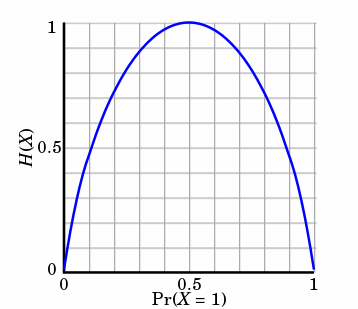

1、信息

这个是熵和信息增益的基础概念，我觉得对于这个概念的理解更应该把他认为是一用名称，就比如‘鸡‘(加引号意思是说这个是名称)是用来修饰鸡(没加引号是说存在的动物即鸡)，‘狗’是用来修饰狗的，但是假如在鸡还未被命名为'鸡'的时候，鸡被命名为‘狗’，狗未被命名为‘狗’的时候，狗被命名为'鸡'，那么现在我们看到狗就会称其为‘鸡’，见到鸡的话会称其为‘鸡’，同理，信息应该是对一个抽象事物的命名，无论用不用‘信息’来命名这种抽象事物，或者用其他名称来命名这种抽象事物，这种抽象事物是客观存在的。

引用香农的话，信息是用来消除随机不确定性的东西，当然这句话虽然经典，但是还是很难去搞明白这种东西到底是个什么样，可能在不同的地方来说，指的东西又不一样，从数学的角度来说可能更加清楚一些，数学本来就是建造在悬崖之上的一种理论，一种抽象的理论，利用抽象来解释抽象可能更加恰当，同时也是在机器学习决策树中用的定义，如果带分类的事物集合可以划分为多个类别当中，则某个类（xi）的信息定义如下:

​    　　　　　　　　　　　　　　　　　　　　　　

I(x)用来表示随机变量的信息，p(xi)指是当xi发生时的概率，这里说一下随机变量的概念，随机变量时概率论中的概念，是从样本空间到实数集的一个映射，样本空间是指所有随机事件发生的结果的并集，比如当你抛硬币的时候，会发生两个结果，正面或反面，而随机事件在这里可以是，硬币是正面；硬币是反面；两个随机事件，而{正面，反面}这个集合便是样本空间，但是在数学中不会说用‘正面’、‘反面’这样的词语来作为数学运算的介质，而是用0表示反面，用1表示正面，而“正面->1”,"反面->0"这样的映射便为随机变量，即类似一个数学函数。

2、熵

既然信息已经说完，熵说起来就不会那么的抽象，更多的可能是概率论的定义，熵是约翰.冯.诺依曼建议使用的命名（当然是英文），最初原因是因为大家都不知道它是什么意思，在信息论和概率论中熵是对随机变量不确定性的度量,与上边联系起来，熵便是信息的期望值，可以记作：

　　　　　　　　　　　　　　　　　　　　　　　　　　

熵只依赖X的分布，和X的取值没有关系，熵是用来度量不确定性，当熵越大，概率说X=xi的不确定性越大，反之越小，在机器学期中分类中说，熵越大即这个类别的不确定性更大，反之越小，当随机变量的取值为两个时，熵随概率的变化曲线如下图：

　　　　　　　　　　　　　　　　　　　　

当p=0或p=1时，H(p)=0,随机变量完全没有不确定性，当p=0.5时，H(p)=1,此时随机变量的不确定性最大

条件熵

条件熵是用来解释信息增益而引入的概念，概率定义：随机变量X在给定条件下随机变量Y的条件熵，对定义描述为：X给定条件下Y的条件干率分布的熵对X的数学期望，在机器学习中为选定某个特征后的熵，公式如下：

　　　　　　　　　　　　　　　　

这里可能会有疑惑，这个公式是对条件概率熵求期望，但是上边说是选定某个特征的熵，没错，是选定某个特征的熵，因为一个特征可以将待分类的事物集合分为多类，即一个特征对应着多个类别，因此在此的多个分类即为X的取值。

3、信息增益

信息增益在决策树算法中是用来选择特征的指标，信息增益越大，则这个特征的选择性越好，在概率中定义为：待分类的集合的熵和选定某个特征的条件熵之差（这里只的是经验熵或经验条件熵，由于真正的熵并不知道，是根据样本计算出来的），公式如下：

　　　　　　　　　　　　　　　　

注意：这里不要理解偏差，因为上边说了熵是类别的，但是在这里又说是集合的熵，没区别，因为在计算熵的时候是根据各个类别对应的值求期望来等到熵

4、信息增益算法（举例，摘自统计学习算法）

训练数据集合D，|D|为样本容量，即样本的个数（D中元素个数），设有K个类Ck来表示，|Ck|为Ci的样本个数，|Ck|之和为|D|，k=1，2.....，根据特征A将D划分为n个子集D1，D2.....Dn，|Di|为Di的样本个数，|Di|之和为|D|,i=1,2,....,记Di中属于Ck的样本集合为Dik,即交集，|Dik|为Dik的样本个数，算法如下：

输入：D，A

输出：信息增益g(D,A)

(1)D的经验熵H(D)

　　　　　　　　

 

此处的概率计算是根据古典概率计算，由于训练数据集总个数为|D|，某个分类的个数为|Ck|，在某个分类的概率，或说随机变量取某值的概率为：|Ck|/|D|

(2)选定A的经验条件熵H(D|A)

　　　　　　　　

 

此处的概率计算同上，由于|Di|是选定特征的某个分类的样本个数，则|Di|/|D|,可以说为在选定特征某个分类的概率，后边的求和可以理解为在选定特征的某个类别下的条件概率的熵，即训练集为Di，交集Dik可以理解在Di条件下某个分类的样本个数，即k为某个分类，就是缩小训练集为Di的熵

(3)信息增益

　　　　　　　　