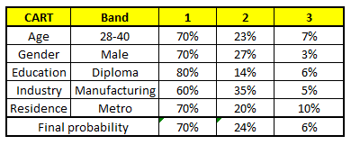

## 1.什么是随机森林

#### 简述

随机森林是一个高度灵活的机器学习方法，拥有广泛的应用前景，从市场营销到医疗保健保险。 既可以用来做市场营销模拟的建模，统计客户来源，保留和流失。也可用来预测疾病的风险和病患者的易感性。

随机森林是一个可做能够回归和分类。 它具备处理大数据的特性，而且它有助于估计或变量是非常重要的基础数据建模。

随机 森林 是 几乎 任何 预测 问题 (甚至 非直线 部分) 的固有 选择 。 它是 一个 相对较 新 的 机器 学习 的策略 （ 在90 年代产生于 贝尔 实验室 ) 和 它 可以 几乎用于 任何方面 。

#### 思想

随机森林就是通过集成学习的思想将多棵树集成的一种算法，它的基本单元是决策树，而它的本质属于机器学习的一大分支——集成学习（Ensemble Learning）方法。随机森林的名称中有两个关键词，一个是“随机”，一个就是“森林”。“森林”我们很好理解，一棵叫做树，那么成百上千棵就可以叫做森林了，这样的比喻还是很贴切的，其实这也是随机森林的主要思想--集成思想的体现。“随机”的含义我们会在下边部分讲到。

其实从直观角度来解释，每棵决策树都是一个分类器（假设现在针对的是分类问题），那么对于一个输入样本，N棵树会有N个分类结果。而随机森林集成了所有的分类投票结果，将投票次数最多的类别指定为最终的输出，这就是一种最简单的 Bagging 思想。

## 2.相关知识

#### 集成学习

集成学习通过建立几个模型组合的来解决单一预测问题。它的工作原理是生成多个分类器/模型，各自独立地学习和作出预测。这些预测最后结合成单预测，因此优于任何一个单分类的做出预测。

随机森林是集成学习的一个子类，由于它依靠于策率树的合并。

**信息、熵以及信息增益的概念**

这三个基本概念是决策树的根本，是决策树利用特征来分类时，确定特征选取顺序的依据。理解了它们，决策树你也就了解了大概。

引用香农的话来说，**信息是用来消除随机不确定性的东西**。当然这句话虽然经典，但是还是很难去搞明白这种东西到底是个什么样，可能在不同的地方来说，指的东西又不一样。对于机器学习中的决策树而言，如果带分类的事物集合可以划分为多个类别当中，则某个类（xi）的信息可以定义如下:


I(x)用来表示随机变量的信息，p(xi)指是当xi发生时的概率。

-   熵是用来度量不确定性的，当熵越大，X=xi的不确定性越大，反之越小。对于机器学习中的分类问题而言，熵越大即这个类别的不确定性更大，反之越小。
-   信息增益在决策树算法中是用来选择特征的指标，信息增益越大，则这个特征的选择性越好。

这方面的内容不再细述，感兴趣的同学可以看 [信息&熵&信息增益](http://www.cnblogs.com/fantasy01/p/4581803.html?utm_source=tuicool) 这篇博文。

#### 决策树

决策树是一种树形结构，其中每个内部节点表示一个属性上的测试，每个分支代表一个测试输出，每个叶节点代表一种类别。常见的决策树算法有C4.5、ID3和CART。

#### 随机决策树

我们知道随机森林是其他的模型聚合， 但它聚合了什么类型模型 ？你可能已经从其名称 、随机森林聚合分类（或回归）的树中猜到。决策树是由一系列的决策的组合，可用于分类观察数据集 。

#### 随机森林

算法引入了一个随机森林来自动创建随机决策树群 。 由于树随机生成的树，大部分的树(或许 99.9%树)不会对学习的分类/回归问题都有意义 。


 

 如果 观察到 长度 为 45 ，蓝 眼睛 ， 和 2 条腿 ， 就 被 归类 为 红色 。

## 3.随机森林的特点

前边提到，随机森林是一种很灵活实用的方法，它有如下几个特点：

-   在当前所有算法中，具有极好的准确率
-   能够有效地运行在大数据集上
-   能够处理具有高维特征的输入样本，而且不需要降维
-   能够评估各个特征在分类问题上的重要性
-   在生成过程中，能够获取到内部生成误差的一种无偏估计
-   对于缺省值问题也能够获得很好得结果

实际上，随机森林的特点不只有这六点，它就相当于机器学习领域的Leatherman（多面手），你几乎可以把任何东西扔进去，它基本上都是可供使用的。在估计推断映射方面特别好用，以致都不需要像SVM那样做很多参数的调试。

## 4.随机森林的生成

前面提到，随机森林中有许多的分类树。我们要将一个输入样本进行分类，我们需要将输入样本输入到每棵树中进行分类。打个形象的比喻：森林中召开会议，讨论某个动物到底是老鼠还是松鼠，每棵树都要独立地发表自己对这个问题的看法，也就是每棵树都要投票。该动物到底是老鼠还是松鼠，要依据投票情况来确定，获得票数最多的类别就是森林的分类结果。森林中的每棵树都是独立的，99.9%不相关的树做出的预测结果涵盖所有的情况，这些预测结果将会彼此抵消。少数优秀的树的预测结果将会超脱于芸芸“噪音”，做出一个好的预测。将若干个弱分类器的分类结果进行投票选择，从而组成一个强分类器，这就是随机森林bagging的思想（关于bagging的一个有必要提及的问题：bagging的代价是不用单棵决策树来做预测，具体哪个变量起到重要作用变得未知，所以bagging改进了预测准确率但损失了解释性。）

有了树我们就可以分类了，但是森林中的每棵树是怎么生成的呢？

　　每棵树的按照如下规则生成：

　　1）如果训练集大小为N，对于每棵树而言，随机且有放回地从训练集中的抽取N个训练样本（这种采样方式称为bootstrap sample方法），作为该树的训练集；

　　从这里我们可以知道：每棵树的训练集都是不同的，而且里面包含重复的训练样本（理解这点很重要）。

　　**为什么要随机抽样训练集？**

　　如果不进行随机抽样，每棵树的训练集都一样，那么最终训练出的树分类结果也是完全一样的，这样的话完全没有bagging的必要；

　　**为什么要有放回地抽样？**

　　如果不是有放回的抽样，那么每棵树的训练样本都是不同的，都是没有交集的，这样每棵树都是"有偏的"，都是绝对"片面的"（当然这样说可能不对），也就是说每棵树训练出来都是有很大的差异的；而随机森林最后分类取决于多棵树（弱分类器）的投票表决，这种表决应该是"求同"，因此使用完全不同的训练集来训练每棵树这样对最终分类结果是没有帮助的，这样无异于是"盲人摸象"。

　　2）如果每个样本的特征维度为M，指定一个常数m<<M，随机地从M个特征中选取m个特征子集，每次树进行分裂时，从这m个特征中选择最优的；

　　3）每棵树都尽最大程度的生长，并且没有剪枝过程。

　　一开始我们提到的随机森林中的“随机”就是指的这里的两个随机性。两个随机性的引入对随机森林的分类性能至关重要。由于它们的引入，使得随机森林不容易陷入过拟合，并且具有很好得抗噪能力（比如：对缺省值不敏感）。

　　**随机森林分类效果（错误率）与两个因素有关：**

-   森林中任意两棵树的相关性：相关性越大，错误率越大；
-   森林中每棵树的分类能力：每棵树的分类能力越强，整个森林的错误率越低。

　　==减小特征选择个数m，树的相关性和分类能力也会相应的降低；增大m，两者也会随之增大。所以关键问题是如何选择最优的m（或者是范围），这也是随机森林唯一的一个参数==。

## 5.袋外错误率（oob error）

构建随机森林的关键问题就是如何选择最优的m，要解决这个问题主要依据计算袋外错误率oob error（out-of-bag error）。

随机森林有一个重要的优点就是，没有必要对它进行交叉验证或者用一个独立的测试集来获得误差的一个无偏估计。它可以在内部进行评估，也就是说在生成的过程中就可以对误差建立一个无偏估计。

在构建每棵树时，我们对训练集使用了不同的bootstrap sample（随机且有放回地抽取）。所以对于每棵树而言（假设对于第k棵树），大约有1/3的训练实例没有参与第k棵树的生成，它们称为第k棵树的oob样本。

而这样的采样特点就允许我们进行oob估计，它的计算方式如下：

　　**（note：以样本为单位）**

　　1）对每个样本，计算它作为oob样本的树对它的分类情况（约1/3的树）；

　　2）然后以简单多数投票作为该样本的分类结果；

　　3）最后用误分个数占样本总数的比率作为随机森林的oob误分率。

## 6.随机森林工作原理解释的一个简单例子

**描述**：根据已有的训练集已经生成了对应的随机森林，随机森林如何利用某一个人的年龄（Age）、性别（Gender）、教育情况（Highest Educational Qualification）、工作领域（Industry）以及住宅地（Residence）共5个字段来预测他的收入层次。

　　**收入层次 :**

　　　　Band 1 : Below $40,000

　　　　Band 2: $40,000 – 150,000

　　　　Band 3: More than $150,000

　　随机森林中每一棵树都可以看做是一棵CART（分类回归树），这里假设森林中有5棵CART树，总特征个数N=5，我们取m=1（这里假设每个CART树对应一个不同的特征）。

　　**CART 1 : Variable Age**

　　

　　**CART 2 : Variable Gender**

　　

　　**CART 3 : Variable Education**

　　

　　**CART 4 : Variable Residence**

　　

　　**CART 5 : Variable Industry**

　　

　　我们要预测的某个人的信息如下：

　　1. Age : 35 years ; 2. Gender : Male ; 3. Highest Educational Qualification : Diploma holder; 4. Industry : Manufacturing; 5. Residence : Metro.

　　根据这五棵CART树的分类结果，我们可以针对这个人的信息建立收入层次的分布情况：

　　

　　最后，我们得出结论，这个人的收入层次70%是一等，大约24%为二等，6%为三等，所以最终认定该人属于一等收入层次（小于$40,000）。

##  7.python实现

```python
from sklearn.datasets import load_iris
from sklearn.ensemble import RandomForestClassifier
from sklearn.ensemble import RandomForestRegressor
from sklearn.model_selection import cross_val_score, ShuffleSplit
from sklearn.ensemble import ExtraTreesClassifier
from sklearn.tree import DecisionTreeClassifier
from sklearn.datasets import make_blobs
import pandas as pd
import numpy as np
import sys


# 利用iris数据集划分训练数据和测试数据，最后得到的结果显示为图表
def testTable(iris):
    # 创建DataFrame，列名为特征名称，属性值为特征值
    df = pd.DataFrame(iris.data, columns=iris.feature_names)
    # 从一个均匀分布 [ 0, 1 ) 中随机采样，注意定义域是左闭右开，即包含 0 ，不包含 1，长度为数据集长度
    df['is_train'] = np.random.uniform(0, 1, len(df)) <= .75
    # 从分类代码和分类类别数组中创建一个分类类型
    df['species'] = pd.Categorical.from_codes(iris.target, iris.target_names)
    # 使用head查看前几行数据（默认是前5行）
    print df.head()
    # 划分训练集和测试集
    train, test = df[df['is_train']==True], df[df['is_train']==False]
    # 得到所有的列标签
    features = df.columns[:4]
    # 并行数为2
    n = 2
    clf = RandomForestClassifier(n_jobs=n)
    #pandas.factorize()把文本标注的属性列还原特征化
    # factorize函数可以将Series中的标称型数据映射称为一组数字，
    # 相同的标称型映射为相同的数字。factorize函数的返回值是一个tuple（元组），元组中包含两个元素。
    # 第一个元素是一个array，其中的元素是标称型元素映射为的数字；
    # 第二个元素是Index类型，其中的元素是所有标称型元素，没有重复。
    y, _ = pd.factorize(train['species'])
    # 放入训练的属性以及分类的特征值
    clf.fit(train[features], y)
    print y
    # 预测训练集预测的类别，获得类别对应的名称
    preds = iris.target_names[clf.predict(test[features])]
    # 第一个参数是行索引，第二个属性为列索引
    print pd.crosstab(test['species'], preds, rownames=['actual'], colnames=['preds'])

# 利用iris数据集训练数据，进行预测
def testRegress(iris):
    print iris
    # 读取列表的长度
    print(iris['target'].shape)
    rf = RandomForestRegressor(n_estimators=100, n_jobs=2)
    rf.fit(iris.data[:150], iris.target[:150])  # 进行模型的训练
    # 随机挑选两个预测不相同的样本
    instance = iris.data[[100, 109]]
    print(instance)
    rf.predict(instance[[0]])
    print('instance 0 prediction:', rf.predict(instance[[0]]))
    print('instance 1 prediction:', rf.predict(instance[[1]]))
    print(iris.target[100], iris.target[109])

# 测试数据集中属性对分类的影响的重要性
def importClass(iris):
    X = iris["data"]
    Y = iris["target"]
    names = iris["feature_names"]
    rf = RandomForestRegressor()
    scores = []
    # 读取X的列数
    for i in range(X.shape[1]):
        # cross_val_score(estimator, X, y=None, scoring=None, cv=None, n_jobs=1,
        # verbose=0, fit_params=None, pre_dispatch=‘2*n_jobs’)
        # estimator：数据对象  X：数据  y：预测数据  soring：调用的方法
        # cv：交叉验证生成器或可迭代的次数  n_jobs：同时工作的cpu个数（-1代表全部）
        # ShuffleSplit：把X中数据打乱，迭代三次，选取0.3的数据作为测试数据
        score = cross_val_score(rf, X[:, i:i + 1], Y, scoring="r2",
                                cv=ShuffleSplit(len(X), 3, .3))
        # print score
        # 取3次迭代的平均值，保留小数点后三位
        scores.append((round(np.mean(score), 3), names[i]))
    print(sorted(scores, reverse=True))

# 三种方法比较
def compTest(iris):
    # 生成用于聚类的各向同性高斯blob
    # n_samples: 待生成的样本的总数  n_features:每个样本的特征数
    # centers:要生成的样本中心（类别）数，或者是确定的中心点
    # random_state:random_state是随机数生成器使用的种子
    X, y = make_blobs(n_samples=10000, n_features=10, centers=100, random_state=0)
    # 决策树分类器
    clf = DecisionTreeClassifier(max_depth=None, min_samples_split=2, random_state=0)
    scores = cross_val_score(clf, X, y)
    print(scores.mean())
    # 随机森林分类器
    clf = RandomForestClassifier(n_estimators=10, max_depth=None, min_samples_split=2, random_state=0)
    scores = cross_val_score(clf, X, y)
    print(scores.mean())
    # ExtraTree分类器
    clf = ExtraTreesClassifier(n_estimators=10, max_depth=None, min_samples_split=2, random_state=0)
    scores = cross_val_score(clf, X, y)
    print(scores.mean())


# 设置编码
reload(sys)
sys.setdefaultencoding('utf-8')
#iris的４个属性是：萼片宽度　萼片长度　花瓣宽度　花瓣长度　标签是花的种类：setosa versicolour virginica
iris = load_iris()
testTable(iris)
testRegress(iris)
importClass(iris)
compTest(iris)
```

运行结果：

使用head查看前几行数据（默认是前5行）


相同的属性映射为相同的数字


预测的表格


testRegress方法


importClass方法


compTest方法


## 8.函数解释

[](javascript:void(0);)

```python
class sklearn.ensemble.RandomForestClassifier(n_estimators=10, crite-rion='gini', max_depth=None,    
min_samples_split=2, min_samples_leaf=1,    
min_weight_fraction_leaf=0.0,    
max_features='auto',    
max_leaf_nodes=None, bootstrap=True,    
oob_score=False, n_jobs=1, ran-dom_state=None, verbose=0,    
warm_start=False, class_weight=None)    
```

[](javascript:void(0);)

-   **随机森林参数**

1) n_estimators=100:决策树的个数，==一般来说n_estimators太小，容易欠拟合，n_estimators太大，又容易过拟合==，一般选择一个适中的数值，至少100左右可以达到可接受的性能和误差率。默认是100。

2) oob_score=False :即==是否采用袋外样本来评估模型的好坏==。默认是False。==推荐设置为True，因为袋外分数反应了一个模型拟合后的泛化能力。==

3) criterion: 即CART树做划分时对特征的评价标准。分类模型和回归模型的损失函数是不一样的。分类RF对应的CART分类树默认是基尼系数gini,另一个可选择的标准是信息增益。回归RF对应的CART回归树默认是均方差mse，另一个可以选择的标准是绝对值差mae。一般来说选择默认的标准就已经很好的。

4）bootstrap=True：==是否有放回的采样，默认为True==

5）n_jobs=1：并行job个数。这个在ensemble算法中非常重要，尤其是bagging（而非boosting，因为boosting的每次迭代之间有影响，所以很难进行并行化），因为可以并行从而提高性能。1=不并行；n：n个并行；-1：CPU有多少core，就启动多少job

6）warm_start=False：热启动，决定是否使用上次调用该类的结果然后增加新的

7）class_weight=None：各个label的权重

-    决策树参数

1) 最大特征数max_features: 可以使用很多种类型的值，默认是"None",意味着划分时考虑所有的特征数；如果是"log2"意味着划分时最多考虑log2N个特征；如果是"sqrt"或者"auto"意味着划分时最多考虑√N个特征。如果是整数，代表考虑的特征绝对数。如果是浮点数，代表考虑特征百分比，即考虑（百分比xN）取整后的特征数。其中N为样本总特征数。一般来说，可以使用"sqrt"。

2) 决策树最大深度max_depth: 默认可以不输入，如果不输入的话，决策树在建立子树的时候不会限制子树的深度。一般来说，数据少或者特征少的时候可以不管这个值。如果模型样本量多，特征也多的情况下，推荐限制这个最大深度，具体的取值取决于数据的分布。常用的可以取值10-100之间。

3) 内部节点再划分所需最小样本数min_samples_split: 这个值限制了子树继续划分的条件，如果某节点的样本数少于min_samples_split，则不会继续再尝试选择最优特征来进行划分。 默认是2.如果样本量不大，不需要管这个值。如果样本量数量级非常大，则推荐增大这个值。

4) 叶子节点最少样本数min_samples_leaf: 这个值限制了叶子节点最少的样本数，如果某叶子节点数目小于样本数，则会和兄弟节点一起被剪枝。 默认是1,可以输入最少的样本数的整数，或者最少样本数占样本总数的百分比。如果样本量不大，不需要管这个值。如果样本量数量级非常大，则推荐增大这个值。

5）叶子节点最小的样本权重和min_weight_fraction_leaf：这个值限制了叶子节点所有样本权重和的最小值，如果小于这个值，则会和兄弟节点一起被剪枝。 默认是0，就是不考虑权重问题。一般来说，如果我们有较多样本有缺失值，或者分类树样本的分布类别偏差很大，就会引入样本权重，这时我们就要注意这个值了。

6) 最大叶子节点数max_leaf_nodes: 通过限制最大叶子节点数，可以防止过拟合，默认是"None”，即不限制最大的叶子节点数。如果加了限制，算法会建立在最大叶子节点数内最优的决策树。如果特征不多，可以不考虑这个值，但是如果特征分成多的话，可以加以限制，具体的值可以通过交叉验证得到。

7) 节点划分最小不纯度min_impurity_split:  这个值限制了决策树的增长，如果某节点的不纯度(基于基尼系数，均方差)小于这个阈值，则该节点不再生成子节点。即为叶子节点 。一般不推荐改动默认值1e-7。

上面决策树参数中最重要的包括最大特征数max_features， 最大深度max_depth， 内部节点再划分所需最小样本数min_samples_split和叶子节点最少样本数min_samples_leaf。

-   预测

predict_proba(x)：给出带有概率值的结果。每个点在所有label的概率和为1.  

predict(x)：直接给出预测结果。内部还是调用的predict_proba()，根据概率的结果看哪个类型的预测值最高就是哪个类型。  

predict_log_proba(x)：和predict_proba基本上一样，只是把结果给做了log()处理。