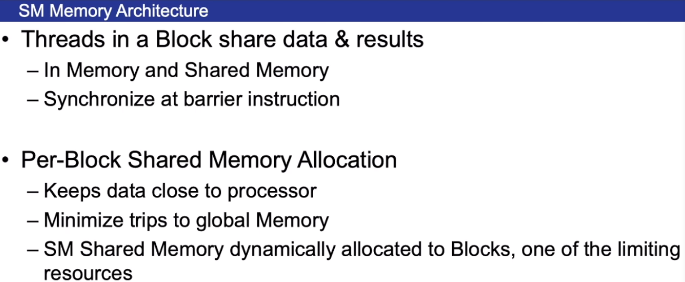
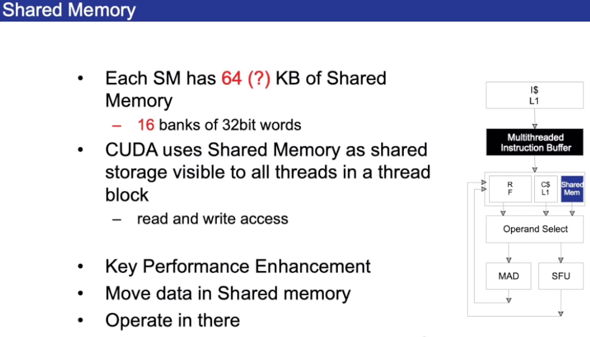
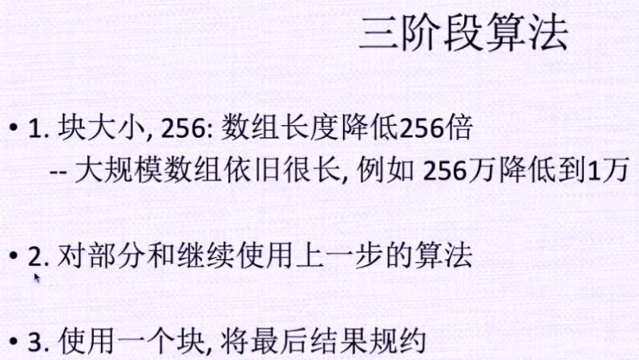

# GPU 硬件架构综述

## 术语

-   SPA: Streaming Processor Array
-   TPC/GPC: Texture(Graphics) Processor Cluster
-   SM: Streaming Multiprocessor, Multi-threaded processor core, Fundamental processing unit for CUDA thread block
-   SP: Streaming Processor(CUDA core)

## Overview


每32个线程是一个Warp

## Thread Life


 





每个块尽量少使用寄存器




---

# CUDA编程模型


`__global__`返回类型必须为`void`


向量长1000000, 每个块256个线程，gs是块数 


 


CPU调用完核函数不会等待GPU运行完成而是直接运行接下来的代码


因为不能调用host函数，所以将`get_tid`和`get_bid`写成了宏的格式

`if (i < n)`是防止线程数大于向量长度


## 向量加法程序解析


## Grid Block Warp Thread 介绍


Index首先`x`方向增加，之后是`y`，之后是`z`。这样的话就可以用宏获得位置。

threadIdx是线程在某一个块中的位置。


# GPU内存模型


共享内存速度非常快， 可以被线程块中所有线程共享。

全局内存速度慢。

SP共享L2缓存


全局内存使用完需要释放。


共享内存需要用`__shared__` 标记


# GPU内存管理


CPU与GPU是异构的，内存是独立的。


flag默认是cudaMemAttachGlobal

一般新型的GPU才能分配统一内存。


同步：数据全被拷贝完才执行下面的语句


异步：运行完指令后直接执行下面的指令，异步拷贝一般需要检测一下是否拷贝完成


共享内存编译时确定

****


# 内存使用

```cpp
#include <stdio.h>
#include <cuda.h>

typedef double FLOAT;

__global__ void sum(FLOAT *x)
{
    int tid = threadIdx.x;

    x[tid] += 1;
}

int main()
{
    int N = 32;
    int nbytes = N * sizeof(FLOAT);

    FLOAT *dx = NULL, *hx = NULL;
    int i;

    /* allocate GPU mem */
    cudaMalloc((void **)&dx, nbytes);

    if (dx == NULL) {
        printf("couldn't allocate GPU memory\n");
        return -1;
    }

    /* alllocate CPU host mem: memory copy is faster than malloc */
    hx = (FLOAT *)malloc(nbytes);

    if (hx == NULL) {
        printf("couldn't allocate CPU memory\n");
        return -2;
    }

    /* init */
    printf("hx original: \n");
    for (i = 0; i < N; i++) {
        hx[i] = i;

        printf("%g\n", hx[i]);
    }

    /* copy data to GPU */
    cudaMemcpy(dx, hx, nbytes, cudaMemcpyHostToDevice);

    /* call GPU */
    sum<<<1, N>>>(dx);

    /* let GPU finish */
    // cudaThreadSynchronize(); // deprecated
    cudaDeviceSynchronize();

    /* copy data from GPU */
    cudaMemcpy(hx, dx, nbytes, cudaMemcpyDeviceToHost);

    printf("\nhx from GPU: \n");
    for (i = 0; i < N; i++) {
        printf("%g\n", hx[i]);
    }

    cudaFree(dx);
    free(hx);

    return 0;
}
```


# CUDA程序执行与硬件映射


# 规约算法和并行


# 并行规约算法-二叉树算法


一个Warp里有的线程执行加和操作，有的不执行，造成了同一个warp里线程没有执行相同的指令。所以效率很低。

一般的GPU理论带宽有几百GB/s，但是此种算法的带宽只有2.083GB/s。


绿色表示处于活跃状态的线程。


# 规约算法 优化


`s = 1`时，第0个线程访问0和1, 第1个线程访问2和3, 第`ceil(blockDim / 2)`个线程访问最后两个位置。

s = 2时， 第0个线程访问0和2, 第1个线程访问4和6, 第`ceil(ceil(blockDim / 2) / 2)个线程访问倒数-2和倒数的位置`

...

直到只剩1个线程。


上图中橙色的圆圈表示线程。


上图中绿色的表示活动的线程。


同样的线程跨bank访问数据，容易降速。上述算法仍然有值得提升的空间。


# 规约算法 再次优化


线程访问前半和后半部分的数据时，内存都是连续的


# 规约算法 改进全局内存访问


# 规约算法 Warp内循环优化


因为一个warp里执行的相同的指令，所以`_syncthreads()`可以不加


# 并行规约算法 完全循环展开


# 并行规约算法： 成功优化的关键

## 规约算法： 循环展开注解


编译器编译时会优化代码，所以下面的代码


可能会被展开成一个表达式，进而造成结果的错误，所以我们要规避掉编译器对上述代码的自动优化


# 完整并行规约算法

## CUDA程序优化

****

 


核函数用global修饰


Host Memory: CPU内存

全局内存的访问注意对齐


# 并行规约算法应用：内积





# CUDA程序优化技巧

### 最大化并行执行


****


## 优化内存使用

