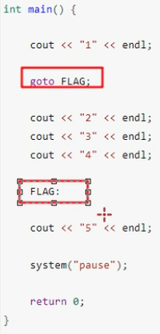

# 数据类型

## 字符串型

C风格字符串：

```c++
char 变量名[] = "字符串值";
```

C++风格字符串

```c++
#include <string>
string 变量名 = "字符串值";
```


## Boolean 型

bool型占用一个字节


## 数据的输入

输入时布尔类型只要是非０值都为ｔｒｕｅ

### 三目运算符

三目运算符返回的是变量，可以继续赋值：

```c
(ai > bi ? ai : bi) = 10; // 给ai或bi之中较大的赋值
```

## Switch语句

switch只能用于整数和字符型

## goto语句

```c
goto FLAG;

FLAG:
		expression;
```

goto直接跳到标记的语句



goto 语句一个很好的作用是退出深嵌套例程。例如，请看下面的代码片段：

```c
for(...) {
   for(...) {
      while(...) {
         if(...) goto STOP;
         .
         .
         .
      }
   }
}
STOP:
cout << "Error in program.\n";
```

消除 **goto** 会导致一些额外的测试被执行。一个简单的 **break** 语句在这里不会起到作用，因为它只会使程序退出最内层循环。

