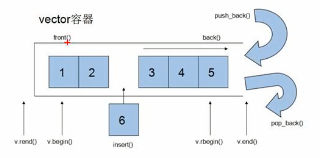
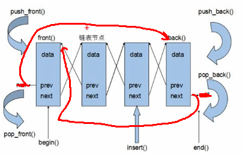

# STL的诞生

* 长久以来，软件界一直希望建立一种可以重复利用的东西
* C++的面向对象和泛型编程思想，目地就是复用性的提升
* 大多情况下，数据结构和算法都未有一套标准，导致被迫从事大量重复性工作
* 为了建立数据结构和算法的一套标准，诞生了STL

# STL的概念

* STL(Standard Template Library)标准模板库
* STL从广义上分为: 容器(container)， 算法(algorithm)， 迭代器(iterator)
* 容器和算法之间通过迭代器进行无缝链接
* STL几乎所有的代码都采用了模板类或者模板函数

# STL六大组件

STL大体分为六大组件：容器，算法，迭代器，仿函数，适配器（配接器），空间配置器

1. 容器：各种数据结构，如vector，list，deque，set，map等，用来存放数据
2. 算法：各种常用的算法，如sort，find，copy，for_each等
3. 迭代器：扮演了容器与算法之间的胶合剂
4. 仿函数：行为类似函数，可作为算法的某种策略
5. 适配器：一种用来修饰容器或者仿函数或迭代器接口的东西
6. 空间配置器：负责空间的配置和管理

# STL中容器、算法、迭代器

容器：

* STL容器就是将运用最广泛的一些数据结构实现出来
* 常用的数据结构：数组、链表、树、栈、队列、集合、映射表等
* 这些容器分为序列式容器和关联式容器
  * 序列式容器：强调值的排序，序列式容器中每个元素都有固定的位置
  * 关联式容器：二叉树结构，各元素之间没严格的物理上的顺序关系

算法：

* 有限的步骤，解决逻辑或数学上的问题，这一门学科称为算法
* 算法分为：质变算法和非质变算法
  * 质变算法：是指运算过程中会更改区间内元素的内容，例如拷贝、替换、删除等
  * 非质变算法：是指运算过程中不会更改区间内的元素内容，如查找、计数、遍历、寻找极值等

迭代器：容器和算法之间的粘合剂

提供一种方法，使之能够依序寻访某个容器所含的各个元素，而又无需暴露该容器内部的表示方式

每个容器都有自己专属的迭代器

迭代器使用非常类似与指针，初学阶段可以先理解迭代器为指针

迭代器种类：

| 种类           | 功能                                                     | 支持运算                                |
| -------------- | -------------------------------------------------------- | --------------------------------------- |
| 输入迭代器     | 对数据的只读访问                                         | 只读，支持++, ==, !=                    |
| 输出迭代器     | 对数据的只写访问                                         | 只写，支持++                            |
| 前向迭代器     | 读写操作，并能向前推进迭代器                             | 读写，支持++, ==, !=                    |
| 双向迭代器     | 读写操作，并能向前和向后操作                             | 读写，支持++, --                        |
| 随机访问迭代器 | 读写操作，可以以跳跃的方式访问任意数据，功能最强的迭代器 | 读写，支持++, --, [n], -n, <, <=, >, >= |

常用的容器中迭代器种类为双向迭代器，和随机访问迭代器

# 容器算法迭代器初识

STL中最常用的迭代器为vector，可以理解为数组

## vector存放内置数据类型

容器: `vector`

算法：`for_each`

迭代器： `vector<int（内置的数据类型就行）>::iterator`

## vector容器存放自定义数据类型

## vector容器嵌套容器

类似于二维数组

## string容器基本概念

本质：string是C++风格的字符串，而string本质上是一个类

string和char *的区别：

1. char *是一个指针
2. string是一个类，类内部封装了char *，管理这个字符串，是一个char *型的容器

特点：

string类内部封装了很多成员方法

例如：查找find，拷贝copy，删除delete，替换replace，插入insert

string惯例char *所分配的内存，不用担心复制越界和取值越界等，由类内部负责

## string构造函数

构造函数原型

* `string() // 创建一个空字符串，如string str;`
* `string(const char *s); // 使用字符串s初始化`
* `string(const string &str); // 拷贝构造`
* `string(int n, char c); 使用n个字符c初始化`

## string赋值操作

赋值的原型是：

* `string & operator=(const char *s); // char*类型字符串，赋值给当前的字符串`
* `string & operator=(const string &s); // 把字符串赋值给当前字符串`
* `string & operator=(char c); // 字符赋值给当前字符串`
* `string & assign(const char *s);`
* `string & assign(const char *s, int n); // 把字符串s的前n个字符赋值给当前字符串`
* `string &assign(const string &s);`
* `string &assign(int n, char c); // 用n个字符c赋值给当前字符串`

## string字符串拼接

功能：在字符串末尾拼接字符串

函数原型：

* `string &operator+=(const char *str);`
* `string &operator+=(const char c);`
* `string &operator+=(const string &str);`
* `string &append(const char *s);`
* `string &append(const char *s, int n);\\ 将字符串s的前n个字符拼接到当前字符串尾`
* `string &append(const string &s);`
* `string &append(const string &s, int pos, int n); // 字符串s中从pos开始的n个字符拼接到当前字符串尾`

## string查找和替换

* 查找： find，查找字符串是否存在
* 替换： replace，在指定的位置替换字符串

函数原型：

* `int find(const string &str, int pos=0) const; // 查找str第一次出现位置，从pos开始查找`
* `int find(const char *s, int pos = 0) const;`
* `int find(const char *s, int pos, int n) const; // 从pos位置查找s的前n个字符出现的第一次位置`
* `int find(const char c, int pos = 0) const;`
* `int rfind(const string &str, int pos = npos) const; // 查找str最后一次出现位置，从pos开始查找`
* `int rfind(const char *s, int pos=npos) const;`
* `int rfind(const char *s, int pos, int n) const; // 从pos查找s前n个字符出现的最后一次位置`
* `int rfind(const char c, int pos=0) const;`
* `string &replace(int pos, int n, const string &str); //替换从pos开始的n个字符为字符串str`
* `string &replace(int pos, int n, const char *s);`

find找不到时返回-1

rfind和find区别

* rfind从右往左查找，find从左往右查找e

## string字符串比较

比较方式：按照字符ASCII码值进行比较

0: 两个字符串相同

1：第一个比第二个大

-1：第一个比第二个小

函数原型：

* `int compare(const string &str) const;`
* `int compare(const char *s) const;`

## string字符存取

string中单个字符存取有两种方式

* `char &operator; // 通过[]方式取字符`
* `char &at(int n); // 通过at方式取字符`

## string插入和删除

函数原型：

* `string &insert(int pos, const char *s); // 插入字符串`
* `string &insert(int pos, const string &str);`
* `string &insert(int pos, char c);`
* `string erase(int pos, int n = npos); // 删除从pos开始的n个字符`

## string容器-子串获取

函数原型：

`string substr(int pos = 0; int n = npos) const; // 返回由pos开始的n个字符组成的子串`

## vector容器-构造函数

功能：vector容器和数组非常相似，也成为单端数组

vector与普通数组区别：

* 数组是静态空间，vector可以动态扩展

动态扩展： 并不是在原空间之后续接新空间，而是找更大的内存空间，然后将原数据拷贝到新空间，释放原空间

vector容器的迭代器是支持随机访问的迭代器，可以跳跃访问

vector构造函数函数原型：

* `vector<T> v; // 采用模板类实现，默认构造函数`
* `vector(v.begin(), v.end()); // 将v[begin(), end()]区间中的元素拷贝给本身`
* `vector(n, elem); // 构造函数将n个elem拷贝给本身`
* `vector(const vector &vec); // 拷贝构造`

## vector赋值操作

函数原型：

* `vector &operator=(const vector &vec); //重载=赋值`
* `assign(beg, end); \\将[beg, end)区间中的数据拷贝赋值给本身`
* `assign(n, elem); // 将n个elem拷贝赋值给本身`

## vector容量和大小

函数原型

* `bool empty(); // 判断是否为空`
* `capacity(); // 容器的容量`
* `size(); // 返回容器中元素的个数`
* `resize(int num); // 重新指定容器的长度num， 若容器变长，则以默认值填充新位置，如果容器变短，则末尾超出容器长度的元素被删除`
* `resize(int num, elem); // 重新指定容器的长度num，若容器变长，则以elem填充新位置，若容器变短，则末尾超出容器长度的元素被删除`

 ## vector容器-插入和删除

函数原型：

* `push_back(ele); // 尾部插入`
* `pop_back(); 删除最后一个元素`
* `insert(const_iterator pos, ele); // 迭代器指向位置pos插入元素ele`
* `insert(const_iterator pos, int count, ele); // 插入count个`
* `erase(const_iterator pos); // 删除迭代器指向的元素`
* `erase(const_iterator start, const_iterator end); // 删除迭代器从start到end之间的元素`
* `clear(); // 删除容器中所有元素`

## vector容器-数据存取

函数原型:

* `at(int idx); // 返回索引idx所指的数据`
* `operator[]; 重载了[]，通过[]访问`
* `front() 返回容器中第一个数据元素`
* `back() 返回容器中最后一个数据元素`

## vector互换容器

实现两个容器内元素进行互换

函数原型：

* `swap(vec); // 将vec与本身的元素互换`

巧用swap收缩空间

## vector容器-预留空间

功能：减少vector在动态扩展容量时的扩展次数，如果数据比较大，可以一开始预留出空间

函数原型：

* `reserve(int len); // 容器预留len个元素长度，预留位置不初始化，元素不可访问`

# deque容器-构造函数

功能： 双端数组，可以对头端进行插入删除操作

deque和vector区别：

* vector对于头部的插入和删除效率低，数据量越大，效率越低
* deque相对而言，对头部的插入和删除速度比vector快
* vector访问元素时的速度会比deque快，这和两者内部实现有关

deque内部工作原理：

* deque内部有个中控器，维护每段缓冲区中的内容，缓冲区中存放真是数据
* 中控器维护的是每个缓冲区的地址，使得使用deque时像一片连续的内存空间

当尾插插满时，再找一块缓冲区，然后中控器记录缓冲区的地址，头部也是如此

deque容器的迭代器也是支持随机访问的， 可以跳跃访问

## deque构造函数

函数原型

* `deque<T> deqT; // 默认构造`
* `deque(begin, end); // 构造函数将[begin, end)去见中的元素拷贝给本身`
* `deque(n, elem); // 构造函数将n个elem拷贝给本身`
* `deque(const deque &deq); // 拷贝构造`

==`const_iterator`只读迭代器==

## deque容器-赋值操作

函数原型：

* `deque &operator=(const deque &deq); // 重载=操作符`
* `assign(beg, end); // 将[beg, end)区间中的数据拷贝赋值给本身`
* `assign(n, elem); 将n个elem赋值给本身`

## deque容器-大小操作

函数原型

* `deque.empty(); // 判断容器是否为空`
* `deque.size(); // 返回容器中元素的个数`
* `deque.resize(num); // 重新指定容器的长度为num，若容器变长，则以默认值填充新位置，若容器便端，则末尾超过容器长度的元素被删除`
* `deque.resize(num, elem); // 重新指定容器的长度为num，若容器变长，则以elem填充新位置，若容器便端，则末尾超过容器长度的元素被删除`

注意：由于deque的实现方式，deque没有capacity函数

## deque容器-插入和删除

函数原型：

两端插入操作

* `push_back();//尾插`
* `push_front(); // 头插`
* `pop_back(); // 尾删`
* `pop_front(); // 头删`

指定位置操作：

* `insert(pos, elem); // 在pos位置插入elem元素，返回新数据的位置`
* `insert(pos, n, elem); // 在pos位置插入n个elem，无返回值`
* `insert(pos, beg, end); // 在pos位置插入[beg, end)区间的数据，无返回值`
* `clear(); // 清空容器内的数据`
* `erase(beg, end); // 删除[beg, end)区间的数据，返回下一个数据的位置`
* `erase(pos); // 删除pos位置的数据， 返回下一个数据的位置`

## deque容器-数据存取

函数原型:

* `at(int idx); // 返回索引idx的所指的数据`
* `operator[]; // 通过[]访问`
* `front(); // 返回容器中第一个数据元素`
* `back(); // 返回容器中最后以后一个数据元素`

## deque容器-排序操作

算法：`sort(iterator begin, iterator end); // 对beg和end区间内元素进行排序`, ==默认升序排序==

需要包含头文件`#include <algorithm> // 标准算法头文件`

对于支持随机访问的迭代器的容器，都可以利用sort算法直接对其进行排序,所以sort也可以对vector进行排序 

# stack容器

概念：stack是一种先进后出(First in Last out, FILO)的数据结构，它只有一个出口

栈中只有顶端的元素才能被外界使用，因此栈不允许遍历行为，栈顶是top()

常用接口：

构造函数：

* `stack<T> stk; // 默认构造`
* `stack(const stack<T> &stk); // 拷贝构造`

赋值操作：

`stack &operator=(const stack &stk); // 重载=运算符`

数据存取：

`push(elem); // 压栈，向栈顶添加元素`

`pop(); //弹栈，从栈顶移除`

`top(); // 返回栈顶元素`

大小操作

* `empty(); // 判断是否为空`

* `size(); // 返回栈大小`

# queue容器

概念：queue是一种先进先出(First In First Out, FIFO)的数据结构，它有两个出口

队列容器允许从一端新增元素，另一端移除元素

队列中只有队尾和队头才能被外界使用，因此不允许有遍历行为

进数据：入队`push()`

出数据：出队`pop()`

队头：`front()`

队尾：`back()`

## queue常用接口：

构造函数：

* `queue<T> que; // 默认构造`
* `queue(const queue<T> &que); // 拷贝构造`

赋值：

* `queue &operator=(const queue &que); // 重载等号运算符`

数据存取：

* `push(elem); //往队尾添加元素`
* `pop(); // 从队头移除一个元素`
* `back(); // 返回最后一个元素`
* `front(); // 返回第一个元素`

大小操作：

* `empty();`
* `size();`

队列不提供迭代器，不支持随机访问

# list容器-基本概念

功能：将数据进行链式存储

链表（list）是一种物理存储单元上的非连续的存储结构，数据元素的逻辑顺序是通过链表中的指针链接实现的

链表的组成： 链表由一系列结点组成

结点的组成：一个是存储数据元素的数据域，另一个是存储下一个结点地址的指针域

STL中的链表是一个==双向循环链表==

链表优点：

* 可以对任意位置进行快速插入或删除元素，执行插入和删除十分方便，修改指针即可
* 采用动态存储分配，不会造成内存浪费和溢出

链表缺点：

* 容器遍历速度没有数组快
* 占用的空间比数组大

由于链表的存储方式并不是连续的内存空间，因此链表中的迭代器只支持前移和后移，属于双向迭代器

list有一个重要的性质，插入操作和删除操作都不会造成原有list迭代器的失效，这在vector中是不成立的

## list构造函数

函数原型：

* `list<T> lst; // 默认构造`
* `list(beg, end); // 构造函数将[beg, end)区间中的元素拷贝给本身`
* `list(n, elem); // 构造函数将n个elem拷贝给本身`
* `list(const list &lst); // 拷贝构造`

## list容器-赋值和交换

函数原型：

* `assign(beg, end); //将[beg, end)区间中的元素赋值给本身 `
* `assign(n, elem);`
* `list &operator=(const list &lst); // 重载=运算符`
* `swap(lst); //将lst与本身交换`

## list容器-大小操作

函数原型：

* `size(); // 返回容器中元素个数`
* `empty();`
* `resize(num); // 重新指定容器的长度为num，若容器变长，则以默认值填充新位置，若容器便端，则末尾超过容器长度的元素被删除`
* `resize(num, elem); // 重新指定容器的长度为num，若容器变长，则以elem填充新位置，若容器便端，则末尾超过容器长度的元素被删除`

## list容器-插入和删除

函数原型：

* `push_back(elem); // 尾插`
* `pop_back(); // 删除容器中最后一个元素`
* `push_front(elem); // 头插`
* `pop_front(); // 删除容器中头一个元素`
* `insert(pos, elem); // 在pos位置插入elem`，==pos是迭代器==
* `insert(pos, n, elem); // 在pos插入n个elem`==pos是迭代器==
* `insert(pos, beg, end); // 在pos插入[beg, end)区间的数据`==pos是迭代器==
* `clear(); // 清空容器`
* `erase(beg, end); // 删除[beg, end)区间的数据`
* `erase(pos); // 删除pos处数据`==pos是迭代器==
* `remove(elem); // 删除容器中所有与elem值匹配的元素`， ==删除所有匹配==

## list容器-数据存取

函数原型：

* `front(); // 返回第一个元素`
* `back(); // 返回最后一个元素`

list不支持`at()`和`[]`访问，而且list迭代器不支持随机访问

## list容器-反转和排序

函数原型：

* `reverse(); // 反转链表`
* `sort(); // 链表排序`, 默认升序排序

==可以调用list.sort()排序，但不能用标准algorithm算法库中的sort(list)，因为所有不支持随机访问迭代器的容器，都不可以用标准的算法==

==不支持随机访问迭代器的容器，内部会提供一些算法，如list中的sort()成员函数==

# set容器

概念：所有元素都会在插入时自动排序

本质：==set/multiset==属于关联式容器，底层结构是用二叉树实现

set和multiset区别：

* set不允许容器中有重复的元素
* multiset允许容器中有重复的元素

## set构造函数和赋值

函数原型：

* `set<T> st; // 默认构造`
* `set(const set &st); // 拷贝构造`

赋值：

* `set &operator=(const set &st); // 重载等号运算符`

set插入数据只有insert方式

set容器不允许插入重复的值，重复插入不会报错，但是会不起作用

## set大小和交换

函数原型:

* `size();`
* `empty();`
* `swap(st); //交换两个集合容器`

## set容器-插入和删除

函数原型:

* `insert(elem); // 插入elem`
* `clear(); // 清空容器`
* `erase(pos); // 删除迭代器pos所指的元素，返回下一个元素的迭代器`
* `erase(beg, end); // 删除区间[beg, end)的元素，返回下一个元素的迭代器`
* `erase(elem); // 删除元素elem`

## set容器-查找和统计

函数原型：

* `find(key); // 查找key是否存在，若存在，返回该key的元素的迭代器;若不存在，返回set.end();`
* `count(key); // 统计key的元素个数, 对于set而言，返回0或1,对multiset，返回结果可能大于1`

## set容器-set和multiset的区别

区别：

* set不可以插入重复数据，而multiset可以
* set插入数据的同时会返回插入结果，表示插入是否成功
* multiset不会检测数据，因此可以插入重复数据

# pair对组创建

功能：成对出现的数据，利用对组可以返回两个数据

两种创建方式：

* `pair<type, type> p(value1, value2);`
* `pair<type, type> p = make_pair(value1, value2);`

`p.first第一个数据，p.second第二个数据`

## set容器排序

set容器默认升序排序

* 利用仿函数，可以改变排序规则

# map和multimap容器

map基本概念：

* map中所有元素都是pair
* pair中第一个元素为key(键值)，起到索引作用， 第二个元素为value
* 所有元素都会根据元素的键值自动排序

map本质：map/multimap 属于==关联式容器==， 底层结构是用二叉树实现

优点：

* 可以根据key值==快速==找到value值, 可以从大量数据中快速查找

map和multimap区别：

* map不允许容器中有重复key值元素
* multimap允许重复key值元素

## map构造和赋值

构造函数原型：

* `map<T1, T2> mp; // 默认构造函数`
* `map(const map &mp); // 拷贝构造函数`

赋值函数原型：

* `map &operator=(const map &mp); // 重载=运算符`

map 容器中所有元素都是成对出现，插入数据时一定要使用pair

## map容器-大小和交换

函数原型：

* `size(); `
* `empty(); `
* `swap(mp);// 交换两个集合容器`

## map容器插入和删除

函数原型：

* `insert(elem); // 插入elem`
* `clear(); // 清空容器`
* `erase(pos); // 删除pos迭代器所指的元素，返回下一个元素的迭代器`
* `erase(beg, end); // 删除区间[beg, end)的元素，返回下一个元素的迭代器`
* `erase(key); // 删除容器中键值为key的元素`

## map查找和统计

函数原型：

* `find(key); // 查找key是否存在，若存在，返回该键值的元素的迭代器， 若不存在，返回map.end();`
* `count(key); // 统计key元素的个数`， 对于map容器，返回值只能是0或1,对于multimap， 可以大于1

## map容器-排序

map容器默认按照key值升序排列

* 利用仿函数，可以改变排序规则

# 函数对象

## 函数对象概念

概念：

* 重载函数调用操作符的类，其对象常称为函数对象
* 函数对象使用重载的()时， 行为类似函数调用，也叫仿函数

本质:

* 函数对象(仿函数)是一个类，不是一个函数

## 函数对象的使用

特点：

* 函数对象在使用时，可以像函数那样调用，可以有参数，可以有返回值
* 函数对象超出普通函数的概念，函数对象可以有自己的状态
* 函数对象可以作为参数传递

## 谓词

概念：

* 返回bool类型的仿函数成为谓词
* 如果operator()接受一个参数，那么叫做一元谓词
* 如果operator()接受两个参数，那么叫做二元谓词

## 内建函数对象

概念：STL内建了一些函数对象

分类：

* 算术仿函数
* 关系仿函数
* 逻辑仿函数

用法：

* 这些仿函数所产生的对象，用法和一般函数完全相同
* 使用内建函数对象，需要包含头文件`#include <functional>`

## 算术仿函数

功能描述：

* 实现四则运算
* 其中negate是一元运算，其他都是二元运算

仿函数原型：

* `template<class T> T plus <T>`// 加法
* `template<class T> T minus<T>// 减法`
* `template<class T> T multiplies<T>// 乘法`
* `template<class T> T divides<T>//除法`
* `template<class T> T modules<T>//取模`
* `template<class T> T negate<T>`//取反

## 关系仿函数

功能：实现关系对比

仿函数原型：

* `template<class T> bool equal_to<T>;//等于`
* `template<class T> bool not_equal_to<T>;//不等于`
* `template<class T> bool greater<T>;//大于`
* `template<class T> bool greater_equal<T>;//大于等于`
* `template<class T> bool less<T>;//小于`
* `template<class T> bool less_equal<T>;//小于等于`

## 逻辑仿函数

函数原型：

* `template<class T> bool logical_and<T>//逻辑与`
* `template<class T> bool logical_or<T>//逻辑或`
* `template<class T> bool logical_not<T>//逻辑非`

