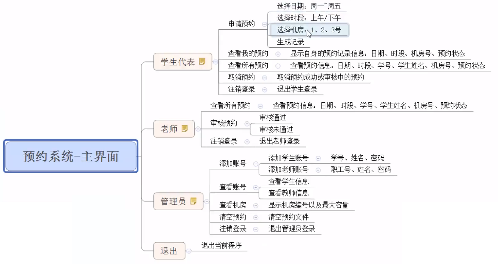

# 机房预约系统

## 1.1 身份简介

分别有三种身份使用该程序：

* 学生代表：申请使用机房
* 教师：审核学生的申请
* 管理员：给学生、教师创建帐号

## 1.2 机房简介

机房共有三间：

* 1号机房：最大容量20人
* 2号机房：最大容量50人
* 3号机房：最大容量100人

## 1.3 申请简介

* 申请订单由管理员每周清空
* 学生可以预约未来一周内机房的使用，周一至周五，预约需要选择预约时间段（上午、下午）
* 教师审核预约，依据实际情况选择是否通过

## 1.4 具体系统需求

* 首先进入登录界面，可选身份有：
  * 学生代表
  * 教师
  * 管理员
  * 退出
* 每个身份都需要进行验证后，进入子菜单
  * 学生需要输入：学号、姓名、登录密码
  * 教师需要输入：职工号、姓名、登录密码
  * 管理员需要输入：管理员姓名、登录密码
* 学生具体功能
  * 申请预约：预约机房
  * 查看自身的预约：查看自己的预约状态
  * 查看所有预约：查看全部预约和状态
  * 取消预约：取消自身的预约，成功的预约或审核中的预约都可以取消
  * 注销登录：退出
* 教师具体功能
  * 查看所有预约：查看全部的预约信息和状态
  * 审核预约：对学生的预约进行审核
  * 注销登录：退出登录
* 管理员具体功能
  * 添加帐号：添加学生或教师帐号，需要检测学号或教师编号是否重复
  * 查看帐号：查看学生或教师的全部信息
  * 查看机房：查看所有的机房信息
  * 清空预约：清空所有的预约记录
  * 注销登录：退出登录

