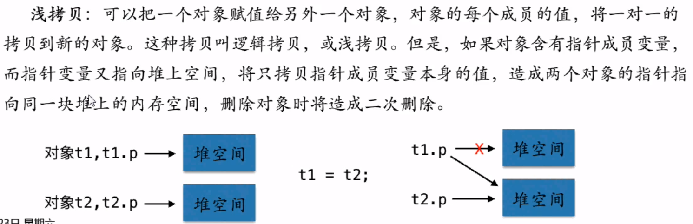
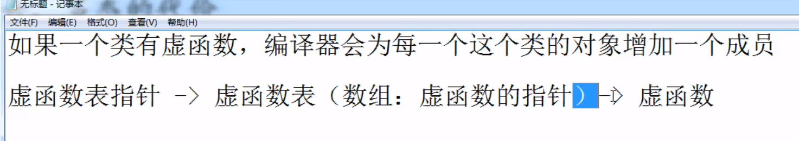
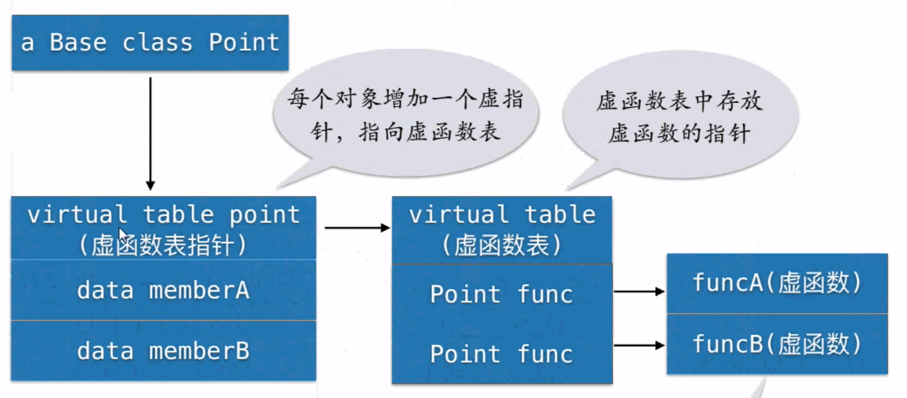
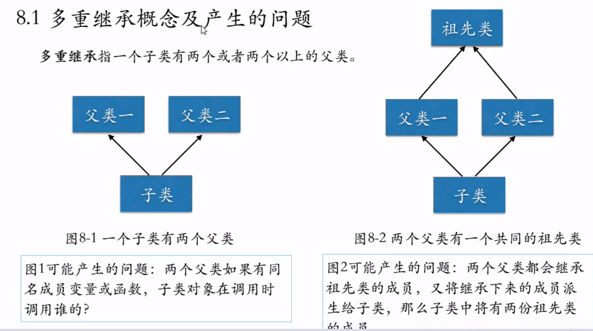
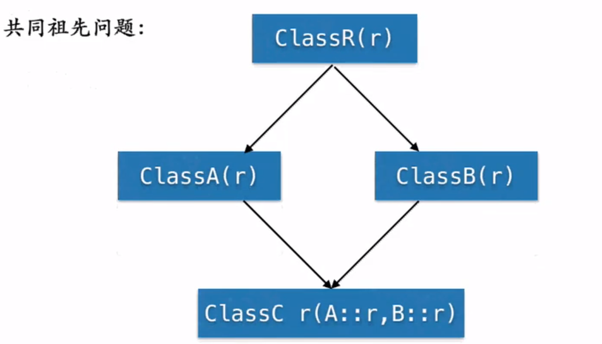
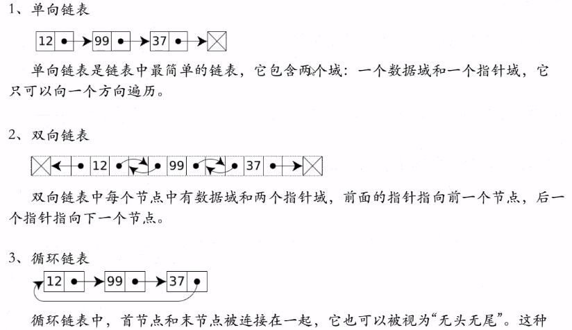

# 类和对象的关系

类是对象的类型，对象是类的具体实例

# 默认构造函数详解

默认构造函数分两种：

1. 构造函数不带参数
2. 构造函数带参位数但参数都有默认值

```c++
class Circle{
Circle(); // 默认构造函数
Circle(float a = 0, float b = 0); // 默认构造函数
Circle(float a, float b); // 有参构造函数
};
```

默认构造函数在使用时，可以不传递参数

# 构造函数初始化列表的使用

初始化列表的优点：

1. 对于类类型的成员，初始化列表的效率更高

2. 有些类型的成员变量必须使用初始化列表的形式初始化，如const成员、引用成员。因为const变量必须被初始化（初始化时赋值），不能被赋值。引用也要被初始化

3. 在继承时，子类的构造函数中初始化父类成员时

   ```c++
   class CPoint{
       public:
       Point();
       Point(float x, float y);
       
       private:
       float x;
       float y;
   }; // CPoint类
   
   class Circle
   {
   public:
       Circle();
       Circle(float x, float y, float r);
       
   private:
       float radius;
       CPoint center;
   };
   
   Circle::Circle() {}
   // 构造函数中需要显式的使用初始化列表初始化center
   // 否则编译器会自动调用Point类中的默认构造函数对其进行初始化
   Circle::Circle(float x, float y, float z) : center(x, y), radius(r) {}
   ```

   

# 复合类的使用

复合类也称组合类，是指将一个类的对象作为另一个类的成员变量

# 类析构函数详解

如果类中有指针成员变量，并且指向堆空间，那么程序员必须显式地声明析构瀚函数，释放指针指向的堆空间，避免内存泄漏。

# 浅拷贝概念及产生的问题



# 类的静态成员

类的静态成员必须在类外使用`类名+作用域符号`初始化，否则会出现链接错误，如

```c++
char *CStudent::m_name = "";
char *CStudent::m_name = nullptr;
```

类的静态成员函数不能访问非静态成员变量和非静态成员函数，只能访问静态成员变量和静态成员函数，因为静态成员函数公有，可以通过类名::静态成员函数的方式调用，所以不能访问非静态成员

普通函数可以访问静态成员，但是一般用静态成员函数操作静态成员变量

# 友元

友元类中的所有成员函数都是友元函数，可以直接访问私有成员

友元类需要前置声明：

```c++
class CCircle; //前置声明，表示有一个类CCircle，但此时编译器并不知道该类的具体声明和实现

class CPoint
{
	friend class CCircle; // 友元类
	...
};

class CCircle
{
	...
};
```

# 继承

* 子类从父类继承了所有成员，除了构造函数、析构函数、赋值运算符重载函数
* 子类继承父类之后，子类的成员分为两部分：1. 继承至父类的部分base part，2. 子类自己拓展的部分 appendent part
* 虽然父类的私有成员被子类继承，但是子类依然不能直接访问父类的私有成员，只能通过继承自父类的公有成员函数访问父类私有成员
* 子类可以自己实现与父类成员函数原型相同，即函数名和参数里列表相同的成员函数，称为覆盖或重写overwrite。当通过父类对象调用被覆盖的函数时，父类版本的函数被调用，当通过子类对象调用覆盖父类的函数时，子类版本的函数被调用。如果想通过子类对象调用被覆盖的父类成员函数，需要使用`子类对象.父类::函数名()`

```c++
class Base
{
private:
    int b_number;
public:
    Base(int i) : b_number(i) {}
    int getNumber() {return b_number;}
    void print() {cout << getNumber() << endl;}
};

class Derived : public Base
{
private:
    int d_number;
public:
    Derived(int i, int j) : Base(i), d_number(j){}
    void print() {cout << getNumber << " " << d_number << endl;}
};
```


继承主要在以下场合使用：

1. 两个类之间有自然的继承关系，即一个类是另一个类的特例（one class of objects is a special case of another class），比如学生继承自人类
2. 实现代码复用。一个类可能需要使用其他类中定义的成员，此时可以定义一个派生类继承自该类，这样我们就不必重复编写代码


类之间最主要的两种交互关系：

1. 组合：一个类是另外一个类的成员变量，一个类拥有另一个类， 是 Has-A, 有一个的关系。如自行车有一个轮子
2. 继承：一个类是另一个类的特例，IS-A，是一个的关系，如一个学生是一个人类

# 虚函数

当父类指针或引用指向子类对象，而子类中又覆盖了父类的函数，希望用父类指针或父类引用，调用到正确版本的函数（父类指针或引用实际所指向的对象版本的函数），需要把该成员函数声明为虚函数

调用虚函数时，到底调用哪个版本，是根据指针或引用实际指向的对象的类型来确定，而不是调用者本身的类型来确定

```c++
class Base
{
public:
	virtual void func() { cout << "Base func." << endl;} // 不加虚函数的话父类的指针或引用指向子类对象时，父类指针或引用仍然会调用父类的函数而不是子类的函数
};

class Derived : public Base
{
public:
    void func() { cout << "Derived func." << endl;}
};

void foo(Base &pBase)
{pBase.func();}

int main(int argc, const char *argv[])
{
    Base base;
    Derived derived;
    Base *pBase = &derived; // 父类指针指向子类
    Base &rBase = derived; // 父类引用引用子类
    base.func(); derived.func();
    pBase->func(); rBase.func(); // 调用的是子类的函数
    foo(derived); // 同样是父类引用接收子类
    
    Base *p[2] = {&base, &derived}; // 父类的指针数组
    p[0]->func(); p[1]->func();
    return 0;
}
```

# 虚析构函数

如果一个类有子类，则这个类的析构函数必须是虚函数，即虚析构

如果父类的析构不是虚析构，则当用delete删除一个指向子类对象的父类指针时，将调用父类版本的析构函数，子类只释放了来自于父类的那部分成员变量，而子类自己扩展的成员没有被释放，造成内存泄漏。

```c++
class Base
{
public:
    Base(){}
    virtual ~Base(){cout << "Base destructor." << endl;}
};

class Derived : public Base
{
public:
    Derived(){}
    ~Derived() {cout << "Derived destructor.\n"}
};

int main()
{
    Base *pBase = new Derived(); // 声明一个子类对象在堆区
    delete pBase; // 如果父类不是虚析构将调用父类的析构函数，子类只释放了继承自父类的那部分成员
    return 0;
}
```

# 动态绑定

虚函数被调用时，到底调用哪个版本，在编译的时候无法确定，只有在执行时才能确定，成为动态绑定。普通的函数调用，是在编译时就可以确定调用哪个版本的函数

绑定使得程序可以照顾到未来增加的代码，比如创建一个新的子类，并在子类中覆盖了父类的虚函数。用之前的父类指针，依然可以正确的调用到新子类里的函数。而无需对旧代码进行更改。

# 多态 

多态：父类的指针或引用有多种形态

用一个父类的指针或引用 统一操作各种子类对象（也包括父类对象）


多态的代价:

* 为了实现动态绑定，编译器会为每一个包含虚函数的类提供一个虚函数表，这个虚函数表被一个虚指针指向，这个类的虚函数表包含一个数组用于存放虚函数的地址，每一个指针指向了类中的虚函数。
* 当虚函数被调用时，编译器会使用该对象中的虚指针来查找虚函数表，然后遍历虚函数表，以查找到虚函数的指针（地址），最终找到正确版本的函数。





* 代价是增加了内存使用，并且要经历两次寻址，运行速度变慢

# 纯虚函数和抽象类

* 纯虚函数：虚函数只有声明，函数体=0,就是一个纯虚函数，纯虚函数没有函数体，不需要实现。在子类里实现纯虚函数的具体功能。
* 抽象基类：拥有纯虚函数的类叫做抽象类，抽象类只能作为基类，不能实例化对象。因为抽象类的纯虚函数没有具体实现。
* 抽象类提供了不同种类的子类对象的一个通用接口
* 纯虚函数被定义在派生类中，如果派生类不重写基类的纯虚函数，则派生类也是一个抽象类。

# 多重继承



* 解决方法：子类对象调用时加上父类作用域

菱形继承



为了解决菱形继承二义性问题，使用虚继承

虚继承：

* 直接继承祖先的两个基类，在继承时加virtual
* 通过多重继承而来的哪个子类（孙子类），在构造函数时，要调用祖先类的构造函数。孙子辈的派生类，直接继承祖先类的成员，再继承两个父类各自拓展的成员

```c++
class R{};
class A : public R{};
class B : public R{};
class C : public A, public B {};
```

->

```c++
class R{};
class A : virtual public R{};
class B : virtual public R{};
class C : public A, public B {};
```

示例：

```c++
class R // 祖先类
{
private:
    int r;
public:
    R(int i){ t = i;}
    void printOn() const {cout << r << endl;}
};

class A : virtual public R // 父类A
{
public:
    A(int i1, int i2) : R(i2) { a = i1;}
private:
    int a;
};

class B : virtual public R // 父类B
{
public:
    B(int i1, int i2) : R(i2) { b = i1;}
private:
    int b;
};

class C : public A, public B // C直接继承祖先类R的成员，再继承两个父类各自扩展的成员
{
public:
    C(int i1, int i2, int i3, int i4) : R(i1), A(i2, i1), B(i3, i1) {c = i4;}
private:
    int c;
};

int main()
{
    C c(1, 2, 3, 4);
    c.printOn(); // 因为虚继承C中的r和printOn函数直接从R类中继承，所以孙子类中只有一份R的成员
    return 0;
}
```

# 异常处理

C++异常处理主要使用三个关键字：try、throw和catch， try-catch块的形式为：

```c++
try
{包含可能抛出异常的语句;}
catch(类型名[形参名]) // 捕获特定的异常
{处理异常语句;}
```

try块:将有可能会出现异常的语句包围在try块中

catch块捕获并处理，捕获和处理的条件是抛出的异常类型与catch块参数类型相匹配

* 注意：并使不使用类try块来包含可能出现异常的代码后，程序就不会崩溃，通常还需要额外的两个操作。1. 满足某个条件时==显式地抛出(throw)一个异常== 2. 使用==catch块来匹配抛出的异常类型==

```c++
#include <iostream>

using namespace std;

void func()
{
	int a = 5, b = 0;
	if (0 == b) throw "Error: Divided by 0!"; // 显式地抛出一个异常
	else if (1 == b) throw 404;
	// 抛出异常后异常后面的代码不会被执行
	int c = a / b;
}

int main()
{
	try { func(); } // 将可能出现异常的块用try包裹
	catch (const char *error) { cout << error << endl; } // catch 参数要和抛出的异常类型匹配
	catch (int errorCode) { cout << errorCode << endl;}
	catch (...) {cout << "Caught error!" << endl;} // 所有异常都可以被捕获，针对性差，通用性强，一般放在后面
	return 0;
}
```


* 异常处理的执行顺序： 抛出异常 --> 捕获异常 -->处理异常
* 抛出异常有程序员决定什么是异常、以及是否抛出异常、抛出何种类型的异常
* 有一种可以捕捉到任何异常的块 `catch(...) {cout << "Eroor" << endl;}`,这种catch是一个保底办法，防止因为有些异常没有匹配的catch块，而导致程序异常终止。因此，一般将匹配程度高的catch块放在前面。而无参的catch块，通用性最强，针对性最差，应该把这个“通用”catch块放在所有的catch块后面

# 模板

模板类的每一个成员函数都是模板函数，在类外实现时需要在每一个函数实现前加模板参数的声明`template <class T>`

* 模板参数也可以有默认值， 如`template <class T = int>`

# 运行时类型识别

运行时类型信息是由操作符dynamic_cast指定。dynamic_cast用于向下转型，即将基类的指针或引用动态转型为派生类指针或引用

* ==static_cast==：静态转型（向下转型），强制转换。不管父类指针是否真的指向子类对象，一律把指针转型后返回。转型不保证安全。
* ==dynamic_cast==：动态转型操作符。把父类指针转型成子类指针，如果转型成功，即父类指针的确指向子类对象，返回子类对象地址， ==如果转型失败，返回NULL==。转型是安全的。

使用格式：

```c++
dynamic_cast<子类指针或引用>(父类指针或引用) // 用来检测父类指针是否可以转换成子类指针
```


* 注意：动态类型转换dynamic_cast的时候必须有virtual虚函数支持

# 字符串类

C++标准提供的字符串string有以下特点：

* 这个类有一个默认构造函数来初始化一个字符串为空字符串 `string str`
* 它也有构造函数接收一个字符串或者一个字符的参数，用于创建一个字符串对象。`string str("Hello World."); string str('I');`
* 构造函数可以使用一个隐式转换构造函数 `string str = "Hello World.";`
* 类字符换还具有拷贝构造换舒和赋值操作符重载。当一个字符串对象被分配到另一个字符串对象时，后者是前者的副本，并且他们是独立的对象。运算符<<可用于输出字符串对象
* 可以获取长度`str.length()`的length成员和函数
* String类中有一个重载操作符`[](int i)`，返回第i个字符，==不会检查是否超出边界==。也可以用`at(int index)`函数来获得，但是==如果超出边界，将抛出异常==。
* 运算符+重载做字符串拼接，也可以用+=拼接字符串
* 字符串对象重载了比较运算符
* 成员函数c_str()是一个封装号的函数，用于返回C类型字符串`string str; str.c_str();`.返回类型为 `char *`
* 成员函数data()也可以用于获取数据`string str; str.data();`

# STL

1. 顺序容器

   1. 向量vector：随机访问任何一个元素，尾部增删元素
   2. 双断队列deque：随机访问，在头部和尾部增删元素
   3. 链表list：顺序访问，任意位置增删元素

   * vector容器，在头部增加、删除元素，其时间消耗与元素数目成正比，若加在尾部，时间消耗是一个常量
   * deque容器，在头部、尾部增加删除元素的时间都是常量
   * vector和deque容器重载了[]运算符，而list没有，所以vector和deque可以随机访问

2. 关联容器

   1. 集合set：集合存储不恩功能有重复元素
   2. 多集合multiset：集合存储可以有重复元素
   3. 映射map：一对一的键值对(key, value)，值可以通过指定的键值检索，key不能重复
   4. 多映射multimap：一对多的键值对(key, value)，key可以重复


顺序容器和关联容器的区别：

* 元素存储的顺序不同
  * 顺序容器：按照插入位置存储
  * 关联容器：按照本身的值大小排列，和插入顺序无关
* 存取元素的方式不同
  * 顺序容器：通关元素在容器里的位置如下标存取
  * 关联容器：通过key存取元素，不关心位置
  * set集合的元素本身就相当于key


# 迭代器

一个迭代器被用来“指向“容器中的元素（不是指针）。迭代器也可以解引用*和进行算术运算


迭代器可以声明如下格式：

* iterator： 前向遍历，可读可写
* const_iterator：前向遍历，只读
* reverse_iterator：后向遍历，可读可写
* const_reverse_iterator：后向遍历，只读


迭代器函数

* begin()：返回一个迭代器指向容器的第一元素
* end()：返回一个迭代器指向容器的最后一个元素的下一个位置
* rbegin()：返回一个反向迭代器指向容量的最后一个元素
* rend()：返回一个反向迭代器指向容器的第一个元素之前的一个位置

# 链表

* 一般链表在一些需要快速插入\删除，而不太关心随机访问的情况下使用
* 链表相对于数组：链表允许任意位置插入删除节点，但是链表不支持随机访问节点，只能从头节点逐个遍历每个节点
* 链表分为三种：单向链表、双向链表以及循环链表

