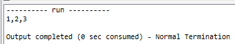
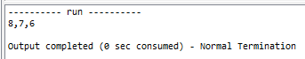
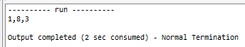
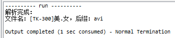

>   
>
>   一个由C/C++编译的程序占用的内存分为以下几个部分：
>
>    1、**栈区（stack）**：又编译器自动分配释放，存放函数的参数值，局部变量的值等，其操作方式类似于数据结构的栈。
>    2、**堆区（heap）**：一般是由程序员分配释放，若程序员不释放的话，程序结束时可能由OS回收，值得注意的是他与数据结构的堆是两回事，分配方式倒是类似于数据结构的链表。
>    3、**全局区（static）**：也叫静态数据内存空间，存储全局变量和静态变量，全局变量和静态变量的存储是放一块的，初始化的全局变量和静态变量放一块区域，没有初始化的在相邻的另一块区域，程序结束后由系统释放。
>    4、文字常量区：常量字符串就是放在这里，程序结束后由系统释放。
>    5、程序代码区：存放函数体的二进制代码。

# 一、栈空间

## 1.1 自动释放内存无需码农操作

　　我们在程序中所定义的定义的局部变量int、局部数组等都是存储在栈空间中。==栈空间具有一个鲜明的特点：**函数内定义的变量出了函数范围，其所占用的内存空间自动释放**。但是，**栈空间的尺寸有最大限制，不适合分配大空间使用**；==

　　所以，因为==栈空间出了函数范围就释放，所以不适合要给其他地方使用的内存需求。其最大的好处就在于：不用程序员手动释放内存。==

## 1.2 ==不要把局部变量的指针做为返回值返回==

　　首先，我们来看看下面一段代码，其中getData函数返回了一个int数组类型的指针，而getData2函数返回了另一个int数组类型的指针：

```c
int *getData()
{
    int nums[10]={1,2,3,4,5,6,7,8};
    return nums;
}
 
int *getData2()
{
    int aaa[10]={8,7,6,5,4,3,2,1};
    return aaa;
}
```

　　我们在main函数中首先调用getData函数，看看能否取得nums数组的前三个元素：

```c
int main(int argc, char *argv[])
{
    int *nums = getData();
    printf("%d,%d,%d\n",nums[0],nums[1],nums[2]);
    return 0;
}
```

　　运行结果如下图所示，我们发现是OK的，原来可以将局部变量的指针作为返回值返回呢！



　　但是，如果我们在调用getData函数之后，又调用了getData2函数呢，这时还能正确地打印nums数组吗？看看下面的执行顺序：

```c
int main(int argc, char *argv[])
{
    int *nums = getData();
    getData2();
    printf("%d,%d,%d\n",nums[0],nums[1],nums[2]);

    return 0;
}
```

　　在打印之前，我们又执行了getData2函数，那么运行结果呢，看看下图吧：



　　这时，突然觉得，忧伤爆了！刚刚都还是好的啊！

　　那么，问题来了，这是为什么呢？我们刚刚提到了，==栈是由系统自动分配和释放，函数内部的局部变量的生命周期就只是在函数周期内，只要函数执行完毕，那么其内部的局部变量的生命周期也就结束了。于是，当我们执行完第一句代码后，nums指针所指向的数组的那一块内存区域可能就已经被释放了，但是数据还未清理也就是还留在那儿。但是，当我们执行完第二句代码后，在getData2函数中又定义了一个数组aaa，它又将刚刚释放的栈空间内存占用了，于是nums所指向的这块区域就是aaa了。当执行完第二句代码，aaa又被释放了，但是其数据还在那里并未清除，也就是我们前面几篇提到的脏内存区域。所以，最后显示的就是8,7,6而不是1,2,3了。==

# 二、堆空间

## 2.1 技术控都喜欢开手动档汽车

　　刚刚提到的栈空间最大的优点就是栈空间出了函数范围就释放，不需要程序员手动释放，就像自动挡汽车一样，都不用我们去加减档变速。但是，如果我们向自己控制内存的分配呢？这时候，就可以使用堆空间来存储，堆空间可以存储栈空间无法存储的大内存。这里，我们可以借助==malloc函数在堆空间中分配一块指定大小的内存，用完之后，调用free函数及时释放内存。==

```c
    // malloc(要分配的字节数)
    int *nums = (int*)malloc(sizeof(int)*10);
    nums[0]=1;
    nums[1]=8;
    free(nums);
```

　　需要注意的是：在malloc函数中需要指定要分配的内存所占用的字节大小。

## 2.2 ==函数返回指针的几种解决办法==

　　（1）==在方法内malloc，用完了由调用者free==

　　这里我们可以结合malloc和free来解决我们在栈空间中所遇到的问题，重写上面的代码如下：

```c
int *getData()
{
    int *nums = (int*)malloc(sizeof(int)*10);
    nums[0]=1;
    nums[1]=8;
    nums[2]=3;

    return nums;
}

int *getData2()
{
    int *nums = (int*)malloc(sizeof(int)*10);
    nums[0]=2;
    nums[1]=7;
    nums[2]=5;

    return nums;
}

int main(int argc, char *argv[])
{
    int *numsptr = getData();
    int *numsptr2 = getData2();
    // numptr[1]等价于*(numptr+1)
    printf("%d,%d,%d\n",numsptr[0],numsptr[1],numsptr[2]);
    // 不要忘记释放内存
    free(numsptr);
    free(numsptr2);

    return 0;
}
```

　　这里我们将所有要返回的指针都改为了使用malloc动态分配的，在main函数中调用free将内存手动释放掉，来看看运行结果：



　　这下输出的还是getData函数返回的指针所指向的内存区域的数据，没有出现交叉影响，完美！

　　（2）==把局部变量定义为static==

```c
char *getStr()
{
    static char strs[]="afsafdasfdsdfsaddafafafasdfadfs";
    return strs;
}

int main(int argc, char *argv[])
{
    char* strsptr = getStr();

    return 0;
}
```

　　由本文开篇可知，除了栈空间和堆空间，还有一块全局区，它直到程序结束后才会释放。

　　But，需要注意的是：不适合于多线程调用，如果想保存返回内容，你需要调用者尽快复制一份。

　　（3）==**（推荐）**由调用者分配内存空间，只是把指针发给函数，函数内部把数据拷贝到内存中==

　　这里怎么来理解呢，也就是三个步骤，==第一步：由调用者分配内存空间；第二步：把指针传递给函数；第三步：函数内部把数据拷贝到内存中。==下面我们通过一个小案例：从文件名分析文件名和扩展名，来看看这三个步骤怎么来实现。

```c
// Step3:函数内部把数据拷贝到内存中
void parseFileName(char* filename,char* name,char* ext)
{
    char *ptr = filename;
    while(*ptr != '\0')
    {
        ptr++;
    }
    // 记录结尾的指针
    char *endPtr = ptr;

    //ptr移动到了字符串的结尾，再把ptr移动到"."的位置
    while(*ptr != '.')
    {
        ptr--;
    }

    // 两个指针相减表示两个指针相隔的元素的个数
    memcpy(name,filename,(ptr-filename)*sizeof(char));
    memcpy(ext,ptr+1,(endPtr-ptr)*sizeof(char));
}

int main(int argc, char *argv[])
{
    // Step1:由调用者分配内存空间
    char str[] = "[TK-300]美.女.avi"; 
    char name[20] = {0};
    char ext[20] = {0};
    // Step2:只是把指针传递给函数
    parseFileName(str,name,ext);
    printf("解析完成：\n");
    printf("文件名：%s，后缀：%s\n",name,ext);
    
    return 0;
}
```

　　这种方法避免了函数返回指针，程序员手动分配的内存都是在栈空间中，然后函数内部处理后再将经过逻辑处理后的数据存储到栈空间中的指定区域内，最后main函数中再访问修改后的内存区域。这里的运行结果如下图所示：



　　虽然这个文件名有点邪恶，但是功能还是完成了