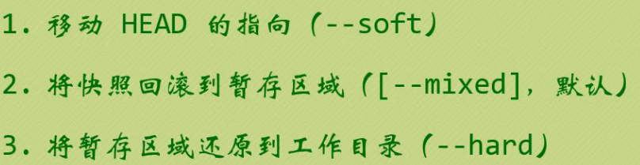
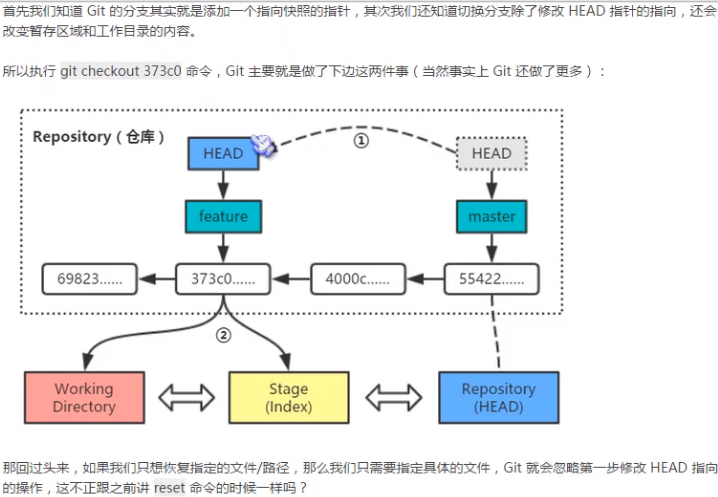

# 理论基础

**Git 记录的是什么？**

------


如果你有使用 SVN 等其他版本控制系统的经验，你应该知道它们的工作原理是记录每一次的变动。每一次版本迭代，SVN 记录的是文件的变化内容。通常让我们自己来写一个版本管理工具也会首选这样的思维吧？就像写小说一样，每次就增加一个章节，修改若干错别字，最终装订成册……没必要为每次的修改都拷贝一整本书！这种存储方式也是有名堂的，叫增量文件系统（Delta Storage systems）。


而 Linus 童鞋这次却决定剑走偏锋，以一种看似“异端”的方式来处理版本迭代：如果每个版本中有文件发生变动，Git 会将整个文件复制并保存起来。这种设计看似会多消耗更多的空间，但在分支管理时却是带来了很多的益处和便利（分支管理我们后边会讲，不急）。


**突然想到了一句话：普通的程序员是把很多的时间放在写代码和调 Bug 上，而优秀的程序员是将更多的精力放在设计上……**

你的==本地仓库==有 Git 维护的三棵“树”组成，这是 Git 的核心框架。

这三棵树分别是：工作区域、暂存区域和 Git 仓库


==工作区域==（Working Directory）就是你平时存放项目代码的地方。

==暂存区域==（Stage）用于临时存放你的改动，事实上它只是一个文件，保存即将提交的文件列表信息。

==Git 仓库==（Repository）就是安全存放数据的位置，这里边有你提交的所有版本的数据。其中，HEAD 指向最新放入仓库的版本（这第三棵树，确切的说，应该是 Git 仓库中 HEAD 指向的版本）。

OK，==Git 的工作流程一般是酱紫：==

1. ==在工作目录中添加、修改文件；==

2. ==将需要进行版本管理的文件放入暂存区域；==

3. ==将暂存区域的文件提交到 Git 仓库。==

因此，Git 管理的文件有三种状态：==已修改（modified）、已暂存（staged）和已提交（committed）==，依次对应上边的每一个流程。

等等……

看到这里，有些鱼油肯定有疑惑：“你说 Git 仓库用于存放每次的版本迭代，我可以理解。但为何还要多增加一个暂存区域呢？”

我这里打个比方：像某些厂家开发一个产品，一般他们都留有一手，不会把该产品的所有特性一次性发布。通过产品的迭代，每年秋季你就可以开开心心地买到又有一两项新功能的“新”产品了。

 我好像知道的太多了……

So，有时你并不想把工作目录中所有的新功能都提交到最新版本，你就可以先添加一些本次需要提交的文件到暂存区，然后从暂存区中提交它们……所以暂存区在江湖中有个外号叫“索引”（Index）。

**记住这三棵树，因为后边教的所有 Git 操作基本上都是在这三棵树之间搞来搞去！**

```bash
git add <file> // 添加工作目录文件到暂存区
```

```bash
git commit -m "信息" // 提交暂存区文件到仓库
```

```bash
git commit -am "信息" // 相当于执行了add和commit -m 命令
// 	将本地修改过的文件且已经追踪的文件添加到本地的暂存区然后将暂存区的代码提交到本地仓库
```

需要注意的是`git commit -am` 只能提交已经追踪过并且修改了的文件，如果有新增文件的话就必须先`add`再`commit`

---

# 查看工作状态和历史提交

文件一般保存问UTF-8无BOM格式，这样在Linux和Mac下兼容性最好。

## 查看状态

```bash
git status
```

## MIT协议

新建LICENCE文件（无扩展名），拷贝MIT协议内容至文件夹。MIT协议表示任何人可以修改使用代码。

## add仓库后撤销add操作

```bash
git reset HEAD <file>
```

## 用暂存区的文件覆盖工作目录的文件

```bash
git checkout -- <file>
```

## 查看历史提交

```bash
git log
```

---

# 回到过去


## 回滚仓库快照到前一个版本

```bash
git reset HEAD~ // 返回上一个快照
git reset HEAD~~ //返回上两个快照
git reset HEAD~2 //返回上两个快照
...
git reset HEAD~10 // 返回上十个快照
```

假如现在的状态是这样的：


执行完reset命令后：


注意仓库和暂存区的版本都改变了，最新的版本并不会消失，只是HEAD指针指向了上一版本。

## reset命令的选项


`--mixed` 是默认选项，同时回滚了仓库和暂存区


`--soft`只会回滚仓库，不会改变暂存区，相当去撤销了`commit`命令


`--hard`选项还会改变工作目录，比较危险的选项

### `reset`命令回滚快照三部曲



### 回滚指定快照

```bash
git reset 哈希值（快照ID）
```

>  快照名不必要完全输入，只输入见面6、7个字母就可以

### 回滚个别文件

```bash
git reset 版本快照 文件名/路径
```

>  快照名不必要完全输入，只输入见面6、7个字母就可以

### 往后滚

```bash
git reset 版本快照的ID号（哈希值）
```

> 快照名不必要完全输入，只输入见面6、7个字母就可以

---

# 版本对比

### 比较暂存区域与工作目录

```bash
git diff
```

`---`表示旧文件， `+++`表示新文件

当出现`：`浏览时-

> `j`向下移动一行，`k`向上一行，`f`向下翻一页，`b`向上翻一页，`d`向下翻半页， `u`向上移动半页，小写`g`第一行，大写`G`最后一行，先输入数字再输入`g`跳到数字指定的行数。`/`加关键词从上往下搜索，`？`加关键词从下往上搜索。搜索时个按小写`n`移动到搜索结果的下一个， 按大写`N`移动到上一个搜索结果。按`h`弹出帮助窗口。

### 比较两个历史快照

```bash
git diff 快照ID1 快照ID2
```

> 快照名不必要完全输入，只输入见面6、7个字母就可以

### 比较当前工作目录和Git仓库中的快照

```bash
git diff 快照ID
git diff HEAD // 比较当前工作目录和Git仓库当前版本
```

### 比较暂存区域和Git仓库快照

```bash
git diff --cached 快照ID // 忽略快照ID就是比较当前仓库快照和暂存区域的内容
```


---

# 修改最后一次提交、删除文件和重命名文件

### 修改最后一次提交


```bash
git commit --amend // 进入更改说明的界面（vim编辑界面）
git commit --amend -m <message> // 直接提交
```

### 删除文件

```bash
git checkout -- <filename> // 从暂存区恢复到工作目录(撤销误删除文件)
```

#### 从工作目录和暂存区删除

```bash
git rm <filename>  // 删除暂存区和工作目录的文件（只有当工作目录和暂存区的文件内容相同时才能这样写）
git rm -f <filename> // 强行删除暂存区和工作目录的文件（即时两个文件内容不同也要强行删除）
git rm --cached <filename> // 只删除暂存区的文件
```


#### 然后--soft回滚仓库

```bash
git reset --soft HEAD // 回滚仓库
```

### 重命名文件

```bash
git mv <oldFileName> <newFileName> // 修改工作目录和暂存区的文件名
```

---

# 创建和切换分支

## Git分支


## 创建分支

```bash
git branch <featureName>
```

```bash
git log --decorate // 显示指向提交的所有引用，比如分支，标签
// --decorate是默认选项，不输入也可以
```

## 切换分支

把HEAD指针切换到<feature>分支

```bash
git checkout 分支名
```

切换之前：


切换之后：


```bash
git log --decorate --oneline // 精简版的log
```

### 创建并切换分支

```bash
git checkout -b 分支名
```


```bash
git log --oneline  --graph --all 	
```

> git log 里`--graph`选项以图形方式显示，`--all`显示所有分支

---

# 合并和删除分支


## 合并分支

```bash
git merge 分支名
```

## 删除分支

```bash
git branch -d 分支名
```

---

# 匿名分分支和checkout命令

## 切换到匿名分支

```bash
git checkout HEAD~
```




---

# git删除本地分支和删除远程分支

　　我现在在dev20181018分支上，想删除dev20181018分支

　　1 先切换到别的分支: git checkout dev20180927

　　2 删除本地分支： git branch -d dev20181018

　　3 如果删除不了可以强制删除，git branch -D dev20181018

　　4 有必要的情况下，删除远程分支：git push origin --delete dev20181018

　　5 在从公用的仓库fetch代码：git fetch origin dev20181018:dev20181018

　　6 然后切换分支即可：git checkout dev20181018

　　注：上述操作是删除个人本地和个人远程分支，如果只删除个人本地，请忽略第4步