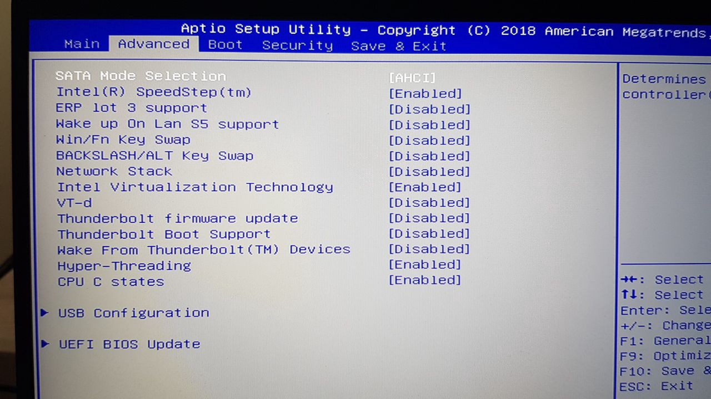
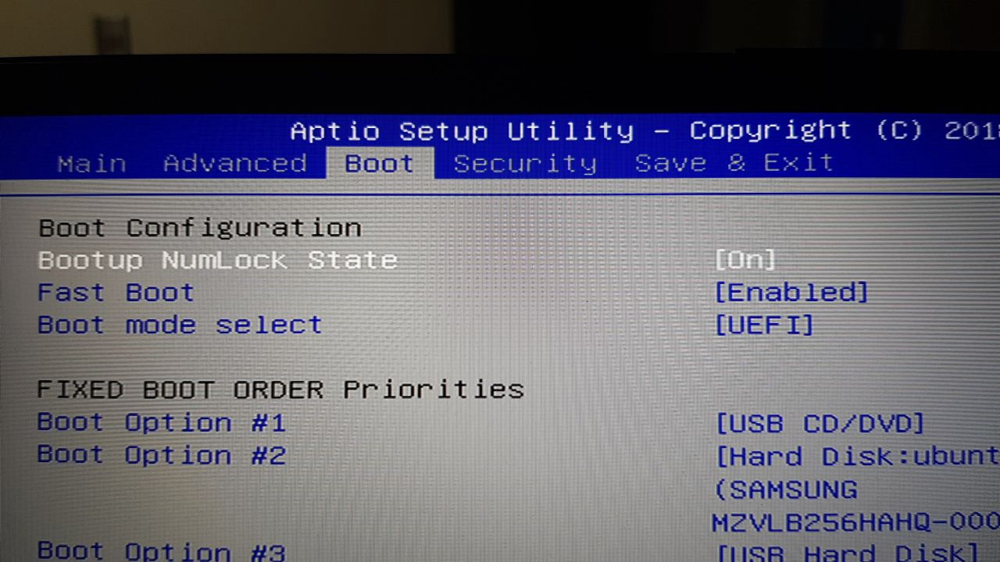
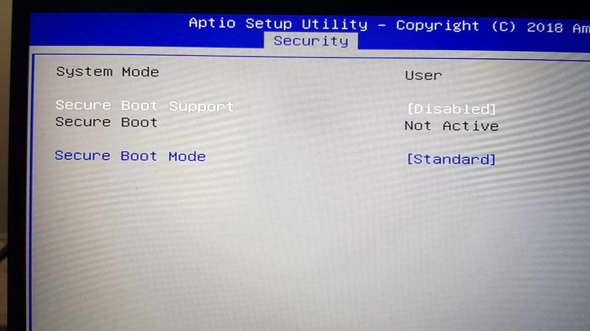
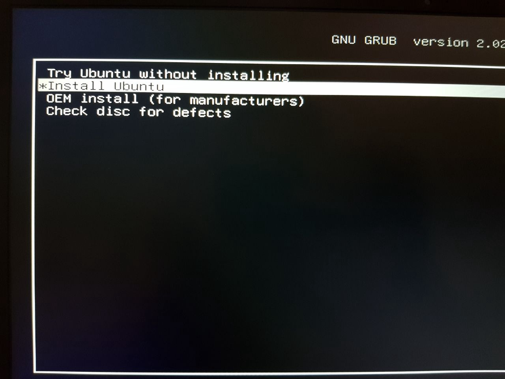

# BIOS setup

First thing we need to do is setup our BIOS with the right configurations. I only disabled Secure Boot, some people say you should disable more than that, but just the Secure Boot part worked for me. You can see my configuration below in screenshots.




Nothing changed from default




Fastboot enabled, UEFI, again nothing changed from default




Secure Boot disabled

# Installing Ubuntu 18.04

I used a simple 8GB USB with the most recent Ubuntu 18.04 image. There’s one thing you need to do, otherwise it will freeze at a random point during the installation.

Just before booting from the USB, on the menu, select “Install Ubuntu” and press “e”, then on the line that reads “linux /cas/vmlinuz”, just before the “quiet splash — -”, write “nomodeset”, then press “F10” to run. You can see screenshots below.




On "Install Ubuntu" press 'e'


Write "nomodeset" before quiet splash, then F10 to load

After this, install as you wish.

# First boot into Ubuntu 18.04

If you did the nomodeset part above, your Ubuntu 18.04 should have that option by default on boot. Just make sure it does, on boot, ‘Ubuntu’, press ‘e’ again and **just make sure it says “nomodeset” around the same linux quiet splash line**, then F10. If it doesn’t then add it just like you did when installing, otherwise Ubuntu will freeze.

# Installing GPU drivers

1.  Install the ubuntu recommended drivers, they should work just fine.

```
sudo ubuntu-drivers autoinstall
```

\2. We need to tell grub to stop using nomodeset and to blacklist Nouveau. The reason for blacklisting nouveau is because we now use nvidia.
Edit /etc/default/grub,

```
sudo nano /etc/default/grub
```

Go to the line with “GRUB_CMDLINE_LINUX”, remove “nomodeset” and write “nouveau.blacklist=1”, save the file.

Line should be like this:

```
GRUB_CMDLINE_LINUX="nouveau.blacklist=1"
```

Now let's update the boot configuration.

```
sudo grub-mkconfig -o /boot/grub/grub.cfg
```

\3. Reboot. Now you laptop should be running the nvidia drivers (we have not changed to intel yet). Select the intel card:

```
sudo prime-select intel
```

\4. Install bbswitch. It’s a tool we will use for disabling the nvidia card at boot, so we will always use the intel only.

```
sudo apt install bbswitch-dkms
```

\5. Configure bbswitch. Create file (or edit) bsswitch conf file:

```
echo "options bbswitch load_state=0" | sudo tee /etc/modprobe.d/bbswitch.conf
```

\6. Add bbswitch to the modules to load (simply add "bbswitch" to the end of this file: /etc/modules)

```
echo "bbswitch" | sudo tee -a /etc/modules
```

\7. Now let's make the changes take effect after boot.

```
sudo update-initramfs -u
```

\8. Reboot

Now your laptop should be loading the intel drivers only. Thunderbolt (USB-C) port should also work for extra monitors. If you need to use HDMI, you need to use the nvidia drivers (disable bbswitch, select nvidia on prime-select and reboot).
I don’t recommend using bumblebee for Ubuntu 18.04. If you want to game, you can use Ubuntu 16.04, bumblebee works wonders there on this same laptop, or you could just not disable the nvidia drivers.

# Making suspend work

I never shut down my laptop, I just close it and open when I need. The first time you suspend it and wake it up, you will notice it’s in airplane mode and you can’t turn on WiFi. We need to add some commands to the GRUB boot configuration in order to make it work. If you run dmesg, you will notice there are ACPI errors (or sometimes on boot, you might see some ACPI errors). We need to add some specific instructions for ACPI so it works. If you have the right fix for that (not using grub commands), let me know to add it here so everyone can use it.

Edit file "/etc/default/grub"
Look for the line that has GRUB_CMDLINE_LINUX_DEFAULT=”quiet splash”
Just before quiet, add add acpi_osi=! acpi_osi=’Windows 2009'
See below screenshot for how this file should look like (at least for me).

```
# The following constants should have these values:
GRUB_CMDLINE_LINUX_DEFAULT=”acpi_osi=! acpi_osi=’Windows 2009' quiet splash”
GRUB_CMDLINE_LINUX=”nouveau.blacklist=1"
```


Now re-generate grub boot config

```
sudo grub-mkconfig -o /boot/grub/grub.cfg
```

Now every time you suspend and wake it up, you can use FN+F10 (press it two times) to disable airplane mode.

# Skype/Discord (even web) not detecting audio devices

If you don’t use skype/discord or don’t have problems with it, you can skip this. I commonly use it for work and for calling family, so I had to make it work. Every time I installed, be it from repository, from skype.com, snap, etc, none would work. The reason is that it uses pulseaudio, but ubuntu 18.04 uses ALSA by default. We need to change it so it works.
\1. Let’s remove the default alsa and any other audio stuff you might had:

```
sudo apt remove --purge alsa-base alsa-utils pulseaudio pulseaudio-utils pavucontrol
```

\2. I recommend rebooting, not needed but ensures no modules/stuff is loaded and not really removed.
\3. Now let’s install pulseaudio. pavucontrol is optional, but I prefer it rather than the default sound settings.

```
sudo apt install pulseaudio pavucontrol
```

\4. Reboot. That’s it, now skype should detect your devices, same for skype web, or discord web.


---

---

---

# Setting up a MSI laptop with GPU (gtx1060)
## Installing Ubuntu 18.04, CUDA, CDNN, Pytorch and TensorFlow

### Installing Ubuntu 18.04

#### Get Image

https://tutorials.ubuntu.com/tutorial/tutorial-create-a-usb-stick-on-ubuntu#0

#### Install (solving issues)

* Security boot disable (change this in BIOS, for MSI computers reboot system and press delete a couple of times
before the OS is loaded)
* **Possible problem: Screen freezing while installing**
  * Reboot system
  * Go to the Install Ubuntu option (**BUT DONT PRESS ENTER**)
  * Press **e**
  * Find the line that starts with *linux* then add *modprobe.blacklist=nouveau* after *quiet splash*.
* Choose a Wifi Network and install third party software and updates
* Once the installation is done, remove the pendrive and reboot system

#### Installing Nvidia Drivers

* Select Ubuntu at GRUB (you may need to repeat the *modprobe.blacklist=nouveau* step if the screen freezes again).
* Make sure security boot is disable
* Access command line (ctrl+alt+ F1,F2,F3...F??)
    ```
    sudo add-apt-repository ppa:graphics-drivers/ppa
    sudo apt update
    # You can change this driver to whatever version suits you best :)
    sudo apt install nvidia-driver-396
    sudo reboot
    ```

### Installing Conda

https://docs.anaconda.com/anaconda/install/linux

### Installing CUDA 9.0 and CUDNN 7.0

https://medium.com/@taylordenouden/installing-tensorflow-gpu-on-ubuntu-18-04-89a142325138

### Installing Pytorch 0.4

#### create conda env
conda create -n torch python=3.6

#### install torch (cuda 9)
conda install -y pytorch=0.4 torchvision cuda90 -c pytorch

#### if cuda 9 fails, install this way using cuda 8 
conda install -y pytorch=0.4 torchvision -c pytorch
conda install cuda80 -c soumith

#### test gpu install
python -c 'import torch; print(torch.rand(2,3).cuda())'


### Installing TensorFlow (1.8)

https://www.tensorflow.org/install/install_linux#installing_with_anaconda

#### REMEMBER

export LD_LIBRARY_PATH=$LD_LIBRARY_PATH:/usr/local/cuda/lib64


#### test gpu install
python -c 'from tensorflow.python.client import device_lib; device_lib.list_local_devices()'

**output:**
```
2018-06-11 11:32:18.954198: I tensorflow/core/common_runtime/gpu/gpu_device.cc:1053] Created TensorFlow device (/device:GPU:0 with ...)
```

## Getting my battery to last for longer

1. Open the app "Nvidia X Server Settings"
2. Go to "PRIME profiles" and select the Intel (Power Saving Mode).
3. Then restart or log out your user session and log in again.

This way you'll be using the Intel integrated graphics card and the battery will last way more. To use the Nvidia GPU, just repeat the process above but choose Nvidia (Performance Mode).

In a MSI Gs65 Stealth, with nvidia 1060GTX it lasts about 8h with the Intel GPU enabled. It's a minor issue while not using the nvidia graphics cards.