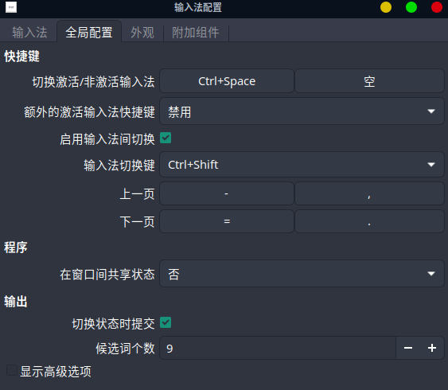

# Linux XFCE4


## Bash

### Edit ~/.bashrc file, add the following line:

```bash
export PS1="\[\033[0;32m\]\T \[\033[1;36m\]User:\[\033[0;33m\]~\[\033[0;35m\]\u\[\033[0;33m\]~ \[\033[1;34m\]Dir:\[\033[1;33m\]\w\[\033[0m\]\n\[\033[1;33m\]努力啊，张猛威 (ง•̀_•́)ง ->\[\033[0m\]"
```


## GS65 休眠后打开无法使用网络解决方案

1. 在`/etc/default/grub`中加入下面一行

   ```bash
   GRUB_CMDLINE_LINUX_DEFAULT="acpi_osi=! acpi_osi='Windows 2009' quiet splash"
   ```

2. 运行如下命令

```bash
sudo grub-mkconfig -o /boot/grub/grub.cfg
sudo update-grub
```

# 快捷键

## 全局快捷键

-   Windows + ` 打开开始菜单
-   Windows + E 打开资源管理器

# Upenn

## Linux连接远程桌面

rdesktop -g 90% vlab-rdp.seas.upenn.edu


# Pycharm

## Change Theme

1.  主题：File -> Settings -> Plugins，搜索：Material Theme UI 并安装。
2.  字体：File -> Settings -> Editor -> Font， Font: Source Code Pro，Size: 16， line-spacing: 1.0，apply，保存。
3.  还有可以设置背景图片 ，按两次shift 搜索set background image 点击最下面那个


 

# Matlab

安装完成后添加桌面图标的方法

新建matlab.desktop文件， 输入以下内容：

>   ```
>   [Desktop Entry]
>   Version=1
>   Name=Matlab
>   Comment=Your comment
>   Keywords=matlab
>   Exec=/usr/local/MATLAB /版本/bin/matlab -desktop
>   Terminal=false
>   X-MultipleArgs=true
>   Type=Application
>   Icon=matlab
>   Categories=GTK;Development;
>   StartupNotify=false
>   ```

把上面的文件放到`~/.local/share/applications/matlab.desktop`

# 取消按Shift在搜狗输入法之间切换

先在输入法设置里面将额外的激活输入法快捷键设置为禁用



再将配置文件属性更改为只读

```bash
chmod 444 ~/.config/fcitx/config
```

