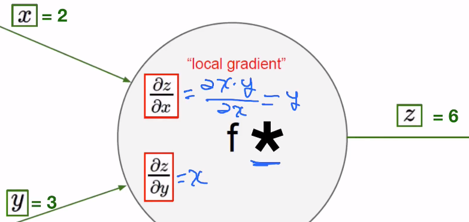

# Machine Learning YouTube Notes

## Lecture 02 Linear Model

### Given  Training Data


### Model Design

What would be the best model for the data? Linear?
$$
\hat{y} = x * w + b
$$

### Training Loss(error)

$$
loss = (\hat{y} - y) ^ 2 = (x * w - y) ^ 2
$$


$$
loss = \frac{1}{N}\sum_{n = 1}^{N}(\hat{y}_n - y_n) ^ 2
$$
Mse : mean square error

### Loss Graph


Model & Loss

For $\hat{y} = x * w$:

```python
w = 1.0 # a random guess: random value
#our model for the forward pass
def forward(x):
    return x * w
```

For $loss = (\hat{y} - y) ^ 2$:

```python
#loss function
def loss(x, y):
    y_pred = forward(x)
    return (y_pred - y) * (y_pred - y)
```

### Compute loss for $w$

```python
for w in np.arange(0.0, 4.1, 0.1):
    print("w = ", w)
    l_sum = 0
    for x_val, y_val in zip(x_data, y_data):
        y_pred_val = forward(x_val)
        l = loss(x_val, y_val)
        l_sum += l
        print("\t", x_val, y_val, y_pred_val, 1)
     print("MSE = ", l_sum / 3)
```

### Code

```python
import numpy as np
import matplotlib.pyplot as plt

x_data = [1.0, 2.0, 3.0]
y_data = [2.0, 4.0, 6.0]

#our model for the forward pass
def forward(x):
    return x * w

#loss function
def loss(x, y):
    y_pred = forward(x)
    return (y_pred - y) * (y_pred - y)

w_list = []
mse_list = []

for w in np.arange(0.0, 4.1, 0.1):
    print("w = ", w)
    l_sum = 0
    for x_val, y_val in zip(x_data, y_data):
        y_pred_val = forward(x_val)
        l = loss(x_val, y_val)
        l_sum += l
        print("\t", x_val, y_val, y_pred_val, l)
    print("MSE = ", l_sum / 3)
    w_list.append(w)
    mse_list.append(l_sum / 3)

#plot part
plt.plot(w_list, mse_list)
plt.ylabel('Loss')
plt.xlabel('w')
plt.show()
```

## Lecture 3: Gradient Descent Algorithm

* What is the learning : find $w$ that minimizes the *loss*

$$
loss(w) = \frac{1}{N}\sum_{n = 1}^{N}(\hat{y}_n - y_n)^2\\
\mathop{\arg\min}_{w} loss(w)
$$

### Gradient descent algorithm


* compute the gradient and decide where to move(contrary to the direction of the gradient)

$$
loss = (\hat{y} - y) ^ 2 = (x * w - y)^2
$$


$$
w = w - \alpha \frac{\partial loss}{\partial w}
= w - \alpha * 2x(xw - y)
$$

#### Which website to calculate the gradient?

<https://www.derivative-calculator.net>


### Code auto_gradient.py

```python
import torch
from torch.autograd import Variable

x_data = [1.0, 2.0, 3.0]
y_data = [2.0, 4.0, 6.0]

w = Variable(torch.Tensor([1.0]),  requires_grad=True)  # Any random value

# our model forward pass


def forward(x):
    return x * w

# Loss function


def loss(x, y):
    y_pred = forward(x)
    return (y_pred - y) * (y_pred - y)

# Before training
print("predict (before training)",  4, forward(4).data[0])

# Training loop
for epoch in range(10):
    for x_val, y_val in zip(x_data, y_data):
        l = loss(x_val, y_val)
        l.backward()
        print("\tgrad: ", x_val, y_val, w.grad.data[0])
        w.data = w.data - 0.01 * w.grad.data

        # Manually zero the gradients after updating weights
        w.grad.data.zero_()

    print("progress:", epoch, l.data[0])

# After training
print("predict (after training)",  4, forward(4).data[0])
```

## Back-propagation

 

*How to compute the gradient of complicated network?*


- Computational graph + chain rule


### Chain rule


$$
f = f(g); g = g(x)\\
\frac{df}{dx} = \frac{df}{dg} \frac{dg}{dx}
$$


\* means multiply




### Computational graph


