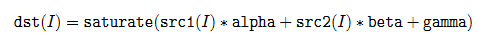
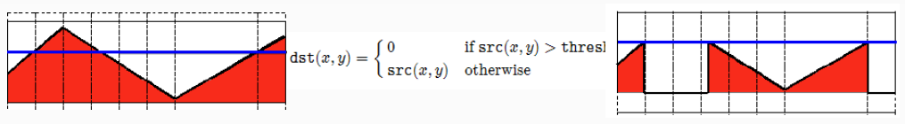
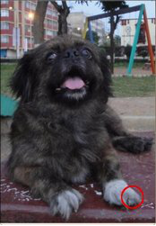
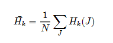

# 001 加载、修改、保存图像

加载图像： `cv::imread`

修改图像：`cv::cvtColor`

保存图像：`cv::imwrite`


加载图像：

* ==`cv::imread`==：加在图像文件成为一个cv::Mat对象，其中第一个参数表示文件路径
* 第二个参数表示加载的图像是什么类型， 支持常见的三个参数值
  * IMREAD_UNCAHNGED(<0)表示加载原图，不做任何改变
  * IMREAD_GRAYSCALE(0)表示把原图作为灰度图像加载
  * IMREAD_COLOR(>0)表示把原图作为RGB图像加载
* OpenCV支持jpg、png、tiff等常见文件的加载


显示图像

* ==`cv::namedWindows 与 cv::imshow`==
* `namedWindows`创建一个OpenCV窗口，由OpenCV自动创建与释放，无需手工销毁
  * 常见用法`namedWindows("Title", WINDOW_AUTOSIZE)`
  * WINDOW_AUTOSIZE会自动根据图像的大小，显示窗口大小，不能人为改变窗口大小
  * WINDOW_NORMAL，跟QT集成的时候会用，允许修改窗口大小
* `imshow`第一个参数是窗口名称，第二个参数是cv::Mat对象


修改图像：

* ==`cv::cvtColor`==
* `cvtColor`把图像从一个色彩空间转换到另一个色彩空间
* 第一个参数表示源，第二个参数表示目标，第三个参数表示源和目标的色彩空间如COLOR_BGR2HLS, COLOR_BGR2GRAY等
* `cvtColor(image, gray_image, COLOR_BGR2GRAY)`


保存图像：

* ==`cv::imwrite`==
* 只有8位、16位和png、jpg、tiff文件格式而且是单通道或者三通道的BGR图像才可以通过imwrite保存
* 保存png格式时可以保存透明通道的图片
* 可以指定压缩参数


# 002 矩阵的掩膜操作

本节内容：

* 获取图像像素指针
* 掩膜操作解释


==获取图像像素指针：==

* `CV_Assert(myImage.depth() == CV_8U)`
* ==`Mat.ptr<uchar>(int i = 0)`==获取图像像素矩阵的指针，索引i表示第i行，从0开始
* 获得当前行指针`const char* current = myImage.ptr<uchar>(row);`
* 获取当前像素点P(row, col)的像素值`p(row, col) = current[col]`


==像素范围处理====`saturate_cast<uchar>`==， 确保GRB值在0～255之间

* `saturate_cast<uchar>(-100)`返回0
* `saturate_cast<uchar>(299)`返回255
* `saturate_cast<uchar>(35)`返回35


掩膜操作实现图像对比度调整


掩膜操作==`cv::filter2D(srcImg, dstImg, imgDepth, kernelSize)`==

* 定义kernel`cv::Mat kernel = (cv::Mat_<char>(3, 3) << 0, -1, 0, -1, 5, -1, 0, -1, 0);`
* depth表示位图深度，有8, 24, 32等， ==-1表示默认==

```c++
cv::Mat dstImg(srcImg.size(), srcImg.type());
cv::Mat kernel = (cv::Mat_<char>(3, 3) << 0, -1, 0, -1, 5, -1, 0, -1, 0);
cv::filter2D(srcImg, dstImg, srcImg.depth(), kernel);
```

# 003 Mat对象

Mat对象与IplImage对象：

* Mat对象OpenCV2.0之后引进的图像数据结构、自动分配内存、不存在内存泄漏的问题，是面向对象的数据结构。分了两个部分，头部与数据部分
* IplImage是从2001年OpenCV发布之后就一直存在，是C语言风格的数据结构，需要开发者自己分配与管理内存，对大的程序使用它容易导致内存泄漏问题


Mat对象构造函数和常用方法:

* 

* ==`cv::Mat::Mat`==构造函数`Mat M(2,2,CV_8UC3, Scalar(0,0,255))`

  * 其中前两个参数分别表示行(row)跟列(column)、第三个CV_8UC3中的8表示每个通道占8位、U表示无符号、C表示Char类型、3表示通道数目是3，第四个参数是向量表示初始化每个像素值是多少（BGR），向量长度对应通道数目一致

* `int sz[3] = {2,2,2}; Mat  L(3,sz, CV_8UC1, Scalar::all(0));`

* ==`cv::Mat::create`==实现

  ```c++
  Mat M;
  M.create(4, 3, CV_8UC2);
  M = Scalar(127,127);
  cout << "M = " << endl << " " << M << endl << endl;
  uchar* firstRow = M.ptr<uchar>(0);
  printf("%d", *firstRow);
  ```

* 自定义内容小数组`Mat C = (Mat_<double>(3,3) << 0, -1, 0, -1, 5, -1, 0, -1, 0);`
* 初始化为0的Mat对象`cv::Mat::zeros`
* 对角矩阵`cv::Mat::eye`


* 常用方法：
  * void copyTo(Mat mat)
    void convertTo(Mat dst, int type)
    Mat clone()
    int channels()
    int depth()
    bool empty();
    uchar* ptr(i=0) // 像素指针


Mat对象使用：

* ==部分复制==：一般情况下==只会复制Mat对象的头和指针部分，不会复制数据部分==
  Mat A= imread(imgFilePath);
  Mat B(A)  // ==只复制==
* ==完全复制==：如果想把Mat对象的头部和数据部分一起复制，可以通过如下两个API实现
  Mat F = A.==clone()==; 或 Mat G; A.==copyTo==(G);


Mat对象使用四个要点：

* 输出图像的内存是自动分配的
* 使用OpenCV的C++接口，不需要考虑内存分配问题
* 赋值操作和拷贝构造函数只会复制头部分
* 使用clone与copyTo两个函数实现数据完全复制


# 004 图像操作

读写像素

* 读一个GRAY像素点的像素值（CV_8UC1）
  `Scalar intensity = img.at<uchar>(y, x); `
  或者 `Scalar intensity = img.at<uchar>(Point(x, y));`

* 读一个RGB像素点的像素值

  ```c++
  Vec3f intensity = img.at<Vec3f>(y, x); // Vec3f也可以， Vec3b也可以
  float blue = intensity.val[0]; 
  float green = intensity.val[1]; 
  float red = intensity.val[2];
  ```

* 修改像素值

  * ```c++
    灰度图像
    img.at<uchar>(y, x) = 128;
    
    RGB三通道图像
    img.at<Vec3b>(y,x)[0]=128; // blue
    img.at<Vec3b>(y,x)[1]=128; // green
    img.at<Vec3b>(y,x)[2]=128; // red
    
    空白图像赋值
    img = Scalar(0);
    
    ROI选择
    Rect r(10, 10, 100, 100); 
    Mat smallImg = img(r);
    ```


Vec3b与Vec3f

* Vec3b对应三通道的顺序是blue、green、red的uchar类型数据。
* Vec3f对应三通道的float类型数据
* 把CV_8UC1转换到CV32F1实现如下：
  `src.convertTo(dst, CV_32F);`


# 006 图像混合

图像线性混合：
$$
g(x) = (1-\alpha)f_0(x) + \alpha f_1(x), 0 < \alpha < 1
$$


API: `addweighted`

* 参数1：输入图像Mat – src1
  参数2：输入图像src1的alpha值
  参数3：输入图像Mat – src2
  参数4：输入图像src2的alpha值
  参数5：gamma值
  参数6：输出混合图像
* 注意点：两张图像的大小和类型必须一致才可以


`add(src1, src2, dst, mask)`: 两张图片直接相加


`multiply(src1, src2, dst, scale)`：两张图片相乘

# 007 调整图像的亮度和对比度

图像变换可以看作如下：
 - 像素变换 – 点操作
 - 邻域操作 – 区域


调整图像亮度和对比度属于像素变换-点操作

$g(i, j) = \alpha f(i, j) + \beta, \alpha > 0, \beta 是增益偏移变量$


重要的API

- `Mat new_image = Mat::zeros( image.size(), image.type() ); ` 创建一张跟原图像大小和类型一致的空白图像、像素值初始化为0
-  `saturate_cast<uchar>(value)`确保值大小范围为0~255之间

- `Mat.at<Vec3b>(y,x)[index]=value `给每个像素点每个通道赋值


# 008 绘制形状和文字

`cv::Point与cv::Scalar`

* Point表示2D平面上一个点x,y

  * ```c++
    Point p;
    	p.x = 10;
    	p.y = 8;
     	or
    	p = Pont(10,8);
    ```

* Scalar表示四个元素的向量
  	`Scalar(a, b, c);// a = blue, b = green, c = red表示RGB三个通道`


绘制线、矩形、园、椭圆等基本几何形状

* 画线 cv::line （LINE_4\LINE_8\LINE_AA）, LINE_AA是反锯齿，否则用LINE_4或LINE_8
* 画椭圆cv::ellipse
* 画矩形cv::rectangle
* 画圆cv::circle
* 画填充cv::fillPoly


OpenCV生成随机数：

```c++
cv::RNG rng((unsigned int)time(NULL));
int range = 10;
int randNum = rng.uniform(0, range);
```


# 009 模糊图像

模糊原理:

- Smooth/Blur 是图像处理中最简单和常用的操作之一
- 使用该操作的原因之一就为了给图像预处理时候减低噪声
- 使用Smooth/Blur操作其背后是数学的卷积计算
- 通常这些卷积算子计算都是线性操作，所以又叫线性滤波


**均值滤波**/归一化盒子滤波：

**高斯滤波**：


**中值滤波**：

- 统计排序滤波器， 中值==对椒盐噪声==有很好的抑制作用

**双边滤波**：

- 均值模糊无法克服边缘(极大极小)像素信息丢失缺陷。原因是均值滤波是基于平均权重

- 高斯模糊部分克服了该缺陷，但是无法完全避免，因为没有考虑像素值的不同

- 高斯双边模糊 – 是边缘保留的滤波方法，避免了边缘信息丢失，保留了图像轮廓不变


OpenCV相关API:

- **均值模糊**
  	- `blur(Mat src, Mat dst, Size(xradius, yradius), Point(-1,-1));`
  	- 
- **高斯模糊**
   - `GaussianBlur(Mat src, Mat dst, Size(11, 11), sigmax, sigmay);`其中Size（x, y）, x, y 必须是正数而且是==奇数==
 - **中值模糊**`medianBlur（Mat src, Mat dest, ksize）`中值模糊的ksize大小必须是大于1而且必须是==奇数==。
 - **双边模糊**`bilateralFilter(src, dest, d=15, 150, 3);`
   - 15 –计算的半径，半径之内的像数都会被纳入计算，如果提供-1 则根据sigma space参数取值
   - 150 – sigma color 决定多少差值之内的像素会被计算
   - 3 – sigma space 如果d的值大于0则声明无效，否则根据它来计算d值

# 010 腐蚀与膨胀

* 图像形态学操作 – 基于形状的一系列图像处理操作的合集，主要是基于集合论基础上的形态学数学
* 形态学有四个基本操作：**腐蚀、膨胀、开、闭**
* 膨胀与腐蚀是图像处理中最常用的形态学操作手段


形态学操作(morphology operators)-**膨胀**:

* 跟卷积操作类似，假设有图像A和结构元素B，结构元素B在A上面移动，其中B定义其中心为锚点，计算B覆盖下A的==最大像素(越浅值越大)==值用来替换锚点的像素，其中B作为结构体可以是任意形状

形态学操作-**腐蚀**:

- 腐蚀跟膨胀操作的过程类似，唯一不同的是以最小值替换锚点重叠下图像的像素值

OpenCV相关API：

- `getStructuringElement(int shape, Size ksize, Point anchor)`
-  - 形状 (MORPH_RECT \MORPH_CROSS \MORPH_ELLIPSE)
   - 大小
   - 锚点 默认是Point(-1, -1)意思就是中心像素
 - `dilate(src, dst, kernel) `
- `erode(src, dst, kernel)`
- ==动态调整结构元素大小==`TrackBar – createTrackbar(const String & trackbarname, const String winName,  int* value, int count, Trackbarcallback func, void* userdata=0)`
  其中最中要的是 callback 函数功能。如果设置为NULL就是说只有值update，但是不会调用callback的函数。

# 011 形态学操作

==形态学操作处理二值图像和灰度图像进行处理==

形态学操作：

* 开操作open
* 闭操作close
* 形态学梯度Morphological Gradient
* 顶帽top hat
* 黑帽black hat

#### 开操作， 去除局部极大值

先腐蚀后膨胀，可以去掉小的对象，假设对象是前景色，背景是黑色

、

#### 闭操作， 去除局部极小值

先膨胀后腐蚀 可以填充小的洞（fill hole），假设对象是前景色，背景是黑色


#### 形态学梯度- Morphological Gradient

膨胀减去腐蚀，又称为基本梯度（其它还包括-内部梯度、方向梯度）


#### 顶帽top hat， 显示局部极大值

顶帽 是原图像与开操作之间的差值图像


#### 黑帽 black hat， 显示局部极小值

黑帽是闭操作图像与源图像的差值图像


#### OpenCV API

`morphologyEx(src, dest, OPT, kernel);`

 - Mat src – 输入图像
 - Mat dest – 输出结果
 - int OPT – CV_MOP_OPEN/ CV_MOP_CLOSE/ CV_MOP_GRADIENT / CV_MOP_TOPHAT/ CV_MOP_BLACKHAT 形态学操作类型
 - Mat kernel 结构元素
 - int Iteration 迭代次数，默认是1

# 012 形态学操作 提取水平与竖直线

原理：

图像形态学操作时候，可以通过自定义的结构元素实现结构元素对输入图像一些对象敏感、另外一些对象不敏感，这样就会让敏感的对象改变而不敏感的对象保留输出。通过使用两个最基本的形态学操作 – 膨胀与腐蚀，使用不同的结构元素实现对输入图像的操作、得到想要的结果。

 - 膨胀，输出的像素值是结构元素覆盖下输入图像的最大像素值
 - 腐蚀，输出的像素值是结构元素覆盖下输入图像的最小像素值


#### 二值图像与灰度图像上的膨胀操作


#### 二值图像与灰度图像上的腐蚀操作


#### 结构元素

上述膨胀与腐蚀过程可以使用任意的结构元素
常见的形状：矩形、园、直线、磁盘形状、砖石形状等各种自定义形状。

#### 提取步骤

- 输入图像彩色图像 imread
- 转换为灰度图像 – cvtColor
- 转换为二值图像 – adaptiveThreshold
- 定义结构元素
- 开操作 （腐蚀+膨胀）提取 水平与垂直线


#### 转换为二值图像 – adaptiveThreshold

```c
adaptiveThreshold(
Mat src, // 输入的灰度图像
Mat dest, // 二值图像
double maxValue, // 二值图像最大值
int adaptiveMethod // 自适应方法，只能其中之一 – 
		         // ADAPTIVE_THRESH_MEAN_C ， ADAPTIVE_THRESH_GAUSSIAN_C 
int thresholdType,// 阈值类型 THRESH_BINARY, THRESH_BINARY_INV
int blockSize, // 块大小
double C // 常量C 可以是正数，0，负数
)
```


#### 定义结构元素

一个像素宽的水平线 -  水平长度 width/30
一个像素宽的垂直线 – 垂直长度 height/30

#### 开操作(腐蚀+膨胀)-检测


#### 后处理

bitwise_not（Mat bin, Mat dst）像素取反操作，255 – SrcPixel
模糊（blur）


# 013 图像金字塔-上采样和降采样

#### 图像金字塔概念

1. 我们在图像处理中常常会调整图像大小，最常见的就是放大(zoom in)和缩小（zoom out）
2. 一个图像金字塔式一系列的图像组成，最底下一张是图像尺寸最大，最上方的图像尺寸最小，从空间上从上向下看就想一个古代的金字塔。


**高斯金字塔 – 用来对图像进行降采样**
**拉普拉斯金字塔 – 用来重建一张图片根据它的上层降采样图片**

#### 高斯金字塔

高斯金子塔是从底向上，逐层降采样得到。
降采样之后图像大小是原图像MxN的M/2 x N/2 ,就是对原图像删除偶数行与列，即得到降采样之后上一层的图片。
**高斯金子塔的生成过程分为两步：**

 	- 对当前层进行高斯模糊

  - 删除当前层的偶数行与列即可得到上一层的图像，这样上一层跟下一层相比，都只有它的1/4大小。


#### 高斯不同(Difference of Gaussian-DOG)

定义：就是把同一张图像在不同的参数下做高斯模糊之后的结果相减，得到的输出图像。称为高斯不同(DOG)
高斯不同是图像的内在特征，在灰度图像增强、角点检测中经常用到。

#### OpenCV采样相关API

上采样`(cv::pyrUp)` – zoom in 放大
降采样 `(cv::pyrDown)` – zoom out 缩小

* `pyrUp(Mat src, Mat dst, Size(src.cols*2, src.rows*2)) `
  * 生成的图像是原图在宽与高各放大两倍
* `pyrDown(Mat src, Mat dst, Size(src.cols/2, src.rows/2))`
  * 生成的图像是原图在宽与高各缩小1/2


`cv::subtract(src1, src2, dst)`图像相减，可以减去两个高斯模糊的图像获取DOG

`cv::normalize()`图像归一化

# 014 基本阈值操作

==处理对象必须是8位的灰度图像==

#### 阈值类型一阈值二值化(threshold binary)

左下方的图表示图像像素点Src(x,y)值分布情况，蓝色水平线表示阈值 


#### 阈值类型一阈值反二值化(threshold binary Inverted)


#### 阈值类型一截断 (truncate)

#### 

#### 阈值类型一阈值取零 (threshold to zero)


#### 阈值类型一阈值反取零 (threshold to zero inverted)




```c
enum ThresholdTypes {
   THRESH_BINARY     = 0, //!< \f[\texttt{dst} (x,y) =  \fork{\texttt{maxval}}{if \(\texttt{src}(x,y) > \texttt{thresh}\)}{0}{otherwise}\f]
   THRESH_BINARY_INV = 1, //!< \f[\texttt{dst} (x,y) =  \fork{0}{if \(\texttt{src}(x,y) > \texttt{thresh}\)}{\texttt{maxval}}{otherwise}\f]
   THRESH_TRUNC      = 2, //!< \f[\texttt{dst} (x,y) =  \fork{\texttt{threshold}}{if \(\texttt{src}(x,y) > \texttt{thresh}\)}{\texttt{src}(x,y)}{otherwise}\f]
   THRESH_TOZERO     = 3, //!< \f[\texttt{dst} (x,y) =  \fork{\texttt{src}(x,y)}{if \(\texttt{src}(x,y) > \texttt{thresh}\)}{0}{otherwise}\f]
   THRESH_TOZERO_INV = 4, //!< \f[\texttt{dst} (x,y) =  \fork{0}{if \(\texttt{src}(x,y) > \texttt{thresh}\)}{\texttt{src}(x,y)}{otherwise}\f]
   THRESH_MASK       = 7,
   THRESH_OTSU       = 8, //!< flag, use Otsu algorithm to choose the optimal threshold value
   THRESH_TRIANGLE   = 16 //!< flag, use Triangle algorithm to choose the optimal threshold value
};
```

# 015 自定义线性滤波


#### 卷积概念

卷积是图像处理中一个操作，是kernel在图像的每个像素上的操作。

Kernel本质上一个固定大小的矩阵数组，其中心点称为锚点(anchor point)

把kernel放到像素数组之上，求锚点周围覆盖的像素乘积之和（包括锚点），用来替换锚点覆盖下像素点值称为卷积处理。数学表达如下：


#### 常见算子

**Robert算子**

**Sobel算子**

**拉普拉斯算子**

#### 自定义卷积模糊

```c
filter2D方法filter2D(
Mat src, //输入图像
Mat dst, // 模糊图像
int depth, // 图像深度32/8
Mat kernel, // 卷积核/模板
Point anchor, // 锚点位置
double delta // 计算出来的像素+delta
)
```


# 016 处理边缘

#### 卷积边缘问题

图像卷积的时候边界像素，不能被卷积操作，原因在于边界像素没有完全跟kernel重叠，所以当3x3滤波时候有1个像素的边缘没有被处理，5x5滤波的时候有2个像素的边缘没有被处理。


#### 处理边缘

在卷积开始之前增加边缘像素，填充的像素值为0或者RGB黑色，比如3x3在四周各填充1个像素的边缘，这样就确保图像的边缘被处理，在卷积处理之
后再去掉这些边缘。openCV中默认的处理方法是： `BORDER_DEFAULT`，此外常用的还有如下几种：

- `BORDER_CONSTANT` – 填充边缘用指定像素值
- `BORDER_REPLICATE` – 填充边缘像素用已知的边缘像素值。
- `BORDER_WRAP` – 用另外一边的像素来补偿填充

#### BORDER_DEFAULT


#### BORDER CONSTANT


#### BORDER_REPLICATE


#### BORDER_WARP


#### API说明 – 给图像添加边缘API

```c
copyMakeBorder（
 - Mat src, // 输入图像
 - Mat dst, // 添加边缘图像
 - int top, // 边缘长度，一般上下左右都取相同值，
 - int bottom,
 - int left,
 - int right, 
 - int borderType // 边缘类型
 - Scalar value color
）
```

# 017 Sobel

#### 卷积应用-图像边缘提取


边缘是什么 – 是像素值发生跃迁的地方，是图像的显著特征之一，在图像特征提取、对象检测、模式识别等方面都有重要的作用。
==如何捕捉/提取边缘 – 对图像求它的一阶导数== $delta =  f(x) – f(x-1)$, delta越大，说明像素在X方向变化越大，边缘信号越强，用Sobel算子卷积操作！

#### Sobel 算子

- 是离散微分算子（discrete differentiation operator），用来计算图像灰度的近似梯度
- Soble算子功能集合高斯平滑和微分求导
- 又被称为一阶微分算子，求导算子，在水平和垂直两个方向上求导，得到图像X方法与Y方向梯度图像
- Sobel算子对图像噪声比较敏感，一般先==高斯模糊==等预处理


水平梯度：， 垂直梯度： 

最终图像梯度：


Sobel算子求取导数的近似值，kernel=3时不是很准确，OpenCV使用改进版本Scharr函数，算子如下：

#### API说明cv::Sobel 

```c
cv::Sobel (
InputArray Src // 输入图像
OutputArray dst// 输出图像，大小与输入图像一致
int depth // 输出图像深度. 不推荐用-1即使用源深度，因为值超出原本深度会被截断，建议用下图的值
Int dx.  // X方向，几阶导数
int dy // Y方向，几阶导数. 
int ksize, SOBEL算子kernel大小，必须是1、3、5、7、
double scale  = 1
double delta = 0
int borderType = BORDER_DEFAULT
)
```


#### API说明cv::Scharr

```c
cv::Scharr (
InputArray Src // 输入图像
OutputArray dst// 输出图像，大小与输入图像一致
int depth // 输出图像深度.  不推荐用-1即使用源深度，建议用上图的值
Int dx.  // X方向，几阶导数
int dy // Y方向，几阶导数. 
double scale  = 1
double delta = 0
int borderType = BORDER_DEFAULT
)
```

#### 其它API

```c
addWeighted( A, 0.5,B, 0.5, 0, AB); // 加权相加
convertScaleAbs(A, B)// 计算图像A的像素绝对值，输出到图像B
```


# 018 Laplace算子


在二阶导数的时候，最大变化处的值为零即边缘是零值。通过二阶导数计算，依据此理论我们可以计W算图像二阶导数，提取边缘。

Laplace算子：

#### 处理流程

- 高斯模糊 – 去噪声GaussianBlur()
- 转换为灰度图像cvtColor()
- 拉普拉斯 – 二阶导数计算Laplacian()
- 取绝对值convertScaleAbs()
- 显示结果

#### OpenCV API

```c
Laplacian(
InputArray src,
OutputArray dst,
int depth, //深度CV_16S
int kisze, // 3
double scale = 1,
double delta =0.0,
int borderType = 4
)
```

# 019 Canny 边缘检测

#### Canny算法介绍

Canny是边缘检测算法，在1986年提出的。是一个很好的边缘检测器，很常用也很实用的图像处理方法

#### Canny算法步骤

1. 高斯模糊 - GaussianBlur
2. 灰度转换 - cvtColor
3. 计算梯度 – Sobel/Scharr
4. 非最大信号抑制
5. 高低阈值输出二值图像

#### 非最大信号抑制


#### 高低阈值输出二值图像

T1， T2为阈值，凡是高于T2的都保留，凡是小于T1都丢弃，从高于T2的像素出发，凡是大于T1而且相互连接的，都保留。最终得到一个输出二值图像。
推荐的高低阈值比值为 T2: T1 = 3:1/2:1其中T2为高阈值，T1为低阈值

#### API – cv::Canny

```c
Canny（
InputArray src, // 8-bit的输入图像
OutputArray edges,// 输出边缘图像， 一般都是二值图像，背景是黑色
double threshold1,// 低阈值，常取高阈值的1/2或者1/3
double threshold2,// 高阈值
int aptertureSize,// Soble算子的size，通常3x3，取值3
bool L2gradient // 选择 true表示是L2来归一化，否则用L1归一化
）
```

默认情况一般选择是L1，参数设置为false

# 020 霍夫变换-直线

#### 霍夫直线变换介绍

Hough Line Transform用来做直线检测
前提条件 – 边缘检测已经完成
平面空间到极坐标空间转换


对于任意一条直线上的所有点来说
变换到极坐标中，从[0~360]空间，可以得到r的大小
属于同一条直线上点在极坐标空(r, theta)必然在一个点上有最强的信号出现，根据此反算到平面坐标中就可以得到直线上各点的像素坐标。从而得到直线


#### OpenCV相关API

标准的霍夫变换 `cv::HoughLines`从平面坐标转换到霍夫空间，最终输出是$(\theta, r_\theta)$表示极坐标空间
霍夫变换直线概率 `cv::HoughLinesP`最终输出是直线的两个点$(x_0, y_0, x_1, y_1)$

```c
cv::HoughLines(
InputArray src, // 输入图像，必须8-bit的灰度图像
OutputArray lines, // 输出的极坐标来表示直线
double rho, // 生成极坐标时候的像素扫描步长
double theta, //生成极坐标时候的角度步长，一般取值CV_PI/180
int threshold, // 阈值，只有获得足够交点的极坐标点才被看成是直线
double srn=0;// 是否应用多尺度的霍夫变换，如果不是设置0表示经典霍夫变换
double stn=0;//是否应用多尺度的霍夫变换，如果不是设置0表示经典霍夫变换
double min_theta=0; // 表示角度扫描范围 0 ~180之间， 默认即可
double max_theta=CV_PI
) // 一般情况是有经验的开发者使用，需要自己反变换到平面空间
```

```c
cv::HoughLinesP(
InputArray src, // 输入图像，必须8-bit的灰度图像
OutputArray lines, // 输出的极坐标来表示直线
double rho, // 生成极坐标时候的像素扫描步长
double theta, //生成极坐标时候的角度步长，一般取值CV_PI/180
int threshold, // 阈值，只有获得足够交点的极坐标点才被看成是直线
double minLineLength=0;// 最小直线长度
double maxLineGap=0;// 最大间隔
)
```


# 021 霍夫圆检测


在二维笛卡尔坐标系下，一个圆的解析方程表示如下：

$(x-a)^2 + (y - b)^2 = r^2$

其中，(x, y)为圆上任意一点的坐标，(a, b)为圆心，r为半径。

假设给定圆上任意一点(x, y)，则由(a, b, r)三个参数张成的空间为三维空间中以(x,y,0)为顶点的倒立圆锥表面，这个空间即为**霍夫参数空间**。

- **若 r 已知**

即给定圆上一点(x, y)以及圆的半径r，则**霍夫参数空间退化成平面上的一个圆**，即参数(a, b)分布在以(x, y)为圆心，r为半径的圆上。

举例如下：

给定四个点的坐标P1、P2、P3、P4，求其拟合成**圆的中心坐标(a,b)**(这里假设r已知)。

对于每一点Pi，由 Pi 和 r 约束下的参数(a,b)分布在一个圆上，联合所有的Pi，其约束所构成的交集即为所求参数(a,b).


这里是一个理想化的模型，实际操作时，所有的点不可能全在一个半径确定的圆上，因此需要用到**投票策略**。

将霍夫参数空间离散化为一张二维的网格，若某圆经过该单元格，则该单元网格票数加一，选出票数最高的网格对应的(a,b)值，即为所求参数。


实际求解时，r 是未知的，因此只需遍历所有可能的 r 值即可。伪代码如下：

```python3
 For each pixel(x,y)
    For each radius r = 10 to r = 60 // the possible radius
      For each theta t = 0 to 360  // the possible  theta 0 to 360 
         a = x – r * cos(t * PI / 180); //polar coordinate for center
         b = y – r * sin(t * PI / 180);  //polar coordinate for center 
         A[a,b,r] +=1; //voting
      end
    end
  end
```

#### 相关API cv::HoughCircles

==因为霍夫圆检测对噪声比较敏感，所以首先要对图像做中值滤波。==
基于效率考虑，Opencv中实现的霍夫变换圆检测是基于图像梯度的实现，分为两步：
 	1. 检测边缘，发现可能的圆心
 	2. 基于第一步的基础上从候选圆心开始计算最佳半径大小

```c
HoughCircles(
InputArray image, // 输入图像 ,必须是8位的单通道灰度图像
OutputArray circles, // 输出结果，发现的圆信息
Int method, // 方法 - HOUGH_GRADIENT
Double dp, // dp = 1，尺度， 1表示在原图上寻找，2表示在一半大小的图像上寻找...; 
Double mindist, // 10 最短距离-可以分辨是两个圆的，否则认为是同心圆- src_gray.rows/8
Double param1, // canny edge detection low threshold
Double param2, // 中心点累加器阈值 – 候选圆心
Int minradius, // 最小半径
Int maxradius//最大半径 
)
```

# 022 像素重映射

####  像素重映射

把输入图像中各个像素按照一定的规则映射到另外一张图像的对应位置上去，形成一张新的图像。


g(x,y)是重映射之后的图像，h(x,y)是功能函数，f是源图像

例如：

假设有映射函数

->

#### API介绍cv::remap

```c
remap(
InputArray src,// 输入图像
OutputArray dst,// 输出图像
InputArray  map1,// x 映射表 CV_32FC1/CV_32FC2
InputArray map2,// y 映射表
int interpolation,// 选择的插值方法，常见线性插值，可选择立方等
int borderMode,// BORDER_CONSTANT...
const Scalar borderValue// color 
)
```

缩小一半：

Y方向对调：

X方向对调：

XY方向同时对调：

# 023 直方图均衡化

#### 直方图(Histogram)

图像直方图，是指对整个图像像在灰度范围内的像素值(0~255)统计出现频率次数，据此生成的直方图，称为图像直方图-直方图。直方图反映了图像灰度的分布情况。是图像的统计学特征。

假设有图像数据8x8，像素值范围0~14共15个灰度等级，统计得到各个等级出现次数及直方图如右侧所示


#### 直方图均衡化

是一种==提高图像对比度==的方法，==拉伸图像灰度值范围==。


有两个问题比较难懂，一是为什么要选用累积分布函数，二是为什么使用累积分布函数处理后像素值会均匀分布。

第一个问题。均衡化过程中，必须要保证两个条件：①像素无论怎么映射，一定要保证原来的大小关系不变，较亮的区域，依旧是较亮的，较暗依旧暗，只是对比度增大，绝对不能明暗颠倒；②如果是八位图像，那么像素映射函数的值域应在0和255之间的，不能越界。综合以上两个条件，累积分布函数是个好的选择，因为累积分布函数是单调增函数（控制大小关系），并且值域是0到1（控制越界问题），所以直方图均衡化中使用的是累积分布函数。

第二个问题。累积分布函数具有一些好的性质，那么如何运用累积分布函数使得直方图均衡化？比较概率分布函数和累积分布函数，前者的二维图像是参差不齐的，后者是单调递增的。直方图均衡化过程中，映射方法是


其中，n是图像中像素的总和, $n_k$是当前灰度级的像素个数，L是图像中可能的灰度级总数。

来看看通过上述公式怎样实现的拉伸。假设有如下图像：


得图像的统计信息如下图所示，并根据统计信息完成灰度值映射：


映射后的图像如下所示：


#### API说明cv::equalizeHist

```c
equalizeHist(
InputArray src,//输入图像，必须是8-bit的单通道图像
OutputArray dst// 输出结果
)
```

# 024 直方图计算


上述直方图概念是基于图像像素值，其实对图像梯度、每个像素的角度、等一切图像的属性值，我们都可以建立直方图。这个才是直方图的概念真正意义，不过是基于图像像素灰度直方图是最常见的。
直方图最常见的几个属性：
 - dims 表示维度，对灰度图像来说只有一个通道值dims=1
 - bins 表示在维度中子区域大小划分，bins=256，划分为256个级别
 - range 表示值得范围，灰度值范围为[0~255]之间

#### OpenCV直方图相关API

```c
split(// 把多通道图像分为多个单通道图像
const Mat &src, //输入图像
Mat* mvbegin）// 输出的通道图像数组

calcHist(
 const Mat* images,//输入图像指针
int images,// 图像数目
const int* channels,// 通道数
InputArray mask,// 输入mask，可选，不用
OutputArray hist,//输出的直方图数据
int dims,// 维数
const int* histsize,// 直方图级数
const float* ranges,// 值域范围
bool uniform,// true by default
bool accumulate// false by defaut
)
```


# 025 直方图比较

对输入的两张图像计算得到直方图H1与H2，归一化到相同的尺度空间然后可以通过计算H1与H2的之间的距离得到两个直方图的相似程度进而比较图像本身的相似程度。Opencv提供的比较方法有四种：
==Correlation 相关性比较==
==Chi-Square 卡方比较==
==Intersection 十字交叉性==
==Bhattacharyya distance 巴氏距离==

#### 直方图比较方法-相关性计算(CV_COMP_CORREL)

其中

其中N是直方图的BIN个数，$\bar{H}$是均值， 理解成向量的夹角

#### 直方图比较方法-卡方计算(CV_COMP_CHISQR)

H1,H2分别表示两个图像的直方图数据

#### 直方图比较方法-十字计算(CV_COMP_INTERSECT)

H1,H2分别表示两个图像的直方图数据

#### 直方图比较方法-巴氏距离计算(CV_COMP_BHATTACHARYYA )


#### OpenCV API

1. ==首先把图像从RGB色彩空间转换到HSV色彩空间cvtColor==
2. ==计算图像的直方图，然后归一化到[0~1]之间calcHist和normalize;==
3. ==使用上述四种比较方法之一进行比较compareHist==

```c
compareHist(
InputArray h1, // 直方图数据，下同
InputArray H2,
int method// 比较方法，上述四种方法之一
)
```

# 026 直方图反向投射Back Projection

#### 反向投影

反向投影是反映直方图模型在目标图像中的分布情况，简单点说就是用直方图模型去目标图像中寻找是否有相似的对象。通常用HSV色彩空间的HS两个通道直方图模型


#### 反向投影步骤

1.建立直方图模型
2.计算待测图像直方图并映射到模型中
3.从模型反向计算生成图像

#### OpenCV相关API

将图像从RGB色彩空间转换到HSV色彩空间cvtColor
计算直方图和归一化calcHist与normalize
Mat与MatND其中Mat表示二维数组，MatND表示三维或者多维数据，此处均可以用Mat表示。
计算反向投影图像 - `calcBackProject`

# 027 模板匹配 template match


模板匹配就是在整个图像区域发现与给定子图像匹配的小块区域。
所以模板匹配首先需要一个模板图像T（给定的子图像）另外需要一个待检测的图像-源图像S,工作方法，在带检测图像上，从左到右，从上向下计算模板图像与重叠子图像的匹配度，匹配程度越大，两者相同的可能性越大。

#### 匹配算法介绍

计算平方不同

计算相关性

计算相关系数

计算归一化平方不同

计算归一化相关性

计算归一化相关系数


#### API介绍cv::matchTemplate

```c++
matchTemplate(
InputArray image,// 源图像，必须是8-bit或者32-bit浮点数图像
InputArray templ,// 模板图像，类型与输入图像一致
OutputArray result,// 输出结果，必须是单通道32位浮点数，假设源图像WxH,模板图像wxh,则结果必须为W-w+1, H-h+1的大小。
int method,//使用的匹配方法
InputArray mask=noArray()//(optional)
)
```


# 028 轮廓发现 find contour


轮廓发现是基于图像边缘提取的基础寻找对象轮廓的方法。所以边缘提取的阈值选定会影响最终轮廓发现结果

#### OpenCV 轮廓发现API

轮廓发现(find contour)在二值图像上发现轮廓使用API 

```c++
cv::findContours(
InputOutputArray  binImg, // 输入图像，非0的像素被看成1,0的像素值保持不变，8-bit
OutputArrayOfArrays  contours,//  全部发现的轮廓对象
OutputArray,  hierachy// 图该的拓扑结构，可选，该轮廓发现算法正是基于图像拓扑结构实现。
int mode, //  轮廓返回的模式
int method,// 发现方法
Point offset=Point()//  轮廓像素的位移，默认（0, 0）没有位移
)
```

轮廓绘制(draw contour)

```c++
drawContours(
InputOutputArray  binImg, // 输出图像
OutputArrayOfArrays  contours,//  全部发现的轮廓对象
Int contourIdx// 轮廓索引号
const Scalar & color,// 绘制时候颜色
int  thickness,// 绘制线宽
int  lineType ,// 线的类型LINE_8
InputArray hierarchy,// 拓扑结构图
int maxlevel,// 最大层数， 0只绘制当前的，1表示绘制绘制当前及其内嵌的轮廓
Point offset=Point()// 轮廓位移，可选
```

#### 轮廓发现步骤

1. 输入图像转为灰度图像cvtColor
2. 使用Canny进行边缘提取，得到二值图像
3. 使用findContours寻找轮廓
4. 使用drawContours绘制轮廓

# 029 凸包 Convex Hull

#### 概念：

凸包Convex Hull：在一个多变形边缘或者内部任意两个点的连线都包含在多边形边界或者内部。

正式定义：包含点集合S中所有点的最小凸多边形称为凸包


#### Graham扫描算法

首先选择Y方向最低的点作为起始点p0
从p0开始极坐标扫描，依次添加p1….pn（排序顺序是根据极坐标的角度大小，逆时针方向）
对每个点pi来说，如果添加pi点到凸包中导致一个左转向（逆时针方法）则添加该点到凸包， 反之如果导致一个右转向（顺时针方向）删除该点从凸包中

如右图，当添加B时，从B到C是左转，所以加入B,

当添加C时，由于从C到D是右拐，所以不添加C

#### API说明cv::convexHull

```c++
convexHull(
InputArray points,// 输入候选点，来自findContours
OutputArray hull,// 凸包
bool clockwise,// default true, 顺时针方向
bool returnPoints）// true 表示返回点个数，如果第二个参数是vector<Point>则自动忽略
```

#### 示例步骤

1. 首先把图像从RGB转为灰度
2. 然后再转为二值图像
3. 在通过发现轮廓得到候选点
4. 凸包API调用
5. 绘制显示。

# 030 轮廓周围绘制矩形框和圆形框

# 031 图形矩 Image Moments

# 032 点多边形测试

# 033 基于距离变换与分水岭的图像分割